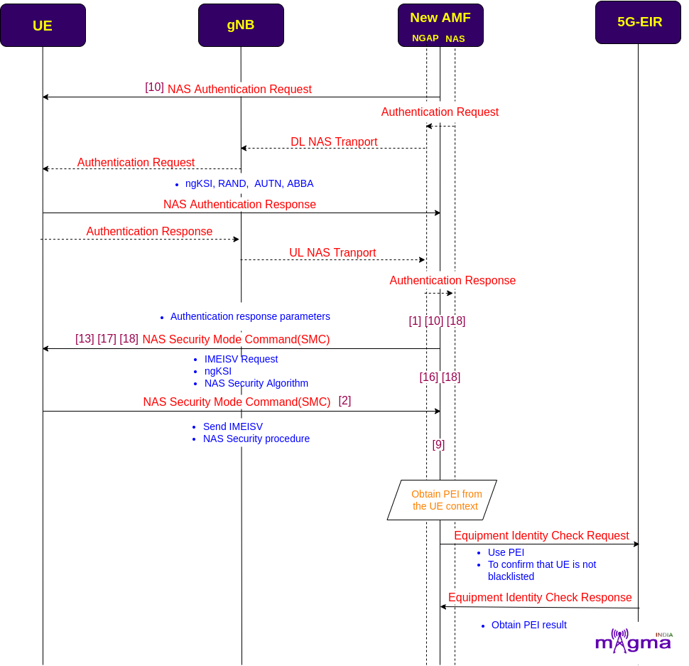

Access and Mobility Management Function
*********

Overview
=======

.. image:: photos/1_magma.png
  :align: right
  :alt: Alternative text

AMF(Access and Mobility Management Function) is a Control Plane(CU) function in the 5G Core Network(CN). gNodeB first needs to connect with AMF to access any 5G services. AMF is the only Network Function(NF) through which gNB communicates with the 5G Core(excluding interaction with the UPF(User Plane Function) during the PDU Session Establishment). 

|
|

AMF Vs MME
=======

.. image:: photos/2_mme_amf.png
  :width: 360
  :height: 340
  :align: right
  :alt: Alternative text

AMF performs most of the functions that the MME(Mobility Management Entity) performs in the 4G Network except for some of them. The establishment of PDU sessions is carried out by a separate network function, SMF(Session Management Function) whereas functions related to authentication and security are carried out by AUSF(Authentication Server Function), an another network function in 5G. This shows that 5G architecture is more distributed than MME in 4G which makes it more effective. 
Basically, the main principle in the 5G architecture is the separation of the control and user plane.

Functions
=======

.. image:: photos/3_amf_functions.png
  :align: center
  :width: 450
  :height: 400
  :alt: Alternative text

**The main functions of AMF are:**

|
 1. **Registration Management** - AMF manages UE registration and deregistration with the 5G System. To access 5G services, UE must complete the registration procedures.

|
 2. **Connection Management** - Establishment and release of the Control Plane(CP) signaling connections between the UE and AMF across the N1 interface.

|
 3. **Mobility Management** - AMF updates the UE’s location within the network. This is achieved through periodic registration by UE.

|
 4. **NGAP Signaling Procedures** - It includes paging procedures, transport of NAS messages, PDU Session Management, UE Context Management and some other message transmission.

NR Interface
=======

.. image:: photos/4_interface.png
  :alt: Alternative text

N1/N2
-------

AMF retrieves all the connection and session related information from the UE over the N1 and N2 interface.

N8 
-------

Policy rules both for all users and for particular UEs, session related subscription data, subscriber data, and any other information(e.g. data exposed to the third party application) is stored in UDM which is retrieved by AMF over the N8 interface.

N11 
-------

N11 interface represents a trigger to add, modify or delete a PDU session by AMF across the User Plane. 

N12
-------

N12 emulates AUSF within the 5G Core offering services to the AMF  via the ausf service-based N12 interfaces. The 5G network represents the service-based interface, with focus on the AUSF and AMF.

N14 
-------

The N14 Reference point is between two AMFs (Access and Mobility Management Functions) and the UE context is transmitted over this interface during handovers, etc.

N15 
-------

Transmission and removal of Access and Mobility policies are carried out over the N15 interface between AMF and PCF.

N17 
-------

N17 emulates Equipment Identity Register(EIR) within the 5G Core offering services to the AMF via the N5g-eir service based interface. This interface supports Equipment Identity Check Service.

N22 
-------

AMF selects the best Network Functions (NF) across the network with the help of NSSF. NSSF provides the network functions location to the AMF over the N22 interface.

N26 
-------

This interface is used to transfer UE’s authentication and session management context as the UE moves between the 5GS and 4G-EPS systems.

NR Call Flow
=======

RRC Connection
-------

* When the UE powers ON, it undergoes an RRC connection setup with gNB. After that, gNB sends an initial NAS message to the AMF over the N2 interface which contains RAN UE NGAP ID, registration request context, User location information, 5G S-TMSI, and RRC establishment Cause.

.. image:: photos/5_RRC.png
  :alt: Alternative text

Initial NAS message + Obtain UE context from old AMF
-------

* These parameters provide an identity to the UE which helps AMF to retrieve UE context either from the old serving AMF or by going through the whole procedure(only when the serving AMF is not able to find the traces of the old AMF). This has taken place through the N14 interface.

.. image:: photos/6_old_amf.png
  :alt: Alternative text

- `[8] <https://github.com/magma/magma/blob/master/lte/gateway/c/core/oai/tasks/amf/amf_app_ue_context.cpp>`_    Release previous registration request context
- `[3] <https://github.com/magma/magma/blob/master/lte/gateway/c/core/oai/tasks/amf/amf_app_handler.cpp>`_    gNB sends Initial NAS message via new RRC connection
- `[23] <https://github.com/magma/magma/blob/master/lte/gateway/c/core/oai/tasks/amf/nas5g_message.cpp>`_    Decode security protected NAS message 
- `[3] <https://github.com/magma/magma/blob/master/lte/gateway/c/core/oai/tasks/amf/amf_app_handler.cpp>`_ `[9] <https://github.com/magma/magma/blob/master/lte/gateway/c/core/oai/tasks/amf/amf_as.cpp>`_ Processes NGAP Initial UE NAS message
- `[4] <https://github.com/magma/magma/blob/master/lte/gateway/c/core/oai/tasks/amf/amf_app_main.cpp>`_    Handle initial UE message from NGAP 
- `[9] <https://github.com/magma/magma/blob/master/lte/gateway/c/core/oai/tasks/amf/amf_as.cpp>`_    Mobility management messages
- `[16] <https://github.com/magma/magma/blob/master/lte/gateway/c/core/oai/tasks/amf/amf_recv.cpp>`_   Store the registration type in parameters 
- `[1] <https://github.com/magma/magma/blob/master/lte/gateway/c/core/oai/tasks/amf/Registration.cpp>`_     Create registration request procedure
- `[9] <https://github.com/magma/magma/blob/master/lte/gateway/c/core/oai/tasks/amf/amf_as.cpp>`_    Encoded the initial NAS information message
- `[7] <https://github.com/magma/magma/blob/master/lte/gateway/c/core/oai/tasks/amf/amf_app_transport.cpp>`_    Handles NAS encoded message and sends it to NGAP task
- `[23] <https://github.com/magma/magma/blob/master/lte/gateway/c/core/oai/tasks/amf/nas5g_message.cpp>`_ Decode plain NAS message
- `[8] <https://github.com/magma/magma/blob/master/lte/gateway/c/core/oai/tasks/amf/amf_app_ue_context.cpp>`_  Check if UE context exists for old parameters like GUTI, IMSI, gNB id, etc or not 
- `[3] <https://github.com/magma/magma/blob/master/lte/gateway/c/core/oai/tasks/amf/amf_app_handler.cpp>`_  Update AMF UE context with new gNB UE NGAP id

* Let's assume, the new AMF does not find any old AMF clues in the network, for closure exposure of NR call flow. Then AMF starts the identity, authentication, and security procedures with the UE to add a more defined identity to the UE.

NAS Identification 
-------                                      

* During NAS identity procedures, identity parameters(e.g. SUCI) are derived from the registration context, and security headers are added to the NAS messages to securely transport them over the air interface through UL and DL DCCH(Dedicated Control Channel) from the N1 interface. There is a possibility of identification rejection due to many problems like TAC setup failure, forbidden PLMN(Public Land Mobile Network), and so on.

.. image:: photos/7_identity.png
  :alt: Alternative text

- `[24] <https://github.com/magma/magma/blob/master/lte/gateway/c/core/oai/tasks/amf/nas_proc.cpp>`_    AMF sends identity request message 
- `[9] <https://github.com/magma/magma/blob/master/lte/gateway/c/core/oai/tasks/amf/amf_as.cpp>`_     Build DL NAS transport message
- `[9] <https://github.com/magma/magma/blob/master/lte/gateway/c/core/oai/tasks/amf/amf_as.cpp>`_     DL messages to NGAP on identity/authentication request
- `[3] <https://github.com/magma/magma/blob/master/lte/gateway/c/core/oai/tasks/amf/amf_app_handler.cpp>`_     Handle Uplink NAS message
- `[15] <https://github.com/magma/magma/blob/master/lte/gateway/c/core/oai/tasks/amf/amf_identity.cpp>`_    Generate GUTI based on SUPI/IMSI
- `[20] <https://github.com/magma/magma/blob/master/lte/gateway/c/core/oai/tasks/amf/amf_smf_send.cpp>`_ `[9] <https://github.com/magma/magma/blob/master/lte/gateway/c/core/oai/tasks/amf/amf_as.cpp>`_ Set NAS security header
- `[16] <https://github.com/magma/magma/blob/master/lte/gateway/c/core/oai/tasks/amf/amf_recv.cpp>`_    AMF handles identity response message 
- `[15] <https://github.com/magma/magma/blob/master/lte/gateway/c/core/oai/tasks/amf/amf_identity.cpp>`_    Identification procedure completion
- `[23] <https://github.com/magma/magma/blob/master/lte/gateway/c/core/oai/tasks/amf/nas5g_message.cpp>`_    Encode header of a security protected NAS message

NAS Authentication 
-------

* On getting the identity of the UE, AMF selects the AUSF, configured by the NRF(Network Repository Function) for the UE authentication and security, based on derived SUCI(Subscription Concealed Identifier). This takes place the same as through UL and DL DCCH over the N1 interface. This procedure is carried out by the MME itself(in addition with AAA) in the 4G Network.

* AUSF then requests the authentication vectors from the UDM over the N13 interface and sends a response message to the AMF with all the required NAS security keys(AUTN, RAND, ABBA) and some other security keys over another interface named N12.

.. image:: photos/8_auth.png
  :alt: Alternative text

- `[10] <https://github.com/magma/magma/blob/master/lte/gateway/c/core/oai/tasks/amf/amf_authentication.cpp>`_ AMF send authentication request 
- `[10] <https://github.com/magma/magma/blob/master/lte/gateway/c/core/oai/tasks/amf/amf_authentication.cpp>`_ Initialisation of authentication procedure to establish partial native 5G CN security context in the UE and the AMF
- `[10] <https://github.com/magma/magma/blob/master/lte/gateway/c/core/oai/tasks/amf/amf_authentication.cpp>`_ Procedure to start authentication procedure 
- `[11] <https://github.com/magma/magma/blob/master/lte/gateway/c/core/oai/tasks/amf/amf_cn.cpp>`_ Received security vector from HSS
- `[10] <https://github.com/magma/magma/blob/master/lte/gateway/c/core/oai/tasks/amf/amf_authentication.cpp>`_ Abort the Authentication procedure 
- `[9] <https://github.com/magma/magma/blob/master/lte/gateway/c/core/oai/tasks/amf/amf_as.cpp>`_  Send authentication reject to UE
- `[16] <https://github.com/magma/magma/blob/master/lte/gateway/c/core/oai/tasks/amf/amf_recv.cpp>`_ Processes authentication failure message
- `[10] <https://github.com/magma/magma/blob/master/lte/gateway/c/core/oai/tasks/amf/amf_authentication.cpp>`_ Authentication response message 
- `[23] <https://github.com/magma/magma/blob/master/lte/gateway/c/core/oai/tasks/amf/nas5g_message.cpp>`_ Encode the message authentication code

NAS Security
-------

* AMF authenticates UE and starts NAS SMC(Security Mode Command) procedures and requests for IMEISV(International Mobile Equipment Identity Software Version) which maintains the user device and assists upgrades and notifications.

* To confirm that UE is not blacklisted, AMF sends an equipment identity check request to the 5G-EIR(Equipment Identity Register) using PEI(Permanent Equipment Identifier) to identify the UE in the network.

- `[18] <https://github.com/magma/magma/blob/master/lte/gateway/c/core/oai/tasks/amf/amf_security_mode_control.cpp>`_    Sends security mode command message
- `[10] <https://github.com/magma/magma/blob/master/lte/gateway/c/core/oai/tasks/amf/amf_authentication.cpp>`_    Handle security request
- `[1] <https://github.com/magma/magma/blob/master/lte/gateway/c/core/oai/tasks/amf/Registration.cpp>`_ `[18] <https://github.com/magma/magma/blob/master/lte/gateway/c/core/oai/tasks/amf/amf_security_mode_control.cpp>`_ Create new security context and initiate SMC procedures
- `[18] <https://github.com/magma/magma/blob/master/lte/gateway/c/core/oai/tasks/amf/amf_security_mode_control.cpp>`_    Request for IMEISV from UE 
- `[18] <https://github.com/magma/magma/blob/master/lte/gateway/c/core/oai/tasks/amf/amf_security_mode_control.cpp>`_    Security keys exchange, setup encryption and integrity algorithms 
- `[17] <https://github.com/magma/magma/blob/master/lte/gateway/c/core/oai/tasks/amf/amf_sap.cpp>`_    AMF send the security mode command message integrity protected 
- `[13] <https://github.com/magma/magma/blob/master/lte/gateway/c/core/oai/tasks/amf/amf_data.cpp>`_    Sets security context type
- `[16] <https://github.com/magma/magma/blob/master/lte/gateway/c/core/oai/tasks/amf/amf_recv.cpp>`_    AMF security mode command reject 
- `[18] <https://github.com/magma/magma/blob/master/lte/gateway/c/core/oai/tasks/amf/amf_security_mode_control.cpp>`_    Notify AMF that security mode procedure failed 
- `[2] <https://github.com/magma/magma/blob/master/lte/gateway/c/core/oai/tasks/amf/amf_Security_Mode.cpp>`_     AMF handle security complete response 
- `[9] <https://github.com/magma/magma/blob/master/lte/gateway/c/core/oai/tasks/amf/amf_as.cpp>`_     Setup/encode the NAS security message

Retrieving Subscription data
-------

* AMF looks for the NSSF(Network Slicing Selection Function) to select the best network slice available for the service requested by the user and connect it over the N22 interface. Then it searches for the UDM to retrieve all the subscription data related to the Access Management(AM), Session Management(SM), and subscriber data. AMF is connected to the UDM through the N10 interface. 

.. image:: photos/10_udm.png
  :alt: Alternative text

- `[21] <https://github.com/magma/magma/blob/master/lte/gateway/c/core/oai/tasks/amf/amf_smf_session_context.cpp>`_ To fill the slice information in PDU session establishment accept message
- `[8] <https://github.com/magma/magma/blob/master/lte/gateway/c/core/oai/tasks/amf/amf_app_ue_context.cpp>`_  Get the AMF context based on UE identity
- `[8] <https://github.com/magma/magma/blob/master/lte/gateway/c/core/oai/tasks/amf/amf_app_ue_context.cpp>`_  Get the SMF context from the map
- `[20] <https://github.com/magma/magma/blob/master/lte/gateway/c/core/oai/tasks/amf/amf_smf_send.cpp>`_ Set the SMF context in AMF context
- `[8] <https://github.com/magma/magma/blob/master/lte/gateway/c/core/oai/tasks/amf/amf_app_ue_context.cpp>`_  AMF create new UE context 

* AMF also configures PCF(Policy Control Function) to retrieve AM policies over the N15 interface, to which UE has access and SMF allocates services accordingly. 

* AMF has collected all the UE context, now it creates another identifier AMF UE NGAP ID for the UE to the network.

Deregistration
-------

* At the same time, the old AMF releases the Session Management context and AM policies with which UE is registered earlier. And also deletes the UE context from itself to make it more reliable.

.. image:: photos/11_dereg.png
  :alt: Alternative text

- `[22] <https://github.com/magma/magma/blob/master/lte/gateway/c/core/oai/tasks/amf/deregistration_request.cpp>`_ Processes deregistration request
- `[9] <https://github.com/magma/magma/blob/master/lte/gateway/c/core/oai/tasks/amf/amf_as.cpp>`_  Build De-registration accept message
- `[20] <https://github.com/magma/magma/blob/master/lte/gateway/c/core/oai/tasks/amf/amf_smf_send.cpp>`_ Sending PDU session resource release request 
- `[20] <https://github.com/magma/magma/blob/master/lte/gateway/c/core/oai/tasks/amf/amf_smf_send.cpp>`_ Execute PDU session release and notify SMF 
- `[19] <https://github.com/magma/magma/blob/master/lte/gateway/c/core/oai/tasks/amf/amf_session_manager_pco.cpp>`_ clear SMF protocol configuration options
- `[20] <https://github.com/magma/magma/blob/master/lte/gateway/c/core/oai/tasks/amf/amf_smf_send.cpp>`_ Clean up the mobility IP address
- `[22] <https://github.com/magma/magma/blob/master/lte/gateway/c/core/oai/tasks/amf/deregistration_request.cpp>`_ Delete PDU session id
- `[24] <https://github.com/magma/magma/blob/master/lte/gateway/c/core/oai/tasks/amf/nas_proc.cpp>`_ Delete the NAS common procedures 
- `[1] <https://github.com/magma/magma/blob/master/lte/gateway/c/core/oai/tasks/amf/Registration.cpp>`_   Delete the NAS registration specific procedure 
- `[13] <https://github.com/magma/magma/blob/master/lte/gateway/c/core/oai/tasks/amf/amf_data.cpp>`_ Clear AMF security context
- `[3] <https://github.com/magma/magma/blob/master/lte/gateway/c/core/oai/tasks/amf/amf_app_handler.cpp>`_  NGAP UE context Release request 
- `[4] <https://github.com/magma/magma/blob/master/lte/gateway/c/core/oai/tasks/amf/amf_app_main.cpp>`_  Handle UE context release requests
- `[22] <https://github.com/magma/magma/blob/master/lte/gateway/c/core/oai/tasks/amf/deregistration_request.cpp>`_ Start releasing UE related context 
- `[4] <https://github.com/magma/magma/blob/master/lte/gateway/c/core/oai/tasks/amf/amf_app_main.cpp>`_  Handle UE context release complete
- `[8] <https://github.com/magma/magma/blob/master/lte/gateway/c/core/oai/tasks/amf/amf_app_ue_context.cpp>`_  Delete the UE context
- `[8] <https://github.com/magma/magma/blob/master/lte/gateway/c/core/oai/tasks/amf/amf_app_ue_context.cpp>`_  Cleans up the AMF context 

Setup User Plane
-------

* AMF selects the SMF which performs all the session management operations that are managed by the MME(in addition with SGW-C and PGW-C) itself in the 4G System. The exchange of messages between AMF and SMF takes place over the N11 interface. Then SMF looks for the best UPF(User Plane Function) for the UE and creates sessions during UL and DL data flow. The interaction between SMF and UPF is carried out by PFCP(Packet Forwarding Control Protocol) over the N4 interface.

.. image:: photos/12_UP.png
  :alt: Alternative text

- `[3] <https://github.com/magma/magma/blob/master/lte/gateway/c/core/oai/tasks/amf/amf_app_handler.cpp>`_    Check for the existing PDU session for session id
- `[3] <https://github.com/magma/magma/blob/master/lte/gateway/c/core/oai/tasks/amf/amf_app_handler.cpp>`_    PDU session Establishment accepts message to UE and gNB
- `[3] <https://github.com/magma/magma/blob/master/lte/gateway/c/core/oai/tasks/amf/amf_app_handler.cpp>`_    PDU session resource setup request message  to gNB
- `[4] <https://github.com/magma/magma/blob/master/lte/gateway/c/core/oai/tasks/amf/amf_app_main.cpp>`_    Handle PDU session resource setup response
- `[4] <https://github.com/magma/magma/blob/master/lte/gateway/c/core/oai/tasks/amf/amf_app_main.cpp>`_    Handle PDU session resource release response 
- `[20] <https://github.com/magma/magma/blob/master/lte/gateway/c/core/oai/tasks/amf/amf_smf_send.cpp>`_   AMF handle PDU session establish reject
- `[20] <https://github.com/magma/magma/blob/master/lte/gateway/c/core/oai/tasks/amf/amf_smf_send.cpp>`_   Send PDU session reject to UE
- `[3] <https://github.com/magma/magma/blob/master/lte/gateway/c/core/oai/tasks/amf/amf_app_handler.cpp>`_    Set Session AMBR 
- `[20] <https://github.com/magma/magma/blob/master/lte/gateway/c/core/oai/tasks/amf/amf_smf_send.cpp>`_   Update IP address information in SMF context Send the Downlink Transport with 5GMM Cause to gnb 
- `[3] <https://github.com/magma/magma/blob/master/lte/gateway/c/core/oai/tasks/amf/amf_app_handler.cpp>`_ `[5] <https://github.com/magma/magma/blob/master/lte/gateway/c/core/oai/tasks/amf/amf_app_pdu_resource_setup_req_rel.cpp>`_ Retrieve subscriber QoS profile, UPF GTP TEID IP address from SMF context
- `[1] <https://github.com/magma/magma/blob/master/lte/gateway/c/core/oai/tasks/amf/Registration.cpp>`_     Send Activate PDU session Context Request message
- `[5] <https://github.com/magma/magma/blob/master/lte/gateway/c/core/oai/tasks/amf/amf_app_pdu_resource_setup_req_rel.cpp>`_    Adding security header to AMF PDU session transfer request
- `[3] <https://github.com/magma/magma/blob/master/lte/gateway/c/core/oai/tasks/amf/amf_app_handler.cpp>`_ `[6] <https://github.com/magma/magma/blob/master/lte/gateway/c/core/oai/tasks/amf/amf_app_state_converter.cpp>`_ Generate new AMF NGAP UE id
- `[8] <https://github.com/magma/magma/blob/master/lte/gateway/c/core/oai/tasks/amf/amf_app_ue_context.cpp>`_    Notify NGAP about new AMF NGAP ID 

AS Security and RRC Reconfiguration
-------

* Now, the AMF sends an initial context setup request along with a registration acceptance message to the gNB to update the UE context present in the gNB. gNB again undergoes RRC reconfiguration and SMC procedures to let the UE access the encrypted channels by using the derived keys(e.g. k-gNB, k-RRC, k-UP-int).

.. image:: photos/13_asSec.png
  :alt: Alternative text

- `[17] <https://github.com/magma/magma/blob/master/lte/gateway/c/core/oai/tasks/amf/amf_sap.cpp>`_    AMF sends SAP
- `[1] <https://github.com/magma/magma/blob/master/lte/gateway/c/core/oai/tasks/amf/Registration.cpp>`_      Updated GUTI assigned to AMF SAP
- `[9] <https://github.com/magma/magma/blob/master/lte/gateway/c/core/oai/tasks/amf/amf_as.cpp>`_     Processes the AMF AS SAP connection establish request
- `[9] <https://github.com/magma/magma/blob/master/lte/gateway/c/core/oai/tasks/amf/amf_as.cpp>`_ `[16] <https://github.com/magma/magma/blob/master/lte/gateway/c/core/oai/tasks/amf/amf_recv.cpp>`_ Processes the AMF AS SAP connection establish reject 
- `[9] <https://github.com/magma/magma/blob/master/lte/gateway/c/core/oai/tasks/amf/amf_as.cpp>`_     Processes the AMF AS SAP connection establish confirm 
- `[18] <https://github.com/magma/magma/blob/master/lte/gateway/c/core/oai/tasks/amf/amf_security_mode_control.cpp>`_    Notify AMF AS SAP that security mode command message has to be sent to the UE
- `[9] <https://github.com/magma/magma/blob/master/lte/gateway/c/core/oai/tasks/amf/amf_as.cpp>`_     Processes the AMF AS SAP security request primitive 
- `[17] <https://github.com/magma/magma/blob/master/lte/gateway/c/core/oai/tasks/amf/amf_sap.cpp>`_    Setup security request when data transfer to lower layers 
- `[1] <https://github.com/magma/magma/blob/master/lte/gateway/c/core/oai/tasks/amf/Registration.cpp>`_      Notify AS SAP about registration reject 
- `[10] <https://github.com/magma/magma/blob/master/lte/gateway/c/core/oai/tasks/amf/amf_authentication.cpp>`_    Fetch new security context to upper layer
- `[23] <https://github.com/magma/magma/blob/master/lte/gateway/c/core/oai/tasks/amf/nas5g_message.cpp>`_    Encrypt/Decrypt/Decode layer 3 NAS message
- `[8] <https://github.com/magma/magma/blob/master/lte/gateway/c/core/oai/tasks/amf/amf_app_ue_context.cpp>`_     Register the UE context

- `[1] <https://github.com/magma/magma/blob/master/lte/gateway/c/core/oai/tasks/amf/Registration.cpp>`_      Performs the registration signaling procedure
- `[1] <https://github.com/magma/magma/blob/master/lte/gateway/c/core/oai/tasks/amf/Registration.cpp>`_      Processes registration complete message 
- `[1] <https://github.com/magma/magma/blob/master/lte/gateway/c/core/oai/tasks/amf/Registration.cpp>`_      AMF sends an registration accept message

UL and DL data transfer
-------

* When the user plane is setup for UL or DL purposes, PDU sessions update messages are transferred by the AMF to the SMF.

.. image:: photos/14_data.png
  :alt: Alternative text

- `[3] <https://github.com/magma/magma/blob/master/lte/gateway/c/core/oai/tasks/amf/amf_app_handler.cpp>`_  Store gNB IP and TEID in respective SMF context 
- `[3] <https://github.com/magma/magma/blob/master/lte/gateway/c/core/oai/tasks/amf/amf_app_handler.cpp>`_  Received the session created response message from SMF
- `[3] <https://github.com/magma/magma/blob/master/lte/gateway/c/core/oai/tasks/amf/amf_app_handler.cpp>`_  Prepare and send gNB setup response message to SMF through gRPC
- `[9] <https://github.com/magma/magma/blob/master/lte/gateway/c/core/oai/tasks/amf/amf_as.cpp>`_  QoS flow setup list
- `[20] <https://github.com/magma/magma/blob/master/lte/gateway/c/core/oai/tasks/amf/amf_smf_send.cpp>`_ Function to check if max PDU sessions reached