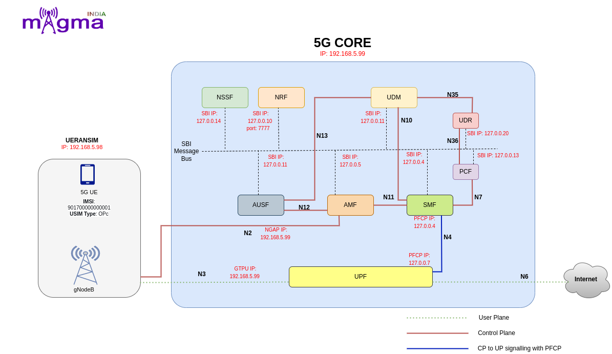

5G Lab Architecture
*******************

Modules
=======

AMF
----

It is a control plane function in 5G core network. The main functions and responsibilities of AMF are:
Registration Management, 
Reachability Management, 
Connection Management, 
Mobility Management

SMF
----
Session Management Function (SMF) is a fundamental element of the 5G Service-Based Architecture (SBA). The SMF is primarily responsible for interacting with the decoupled data plane, creating updating and removing Protocol Data Unit (PDU) sessions and managing session context with the User Plane Function (UPF).
 
UPF
----
The User Plane Function (UPF) represents the data plane evolution of a Control and User Plane Separation (CUPS) strategy, which is a fundamental component of the 3GPP 5G core network(5GC).The UPF plays the most critical role in the process of data transfer. It provides the interconnect point between the mobile infrastructure and the Data Network (DN), i.e. encapsulation and decapsulation of GTP-U.
 
UDR
----
Unified Data Repository (UDR) is a converged database that stores and manages subscriber data, SIM identities, and network service configurations. The UDR is used by multiple network functions such as PCF, UDM, and NEF to store service-specific parameters to be provisioned in the network for devices to use the service.
 
PCF
----
The Policy Control Function (5G PCF) uses the policy subscription information stored in the User Data Repository (UDR) to provide policy rules to network functions (SMF/AMF). It uses a standard REST-based interface to integrate with AMF for access and mobility policy, and with SMF for session management policy.

NSSF
-----
The NSSF (Network Slicing Selection Function) system is a solution to select the optimal network slice available for the service requested by the user in the 5G environment where various services are provided.
 
NRF
----
Network Repository Function(NRF) supports the service discovery feature, which receives NF discovery requests from NF instances and provides information about the discovered NF instance (discovered) to another NF instance. Registration information includes NF type, address, service list, etc.
 
AUSF
-----
As a major part of 5GC to facilitate security processes, AUSF performs the authentication function of identifying UEs and storing authentication keys.
 
UDM
----
UDM is a centralized way to process network user data in 5G through Nudm interfaces to provide services for AMF, SMF, SMSF and AUSF. It also provides services such as authorization of accessing, registration, uninterrupted services.
 
SBI
----
The most outstanding change in the 5G Core Control plane is induction of Service based Interface (SBI) or Service based Architecture (SBA) from traditional Point-to-Point network architecture. With this new change, except for a few interfaces such as N2 and N4, almost every interface is now defined to use unified interface, using HTTP/2 protocol.
 
NGAP
-----
The NG Application Protocol (NGAP) provides the control plane signalling between NG-RAN node and the Access and Mobility Management Function (AMF). The services provided by the NGAP are divided to UE associated and non UE associated.
Different categories of NGAP signalling procedures include: 
PDU Session Management, 
UE Context Managment, 
UE Mobility Management, 
Paging Procedures, 
Transport of NAS messages, 
Interface Management, 
Configuration Transfer, 
Warning Message Transmission

Interface
=========

N2
---
N2 interface supports control plane signalling between RAN and 5G core covering scenarios related to UE context management, PDU session/resource management procedures.
 
N3
---
N3 interface performs the role of conveying user data from the RAN to the User Plane Function, making it possible to create both low- and high-latency services.

N4
---
N4 Interface is the bridge between the control plane and the user plane. As such, it is the conduit for PDU session management and traffic steering towards the UPF and PDU usage and event reporting towards the SMF.
 
N6
---
The N6 interface plays the same role in the 5G network, providing connectivity between the User Plane Function (UPF) and any other external (or internal) networks or service platforms, such as the Internet, the public cloud or private clouds.
 
N7
---
N7 interface to trigger session management policies towards Session Management Function (SMF). SMF controls the User plane Function (UPF) . It translates policies received from the PCF to a set of directives/information understood to the UPF and then forwards it to the UPF.
 
 
N10
---
N10 can emulate UDM within the 5G Core offering services to the SMF via the Nudm service-based N10 interface respectively. The 5G network represents the service-based interface, with focus on N10 between UDM and SMF.
Following services via the Nudm service-based N10 interface respectively: 
Nudm_SubscriberDataManagement Services, 
Nudm_UEContextManagement Services
 
N11
---
N11 interface represent a trigger to add, modify or delete a PDU session across the user plane. The SMF sends messages to the UPF over the N4 reference interface using the Packet Forwarding Control Protocol (PFCP).
 
N12
---
N12 emulates Authentication Server Function (AUSF) within the 5G Core offering services to the Access and Mobility Management Function (AMF) via the ausf service-based N12 interfaces. The 5G network represents the service-based interface, with focus on the AUSF and AMF.
 
N13
---
N13 interface within the 5G Core offering services to the User Data Management (UDM) via the Nausf and Nudm service-based N13 interface respectively. The 5G network represents the service-based interface, with focus on N13 between AUSF and UDM.
