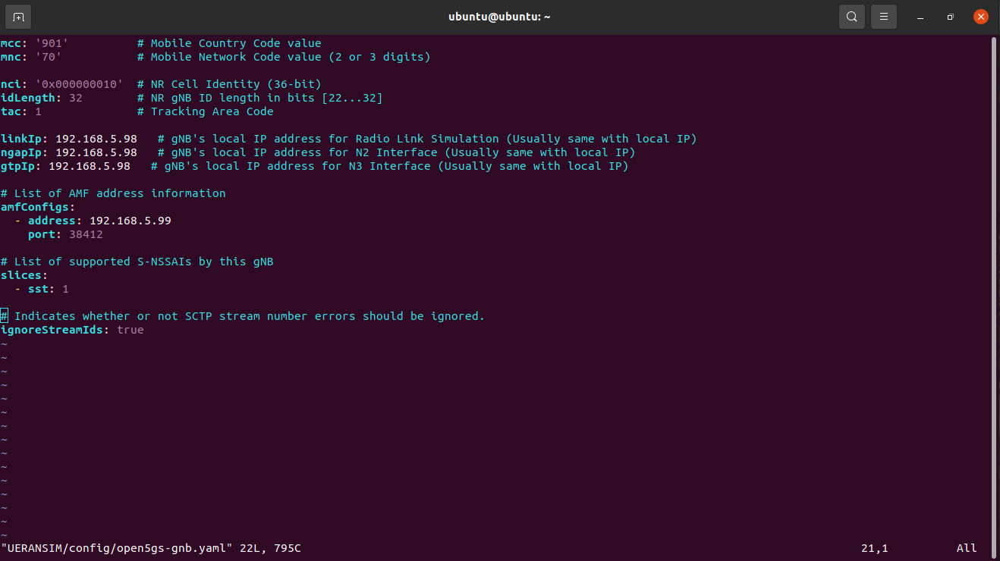
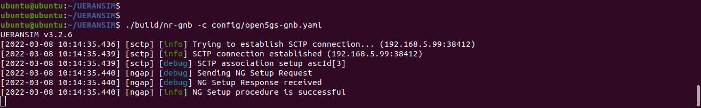
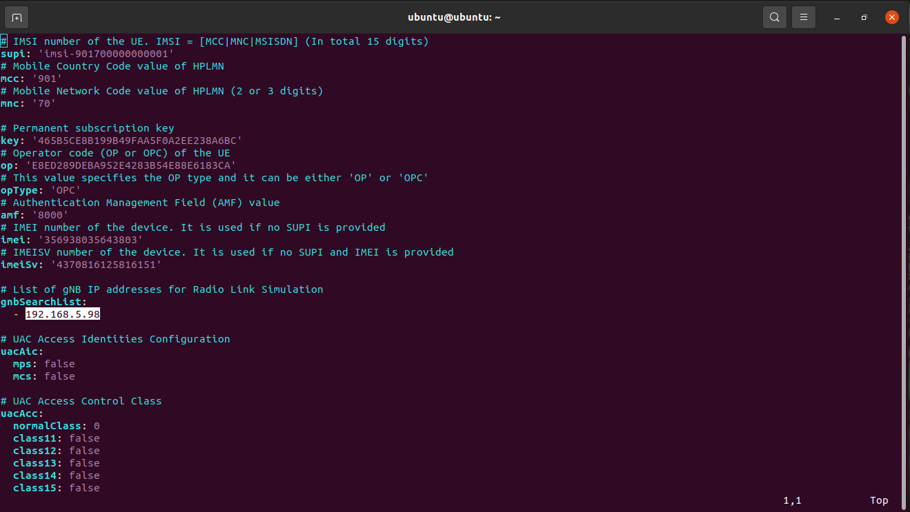
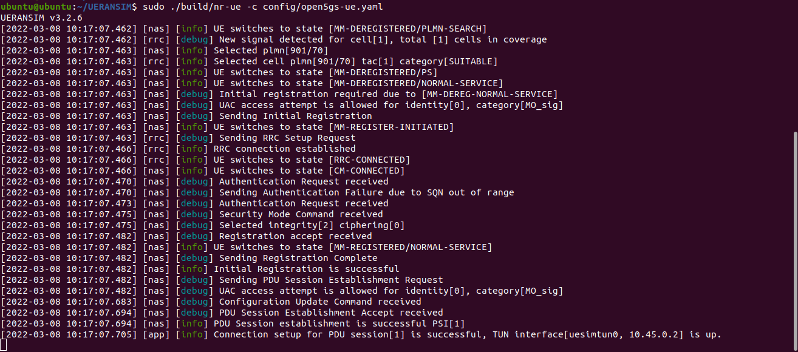
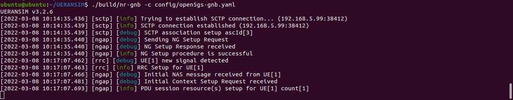

Installation of UERANSIM
************************

Install UERANSIM
================

Now we will install ueransim on server2.The installation done with make file available in UERANSIM repository.

.. code-block:: bash

    # install cmake and other packages
    sudo apt update
    sudo apt upgrade
    sudo apt install iproute2
    sudo snap install cmake --classic
    sudo apt install gcc
    sudo apt install g++
    sudo apt install libsctp-dev
    # clone ueransim
    git clone https://github.com/aligungr/UERANSIM
    cd UERANSIM
    make

Setup gNB
=========
We have to do some changes to the gNB config files located in UERANSIM/config/open5gs-gnb.yaml. Update the "linkIp", "ngapIp", "gtpIp" field with local ip (server 2 ip) and "amfConfigs: address" field with amf ip ( server1 ip).

.. code-block:: bash

    # start gnb with open5gc-gnb.yaml config file
    sudo ./build/nr-gnb -c config/open5gs-gnb.yaml

Setup UE
========
We have to do some changes to the UE config files located in UERANSIM/config/open5gs-ue.yaml. Update the "gnbSearchList" with the IP address of the server2.

.. code-block:: bash

    # start gnb with open5gc-ue.yaml config file
    sudo ./build/nr-ue -c config/open5gs-ue.yaml

Logs on gNB side.

