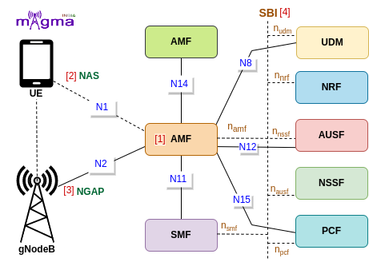
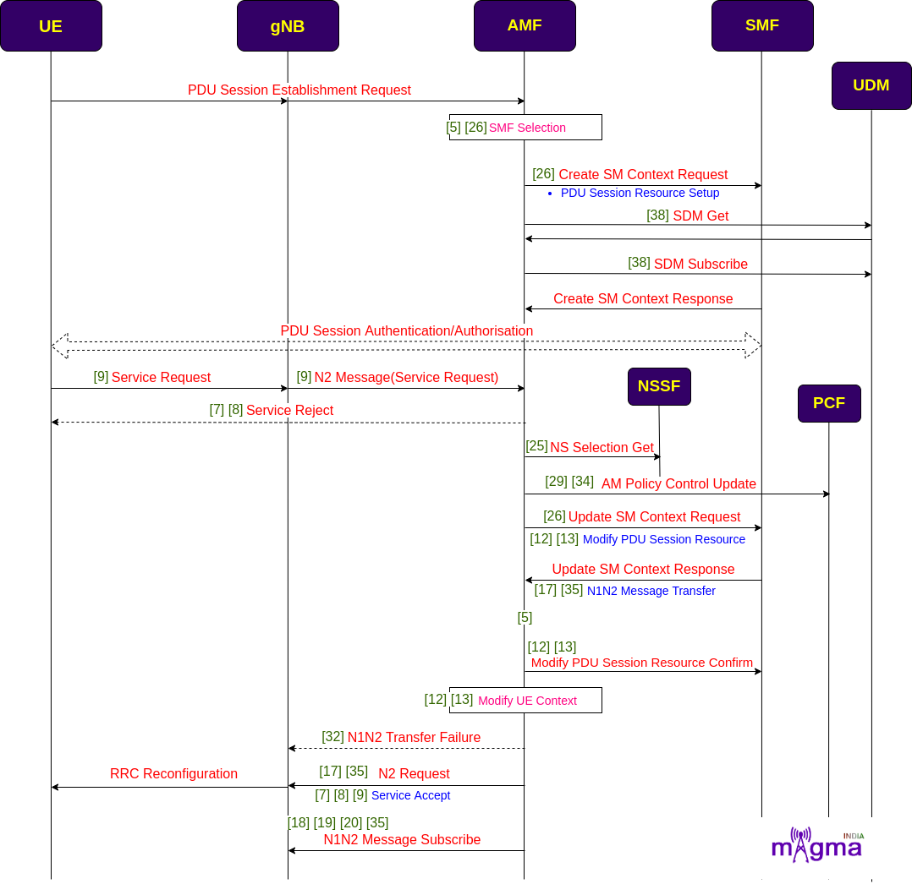
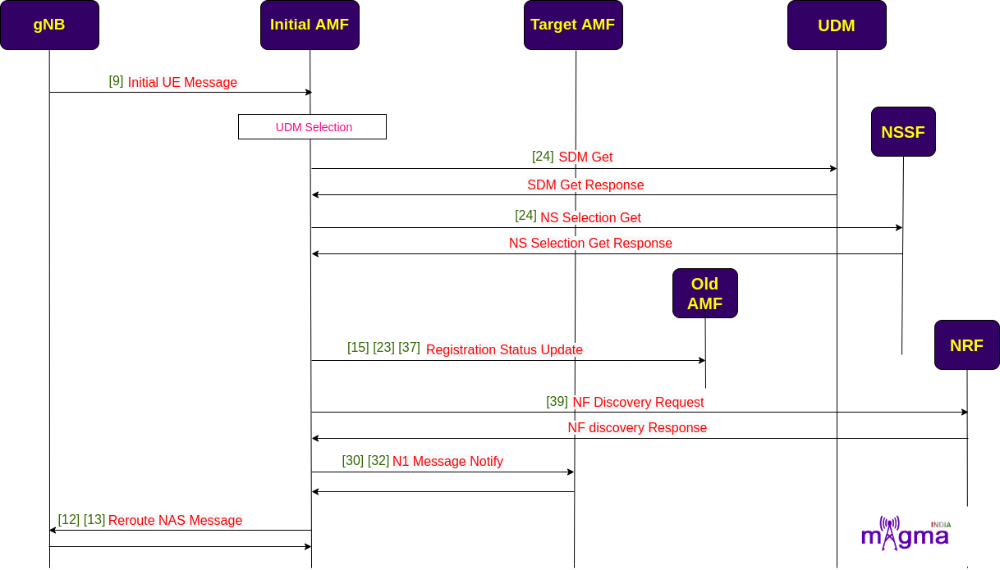
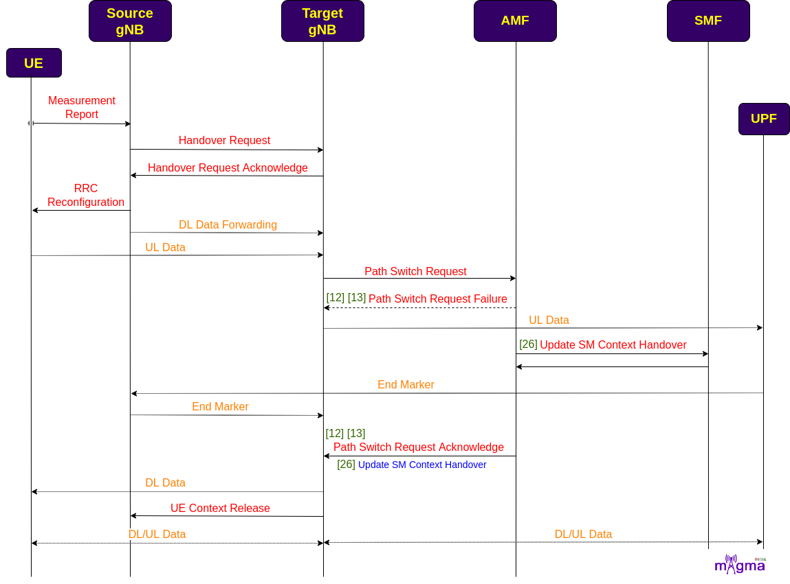
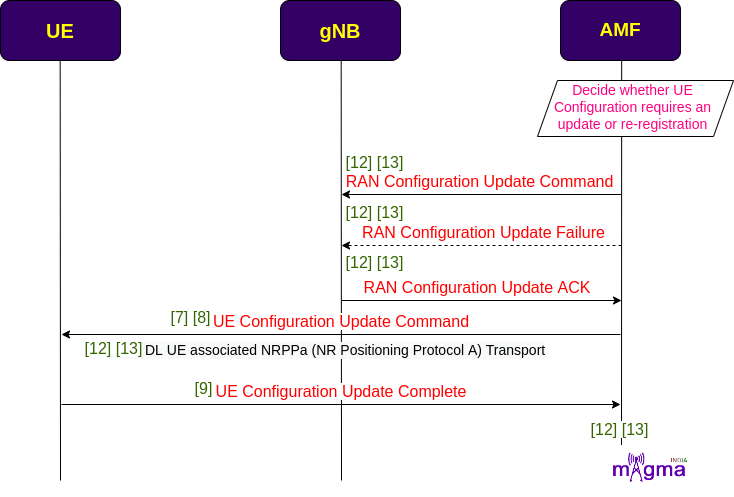

Access and Mobility Management Function `[1] <https://github.com/free5gc/amf>`_
*********

AMF(Access and Mobility Management Function) is a Control Plane(CU) function in the 5G Core Network(CN). gNodeB first needs to connect with AMF to access any 5G services. AMF is the only Network Function(NF) through which gNB communicates with the 5G Core(excluding interaction with the UPF(User Plane Function) during the PDU Session Establishment). 

Protocols
=======

NAS `[2] <https://github.com/free5gc/amf/tree/a3bd5358ec55215e2b2f86f7744609f17bbc6991/internal/nas>`_
-------

The 5G NAS(Non-Access Stratum) is a control plane protocol that is present at the radio interface(N1 interface) between UE and AMF. This manages the mobility and session-related context within 5GS(5G System).

NGAP `[3] <https://github.com/free5gc/amf/tree/a3bd5358ec55215e2b2f86f7744609f17bbc6991/internal/ngap>`_
-------

The Next-Generation Application Protocol(NGAP) is a Control Plane(CP) protocol signaling between gNB and the AMF. It handles the UE-associated and non-UE-associated services.

SBI `[4] <https://github.com/free5gc/amf/tree/main/internal/sbi>`_
-------

A service-Based Interface is an API-based communication between network functions.

Call Flow
=======

Registration 
-------

* When UE wants to access 5G services, it undergoes a registration process. gNB sends registration requests along with an initial UE message to AMF. AMF uses this information to identify UE in the network. Then, it checks for the last AMF with which the UE is registered, and if it succeeds to find the old AMF address, the new AMF request for the UE context procedure. 

* AMF authenticates UE and also at the same, the network initiates the deregistration process against the old AMF. AMF also requests for a UE radio capability check from the UE to be aware of all the details of its capabilities. It stores this information for future requirements. It also retrieves all the subscriber-related data from UDM and session-related subscriber data from SMF.

* It also creates Access Management Policies with PCF and after retrieving all the necessary information, it creates UE context. It allocates UE with an id known as AMF UE NGAP ID to identify it from a pool of UEs. Then, it sends a registration confirmation message with an initial context setup message.

.. image:: photos/registration.png
  :alt: Alternative text

- `[9] <https://github.com/free5gc/amf/blob/a3bd5358ec55215e2b2f86f7744609f17bbc6991/internal/gmm/handler.go>`_ Handle Initial Registration
- `[9] <https://github.com/free5gc/amf/blob/a3bd5358ec55215e2b2f86f7744609f17bbc6991/internal/gmm/handler.go>`_ Handle Registration Request
- `[1] <https://github.com/free5gc/amf/blob/a3bd5358ec55215e2b2f86f7744609f17bbc6991/internal/context/amf_ran.go>`_ Set RAN ID
 
- `[7] <https://github.com/free5gc/amf/blob/a3bd5358ec55215e2b2f86f7744609f17bbc6991/internal/gmm/message/build.go>`_ Build registration reject
- `[8] <https://github.com/free5gc/amf/blob/a3bd5358ec55215e2b2f86f7744609f17bbc6991/internal/gmm/message/send.go>`_ Send Registration Reject
 
- `[37] <https://github.com/free5gc/amf/blob/a3bd5358ec55215e2b2f86f7744609f17bbc6991/internal/sbi/producer/ue_context.go>`_ Handle UE Context Transfer Request
- `[23] <https://github.com/free5gc/amf/blob/a3bd5358ec55215e2b2f86f7744609f17bbc6991/internal/sbi/consumer/communication.go>`_ UE Context Transfer Request
- `[37] <https://github.com/free5gc/amf/blob/a3bd5358ec55215e2b2f86f7744609f17bbc6991/internal/sbi/producer/ue_context.go>`_ `[9] <https://github.com/free5gc/amf/blob/a3bd5358ec55215e2b2f86f7744609f17bbc6991/internal/gmm/handler.go>`_ UE Context Transfer Procedure
- `[15] <https://github.com/free5gc/amf/blob/a3bd5358ec55215e2b2f86f7744609f17bbc6991/internal/sbi/communication/api_individual_ue_context_document.go>`_ HTTP UE Context Transfer
 
- `[15] <https://github.com/free5gc/amf/blob/a3bd5358ec55215e2b2f86f7744609f17bbc6991/internal/sbi/communication/api_individual_ue_context_document.go>`_ HTTP Registration Status Update
- `[23] <https://github.com/free5gc/amf/blob/a3bd5358ec55215e2b2f86f7744609f17bbc6991/internal/sbi/consumer/communication.go>`_ Registration Status Update/Registration Complete Notify
- `[37] <https://github.com/free5gc/amf/blob/a3bd5358ec55215e2b2f86f7744609f17bbc6991/internal/sbi/producer/ue_context.go>`_ Handle Registration Status Update Request
- `[37] <https://github.com/free5gc/amf/blob/a3bd5358ec55215e2b2f86f7744609f17bbc6991/internal/sbi/producer/ue_context.go>`_ Registration Status Update Procedure
 
- `[12] <https://github.com/free5gc/amf/blob/a3bd5358ec55215e2b2f86f7744609f17bbc6991/internal/ngap/message/build.go>`_ Build UE Radio Capability Check Request
- `[13] <https://github.com/free5gc/amf/blob/a3bd5358ec55215e2b2f86f7744609f17bbc6991/internal/ngap/message/send.go>`_ Send UE Radio Capability Check Request
 
- `[2] <https://github.com/free5gc/amf/blob/a3bd5358ec55215e2b2f86f7744609f17bbc6991/internal/context/amf_ue.go>`_ Copy data from the UE Context model
- `[5] <https://github.com/free5gc/amf/blob/a3bd5358ec55215e2b2f86f7744609f17bbc6991/internal/context/sm_context.go>`_ Set User Location
- `[3] <https://github.com/free5gc/amf/blob/a3bd5358ec55215e2b2f86f7744609f17bbc6991/internal/context/context.go>`_ Add AMF UE to the UE pool
- `[9] <https://github.com/free5gc/amf/blob/a3bd5358ec55215e2b2f86f7744609f17bbc6991/internal/gmm/handler.go>`_ store Last Visited Registered TAI
- `[5] <https://github.com/free5gc/amf/blob/a3bd5358ec55215e2b2f86f7744609f17bbc6991/internal/context/sm_context.go>`_ Set PLMN ID
 
- `[5] <https://github.com/free5gc/amf/blob/a3bd5358ec55215e2b2f86f7744609f17bbc6991/internal/context/sm_context.go>`_ Set SNSSAI
- `[9] <https://github.com/free5gc/amf/blob/a3bd5358ec55215e2b2f86f7744609f17bbc6991/internal/gmm/handler.go>`_ Handle Requested NSSAI
- `[25] <https://github.com/free5gc/amf/blob/a3bd5358ec55215e2b2f86f7744609f17bbc6991/internal/sbi/consumer/nsselection.go>`_ NS Selection Get For Registration
- `[38] <https://github.com/free5gc/amf/blob/a3bd5358ec55215e2b2f86f7744609f17bbc6991/internal/sbi/consumer/subscriber_data_management.go>`_ SDM Get Slice Selection Subscription Data
 
- `[28] <https://github.com/free5gc/amf/blob/a3bd5358ec55215e2b2f86f7744609f17bbc6991/internal/sbi/consumer/ue_context_management.go>`_ UE CM Registration
- `[38] <https://github.com/free5gc/amf/blob/a3bd5358ec55215e2b2f86f7744609f17bbc6991/internal/sbi/consumer/subscriber_data_management.go>`_ SDM Get AM Data
- `[38] <https://github.com/free5gc/amf/blob/a3bd5358ec55215e2b2f86f7744609f17bbc6991/internal/sbi/consumer/subscriber_data_management.go>`_ SDM Subscribe
 
- `[38] <https://github.com/free5gc/amf/blob/a3bd5358ec55215e2b2f86f7744609f17bbc6991/internal/sbi/consumer/subscriber_data_management.go>`_ SDM Get SMF Select Data
- `[2] <https://github.com/free5gc/amf/blob/a3bd5358ec55215e2b2f86f7744609f17bbc6991/internal/context/amf_ue.go>`_ Store SM context
 
- `[22] <https://github.com/free5gc/amf/blob/a3bd5358ec55215e2b2f86f7744609f17bbc6991/internal/sbi/consumer/am_policy.go>`_ AM Policy Control Create
- `[23] <https://github.com/free5gc/amf/blob/a3bd5358ec55215e2b2f86f7744609f17bbc6991/internal/sbi/consumer/communication.go>`_ Build AM Policy Request Triggers
 
- `[36] <https://github.com/free5gc/amf/blob/a3bd5358ec55215e2b2f86f7744609f17bbc6991/internal/sbi/producer/oam.go>`_ Build UE Context
- `[15] <https://github.com/free5gc/amf/blob/a3bd5358ec55215e2b2f86f7744609f17bbc6991/internal/sbi/communication/api_individual_ue_context_document.go>`_ HTTP creates UE Context
- `[23] <https://github.com/free5gc/amf/blob/a3bd5358ec55215e2b2f86f7744609f17bbc6991/internal/sbi/consumer/communication.go>`_ Create UE Context Request
- `[37] <https://github.com/free5gc/amf/blob/a3bd5358ec55215e2b2f86f7744609f17bbc6991/internal/sbi/producer/ue_context.go>`_ Handle Create UE Context Request
- `[37] <https://github.com/free5gc/amf/blob/a3bd5358ec55215e2b2f86f7744609f17bbc6991/internal/sbi/producer/ue_context.go>`_ Create UE Context Procedure
 
- `[3] <https://github.com/free5gc/amf/blob/a3bd5358ec55215e2b2f86f7744609f17bbc6991/internal/context/context.go>`_ Allocate AMF UE NGAP ID
 
- `[12] <https://github.com/free5gc/amf/blob/a3bd5358ec55215e2b2f86f7744609f17bbc6991/internal/ngap/message/build.go>`_ Build Initial Context Setup Request
- `[13] <https://github.com/free5gc/amf/blob/a3bd5358ec55215e2b2f86f7744609f17bbc6991/internal/ngap/message/send.go>`_ Send Initial Context Setup Request
 
- `[7] <https://github.com/free5gc/amf/blob/a3bd5358ec55215e2b2f86f7744609f17bbc6991/internal/gmm/message/build.go>`_ Build Registration accept
- `[8] <https://github.com/free5gc/amf/blob/a3bd5358ec55215e2b2f86f7744609f17bbc6991/internal/gmm/message/send.go>`_ Send Registration Accept

Deregistration
-------

* 2 types of deregistration processes occur, first when UE does not want to access the 5GS any longer and second when the network informs UE that it cannot access 5GS any longer. In this flow chart, the UE-initiated deregistration process is initiated. At first, AMF requests for the release of SM context along with resource release messages to the SMF. Then it deregisters with UDM, unsubscribes SDM notification, and also terminates the AM policies, it is created in the context of UE.

* After deregistration confirmation by the AMF, it unsubscribes the N1N2 message notification and releases the UE context. Then, it removes the UE from the AMF UE pool.

.. image:: photos/deregistration.png
  :alt: Alternative text

- `[28] <https://github.com/free5gc/amf/blob/a3bd5358ec55215e2b2f86f7744609f17bbc6991/internal/sbi/consumer/ue_context_management.go>`_ UE CM Deregistration
 
- `[7] <https://github.com/free5gc/amf/blob/a3bd5358ec55215e2b2f86f7744609f17bbc6991/internal/gmm/message/build.go>`_ Build Deregistration Request
- `[9] <https://github.com/free5gc/amf/blob/a3bd5358ec55215e2b2f86f7744609f17bbc6991/internal/gmm/handler.go>`_ Handle Deregistration Request
- `[8] <https://github.com/free5gc/amf/blob/a3bd5358ec55215e2b2f86f7744609f17bbc6991/internal/gmm/message/send.go>`_ Send Deregistration Request
 
- `[26] <https://github.com/free5gc/amf/blob/a3bd5358ec55215e2b2f86f7744609f17bbc6991/internal/sbi/consumer/sm_context.go>`_ Build Release SM Context Request
- `[26] <https://github.com/free5gc/amf/blob/a3bd5358ec55215e2b2f86f7744609f17bbc6991/internal/sbi/consumer/sm_context.go>`_ Send Release SM Context Request
 
- `[12] <https://github.com/free5gc/amf/blob/a3bd5358ec55215e2b2f86f7744609f17bbc6991/internal/ngap/message/build.go>`_ Build PDU Session Release Command
- `[13] <https://github.com/free5gc/amf/blob/a3bd5358ec55215e2b2f86f7744609f17bbc6991/internal/ngap/message/send.go>`_ Send PDU Session Resource Release Command
 
- `[28] <https://github.com/free5gc/amf/blob/a3bd5358ec55215e2b2f86f7744609f17bbc6991/internal/sbi/consumer/ue_context_management.go>`_ SDM Unsubscribe
- `[6] <https://github.com/free5gc/amf/blob/a3bd5358ec55215e2b2f86f7744609f17bbc6991/internal/gmm/common/user_profile.go>`_ Purge Subscriber Data
 
- `[29] <https://github.com/free5gc/amf/blob/a3bd5358ec55215e2b2f86f7744609f17bbc6991/internal/sbi/httpcallback/api_am_policy_control_update_notify.go>`_ HTTP AM Policy Control Update Notify Terminate
- `[34] <https://github.com/free5gc/amf/blob/a3bd5358ec55215e2b2f86f7744609f17bbc6991/internal/sbi/producer/callback.go>`_ Handle Am Policy Control Update Notify Terminate
- `[34] <https://github.com/free5gc/amf/blob/a3bd5358ec55215e2b2f86f7744609f17bbc6991/internal/sbi/producer/callback.go>`_ Am Policy Control Update Notify Terminate Procedure
- `[2] <https://github.com/free5gc/amf/blob/a3bd5358ec55215e2b2f86f7744609f17bbc6991/internal/context/amf_ue.go>`_ Remove AM Policy Association
 
- `[7] <https://github.com/free5gc/amf/blob/a3bd5358ec55215e2b2f86f7744609f17bbc6991/internal/gmm/message/build.go>`_ Build Deregistration Accept
- `[9] <https://github.com/free5gc/amf/blob/a3bd5358ec55215e2b2f86f7744609f17bbc6991/internal/gmm/handler.go>`_ Handle Deregistration Accept
- `[8] <https://github.com/free5gc/amf/blob/a3bd5358ec55215e2b2f86f7744609f17bbc6991/internal/gmm/message/send.go>`_ Send Deregistration Accept
 
- `[35] <https://github.com/free5gc/amf/blob/a3bd5358ec55215e2b2f86f7744609f17bbc6991/internal/sbi/producer/n1n2message.go>`_ Handle N1N2 Message Unsubscribe Request
- `[16] <https://github.com/free5gc/amf/blob/a3bd5358ec55215e2b2f86f7744609f17bbc6991/internal/sbi/communication/api_n1_n2_individual_subscription_document.go>`_ HTTP N1N2 Message UnSubscribe
- `[35] <https://github.com/free5gc/amf/blob/a3bd5358ec55215e2b2f86f7744609f17bbc6991/internal/sbi/producer/n1n2message.go>`_ N1N2 Message UnSubscribe Procedure
 
- `[12] <https://github.com/free5gc/amf/blob/a3bd5358ec55215e2b2f86f7744609f17bbc6991/internal/ngap/message/build.go>`_ Build UE Context Release Command
- `[13] <https://github.com/free5gc/amf/blob/a3bd5358ec55215e2b2f86f7744609f17bbc6991/internal/ngap/message/send.go>`_ Send UE Context Release Command
- `[37] <https://github.com/free5gc/amf/blob/a3bd5358ec55215e2b2f86f7744609f17bbc6991/internal/sbi/producer/ue_context.go>`_ Release UE Context Procedure
- `[37] <https://github.com/free5gc/amf/blob/a3bd5358ec55215e2b2f86f7744609f17bbc6991/internal/sbi/producer/ue_context.go>`_ Handle Release UE Context Request
- `[15] <https://github.com/free5gc/amf/blob/a3bd5358ec55215e2b2f86f7744609f17bbc6991/internal/sbi/communication/api_individual_ue_context_document.go>`_ HTTP Release UE Context
- `[23] <https://github.com/free5gc/amf/blob/a3bd5358ec55215e2b2f86f7744609f17bbc6991/internal/sbi/consumer/communication.go>`_ Release UE Context Request
 
- `[6] <https://github.com/free5gc/amf/blob/a3bd5358ec55215e2b2f86f7744609f17bbc6991/internal/gmm/common/user_profile.go>`_ Remove AMF UE 

Authorization & Authentication 
-------

* After UE context transfer between AMFs, AMF initiates authorization and authentication procedure with the UE. It handles the identification process and asks for the authentication-related parameters from the AUSF. Then, it sends an authentication request to the UE to setup security keys and select security algorithms in the channels to make them secure for the transfer of the data. AMF builds protected NAS UL and DL transport channels before any type of communication between UE, gNB, and AMF.

.. image:: photos/authentication.png
  :alt: Alternative text
 
- `[7] <https://github.com/free5gc/amf/blob/a3bd5358ec55215e2b2f86f7744609f17bbc6991/internal/gmm/message/build.go>`_ Build Identity Request
- `[8] <https://github.com/free5gc/amf/blob/a3bd5358ec55215e2b2f86f7744609f17bbc6991/internal/gmm/message/send.go>`_ Send Identity Request
 
- `[7] <https://github.com/free5gc/amf/blob/a3bd5358ec55215e2b2f86f7744609f17bbc6991/internal/gmm/message/build.go>`_ `[12] <https://github.com/free5gc/amf/blob/a3bd5358ec55215e2b2f86f7744609f17bbc6991/internal/ngap/message/build.go>`_ Build DL NAS Transport
- `[8] <https://github.com/free5gc/amf/blob/a3bd5358ec55215e2b2f86f7744609f17bbc6991/internal/gmm/message/send.go>`_ `[13] <https://github.com/free5gc/amf/blob/a3bd5358ec55215e2b2f86f7744609f17bbc6991/internal/ngap/message/send.go>`_ Send DL NAS Transport
 
- `[9] <https://github.com/free5gc/amf/blob/a3bd5358ec55215e2b2f86f7744609f17bbc6991/internal/gmm/handler.go>`_ Handle Identity Response
 
- `[9] <https://github.com/free5gc/amf/blob/a3bd5358ec55215e2b2f86f7744609f17bbc6991/internal/gmm/handler.go>`_ Handle UL NAS Transport
- `[5] <https://github.com/free5gc/amf/blob/a3bd5358ec55215e2b2f86f7744609f17bbc6991/internal/context/sm_context.go>`_ Store/Delete UL NAS Transport
 
- `[7] <https://github.com/free5gc/amf/blob/a3bd5358ec55215e2b2f86f7744609f17bbc6991/internal/gmm/message/build.go>`_ Build Authentication Request
- `[8] <https://github.com/free5gc/amf/blob/a3bd5358ec55215e2b2f86f7744609f17bbc6991/internal/gmm/message/send.go>`_ `[27] <https://github.com/free5gc/amf/blob/a3bd5358ec55215e2b2f86f7744609f17bbc6991/internal/sbi/consumer/ue_authentication.go>`_ Send Authentication Request
 
- `[7] <https://github.com/free5gc/amf/blob/a3bd5358ec55215e2b2f86f7744609f17bbc6991/internal/gmm/message/build.go>`_ Build Authentication Reject
- `[8] <https://github.com/free5gc/amf/blob/a3bd5358ec55215e2b2f86f7744609f17bbc6991/internal/gmm/message/send.go>`_ Send Authentication Reject
 
- `[9] <https://github.com/free5gc/amf/blob/a3bd5358ec55215e2b2f86f7744609f17bbc6991/internal/gmm/handler.go>`_ Handle Authentication Error
- `[9] <https://github.com/free5gc/amf/blob/a3bd5358ec55215e2b2f86f7744609f17bbc6991/internal/gmm/handler.go>`_ Handle Authentication Failure
 
- `[8] <https://github.com/free5gc/amf/blob/a3bd5358ec55215e2b2f86f7744609f17bbc6991/internal/gmm/message/send.go>`_ Send Authentication Accept
- `[3] <https://github.com/free5gc/amf/blob/a3bd5358ec55215e2b2f86f7744609f17bbc6991/internal/context/context.go>`_ Allocate GUTI to UE 		
- `[2] <https://github.com/free5gc/amf/blob/a3bd5358ec55215e2b2f86f7744609f17bbc6991/internal/context/amf_ue.go>`_ Derive algorithm key 
- `[2] <https://github.com/free5gc/amf/blob/a3bd5358ec55215e2b2f86f7744609f17bbc6991/internal/context/amf_ue.go>`_ Derive NH(Next Hop)
- `[2] <https://github.com/free5gc/amf/blob/a3bd5358ec55215e2b2f86f7744609f17bbc6991/internal/context/amf_ue.go>`_ Derive Kamf
 
- `[27] <https://github.com/free5gc/amf/blob/a3bd5358ec55215e2b2f86f7744609f17bbc6991/internal/sbi/consumer/ue_authentication.go>`_ Send AUTH 5G AKA Confirm Request
- `[27] <https://github.com/free5gc/amf/blob/a3bd5358ec55215e2b2f86f7744609f17bbc6991/internal/sbi/consumer/ue_authentication.go>`_ Send EAP AUTH Confirm Request
 
- `[7] <https://github.com/free5gc/amf/blob/a3bd5358ec55215e2b2f86f7744609f17bbc6991/internal/gmm/message/build.go>`_ Build Authentication Result
- `[9] <https://github.com/free5gc/amf/blob/a3bd5358ec55215e2b2f86f7744609f17bbc6991/internal/gmm/handler.go>`_ Handle Authentication Response 
 
- `[11] <https://github.com/free5gc/amf/blob/a3bd5358ec55215e2b2f86f7744609f17bbc6991/internal/nas/nas_security/security.go>`_ Encode/Decode NAS message
- `[9] <https://github.com/free5gc/amf/blob/a3bd5358ec55215e2b2f86f7744609f17bbc6991/internal/gmm/handler.go>`_ Authentication Procedure
 
- `[7] <https://github.com/free5gc/amf/blob/a3bd5358ec55215e2b2f86f7744609f17bbc6991/internal/gmm/message/build.go>`_ Build Security Mode Command
- `[8] <https://github.com/free5gc/amf/blob/a3bd5358ec55215e2b2f86f7744609f17bbc6991/internal/gmm/message/send.go>`_ Send SMC
 
- `[2] <https://github.com/free5gc/amf/blob/a3bd5358ec55215e2b2f86f7744609f17bbc6991/internal/context/amf_ue.go>`_ Selecting Security Algorithm(Integrity & encryption)
- `[10] <https://github.com/free5gc/amf/blob/a3bd5358ec55215e2b2f86f7744609f17bbc6991/internal/util/init_context.go>`_ Get Integrity and Encryption Algorithm Order
 
- `[9] <https://github.com/free5gc/amf/blob/a3bd5358ec55215e2b2f86f7744609f17bbc6991/internal/gmm/handler.go>`_ Handle Security Mode Reject

- `[9] <https://github.com/free5gc/amf/blob/a3bd5358ec55215e2b2f86f7744609f17bbc6991/internal/gmm/handler.go>`_ Handle Security Mode Complete

PDU Session Establishment/ Modification
-------

* During UE undergoes the registration procedure, it set up a user plane for UE to access 5G data services. It selects the best SMF which can serve the best possible session services to the UE. It requests the creation of SM context to the SMF and also subscribes to the SDM. 

* When UE wants to access 5G data, it sends a service request to the AMF, AMF then sends the modification request of SM context to the SMF which further sends the PDU session modification request to the UPF. AMF accordingly updates the UE context and passes the updated parameters and information to the gNB and UE to reconfigure its base.

- `[26] <https://github.com/free5gc/amf/blob/a3bd5358ec55215e2b2f86f7744609f17bbc6991/internal/sbi/consumer/sm_context.go>`_ Select SMF
- `[5] <https://github.com/free5gc/amf/blob/a3bd5358ec55215e2b2f86f7744609f17bbc6991/internal/context/sm_context.go>`_ Set SMF URI
- `[5] <https://github.com/free5gc/amf/blob/a3bd5358ec55215e2b2f86f7744609f17bbc6991/internal/context/sm_context.go>`_ Set SMF ID

- `[26] <https://github.com/free5gc/amf/blob/a3bd5358ec55215e2b2f86f7744609f17bbc6991/internal/sbi/consumer/sm_context.go>`_ Build Create SM Context Request
- `[26] <https://github.com/free5gc/amf/blob/a3bd5358ec55215e2b2f86f7744609f17bbc6991/internal/sbi/consumer/sm_context.go>`_ Send Create SM Context Request
 
- `[34] <https://github.com/free5gc/amf/blob/a3bd5358ec55215e2b2f86f7744609f17bbc6991/internal/sbi/producer/callback.go>`_ Handle SM Context Status Notify
- `[31] <https://github.com/free5gc/amf/blob/a3bd5358ec55215e2b2f86f7744609f17bbc6991/internal/sbi/httpcallback/api_sm_context_status_notify.go>`_ HTTP SM Context Status Notify
- `[34] <https://github.com/free5gc/amf/blob/a3bd5358ec55215e2b2f86f7744609f17bbc6991/internal/sbi/producer/callback.go>`_ SM Context Status Notify Procedure
 
- `[12] <https://github.com/free5gc/amf/blob/a3bd5358ec55215e2b2f86f7744609f17bbc6991/internal/ngap/message/build.go>`_ Build PDU Session Resource Setup Request
- `[13] <https://github.com/free5gc/amf/blob/a3bd5358ec55215e2b2f86f7744609f17bbc6991/internal/ngap/message/send.go>`_ Send PDU Session Resource Setup Request
 
- `[38] <https://github.com/free5gc/amf/blob/a3bd5358ec55215e2b2f86f7744609f17bbc6991/internal/sbi/consumer/subscriber_data_management.go>`_ SDM Get AM Data
- `[38] <https://github.com/free5gc/amf/blob/a3bd5358ec55215e2b2f86f7744609f17bbc6991/internal/sbi/consumer/subscriber_data_management.go>`_ SDM Subscribe
 
- `[9] <https://github.com/free5gc/amf/blob/a3bd5358ec55215e2b2f86f7744609f17bbc6991/internal/gmm/handler.go>`_ Handle Service Request
- `[9] <https://github.com/free5gc/amf/blob/a3bd5358ec55215e2b2f86f7744609f17bbc6991/internal/gmm/handler.go>`_ Forward 5G SM Message To SMF
- `[9] <https://github.com/free5gc/amf/blob/a3bd5358ec55215e2b2f86f7744609f17bbc6991/internal/gmm/handler.go>`_ Transport 5G SM Message
- `[9] <https://github.com/free5gc/amf/blob/a3bd5358ec55215e2b2f86f7744609f17bbc6991/internal/gmm/handler.go>`_ Forward 5G SM Message To SMF
- `[9] <https://github.com/free5gc/amf/blob/a3bd5358ec55215e2b2f86f7744609f17bbc6991/internal/gmm/handler.go>`_ Transport 5G SM Message
 
- `[7] <https://github.com/free5gc/amf/blob/a3bd5358ec55215e2b2f86f7744609f17bbc6991/internal/gmm/message/build.go>`_ Build Service Reject
- `[8] <https://github.com/free5gc/amf/blob/a3bd5358ec55215e2b2f86f7744609f17bbc6991/internal/gmm/message/send.go>`_ Send Service Reject
 
- `[25] <https://github.com/free5gc/amf/blob/a3bd5358ec55215e2b2f86f7744609f17bbc6991/internal/sbi/consumer/nsselection.go>`_ NS Selection Get For PDU Session
 
- `[29] <https://github.com/free5gc/amf/blob/a3bd5358ec55215e2b2f86f7744609f17bbc6991/internal/sbi/httpcallback/api_am_policy_control_update_notify.go>`_ HTTP AM Policy Control Update Notify Update
- `[34] <https://github.com/free5gc/amf/blob/a3bd5358ec55215e2b2f86f7744609f17bbc6991/internal/sbi/producer/callback.go>`_ Handle AM Policy Control Update Notify Update
- `[34] <https://github.com/free5gc/amf/blob/a3bd5358ec55215e2b2f86f7744609f17bbc6991/internal/sbi/producer/callback.go>`_ AM Policy Control Update Notify Update Procedure
 
- `[26] <https://github.com/free5gc/amf/blob/a3bd5358ec55215e2b2f86f7744609f17bbc6991/internal/sbi/consumer/sm_context.go>`_ Send Update SM Context Request
 
- `[12] <https://github.com/free5gc/amf/blob/a3bd5358ec55215e2b2f86f7744609f17bbc6991/internal/ngap/message/build.go>`_ Build PDU Session Resource Modify Request
- `[13] <https://github.com/free5gc/amf/blob/a3bd5358ec55215e2b2f86f7744609f17bbc6991/internal/ngap/message/send.go>`_ Send PDU Session Resource Modify Request
 
- `[5] <https://github.com/free5gc/amf/blob/a3bd5358ec55215e2b2f86f7744609f17bbc6991/internal/context/sm_context.go>`_ Set PDU Session ID
- `[12] <https://github.com/free5gc/amf/blob/a3bd5358ec55215e2b2f86f7744609f17bbc6991/internal/ngap/message/build.go>`_ Build PDU Session Resource Modify Confirm
- `[13] <https://github.com/free5gc/amf/blob/a3bd5358ec55215e2b2f86f7744609f17bbc6991/internal/ngap/message/send.go>`_ Send PDU Session Resource Modify Confirm
 
- `[12] <https://github.com/free5gc/amf/blob/a3bd5358ec55215e2b2f86f7744609f17bbc6991/internal/ngap/message/build.go>`_ Build UE Context Modification Request
- `[13] <https://github.com/free5gc/amf/blob/a3bd5358ec55215e2b2f86f7744609f17bbc6991/internal/ngap/message/send.go>`_ Send UE Context Modification Request
 
- `[32] <https://github.com/free5gc/amf/blob/a3bd5358ec55215e2b2f86f7744609f17bbc6991/internal/sbi/producer/callback/n1n2message.go>`_ Send N1N2 Transfer Failure Notification
 
- `[35] <https://github.com/free5gc/amf/blob/a3bd5358ec55215e2b2f86f7744609f17bbc6991/internal/sbi/producer/n1n2message.go>`_ Handle N1N2 Message Transfer Request
- `[17] <https://github.com/free5gc/amf/blob/a3bd5358ec55215e2b2f86f7744609f17bbc6991/internal/sbi/communication/api_n1_n2_message_collection_document.go>`_ HTTP N1N2 Message Transfer
- `[35] <https://github.com/free5gc/amf/blob/a3bd5358ec55215e2b2f86f7744609f17bbc6991/internal/sbi/producer/n1n2message.go>`_ N1 N2 Message Transfer Procedure
 
- `[35] <https://github.com/free5gc/amf/blob/a3bd5358ec55215e2b2f86f7744609f17bbc6991/internal/sbi/producer/n1n2message.go>`_ Handle N1N2 Message Transfer Status Request
- `[17] <https://github.com/free5gc/amf/blob/a3bd5358ec55215e2b2f86f7744609f17bbc6991/internal/sbi/communication/api_n1_n2_message_collection_document.go>`_ N1N2 Message Transfer status
- `[35] <https://github.com/free5gc/amf/blob/a3bd5358ec55215e2b2f86f7744609f17bbc6991/internal/sbi/producer/n1n2message.go>`_ N1N2 Message Transfer Status Procedure
 
- `[7] <https://github.com/free5gc/amf/blob/a3bd5358ec55215e2b2f86f7744609f17bbc6991/internal/gmm/message/build.go>`_ Build Service Accept
- `[8] <https://github.com/free5gc/amf/blob/a3bd5358ec55215e2b2f86f7744609f17bbc6991/internal/gmm/message/send.go>`_ `[9] <https://github.com/free5gc/amf/blob/a3bd5358ec55215e2b2f86f7744609f17bbc6991/internal/gmm/handler.go>`_ Send Service Accept
 
- `[35] <https://github.com/free5gc/amf/blob/a3bd5358ec55215e2b2f86f7744609f17bbc6991/internal/sbi/producer/n1n2message.go>`_ Handle N1N2 Message Subscribe Request
- `[35] <https://github.com/free5gc/amf/blob/a3bd5358ec55215e2b2f86f7744609f17bbc6991/internal/sbi/producer/n1n2message.go>`_ N1N2 Message Subscribe Procedure
- `[18] <https://github.com/free5gc/amf/blob/a3bd5358ec55215e2b2f86f7744609f17bbc6991/internal/sbi/communication/api_n1_n2_subscriptions_collection_for_individual_ue_contexts_document.go>`_ `[19] <https://github.com/free5gc/amf/blob/a3bd5358ec55215e2b2f86f7744609f17bbc6991/internal/sbi/communication/api_n1_n2_subscriptions_collection_for_individual_ue_contexts_document.go>`_ `[20] <https://github.com/free5gc/amf/blob/a3bd5358ec55215e2b2f86f7744609f17bbc6991/internal/sbi/communication/api_n1_n2_subscriptions_collection_for_individual_ue_contexts_document.go>`_ HTTP N1N2 Message Subscribe

Registration with AMF Re-allocation
-------

* When an AMF receives a registration request, it may reroute the request to another AMF because of many reasons. For example, maybe the initial AMF is not the right AMF to serve the UE. The registration with AMF re-allocation procedure is used to reroute the NAS message of the UE to the target AMF during the registration procedure.

- `[9] <https://github.com/free5gc/amf/blob/a3bd5358ec55215e2b2f86f7744609f17bbc6991/internal/gmm/handler.go>`_ Handle Initial Registration

- `[24] <https://github.com/free5gc/amf/blob/a3bd5358ec55215e2b2f86f7744609f17bbc6991/internal/sbi/consumer/nf_discovery.go>`_ Send Search NF Instances
- `[24] <https://github.com/free5gc/amf/blob/a3bd5358ec55215e2b2f86f7744609f17bbc6991/internal/sbi/consumer/nf_discovery.go>`_ Search UDM SDM Instance

- `[24] <https://github.com/free5gc/amf/blob/a3bd5358ec55215e2b2f86f7744609f17bbc6991/internal/sbi/consumer/nf_discovery.go>`_ Search NSSF NS Selection Instance
- `[24] <https://github.com/free5gc/amf/blob/a3bd5358ec55215e2b2f86f7744609f17bbc6991/internal/sbi/consumer/nf_discovery.go>`_ Search AMF Communication Instance
 
- `[15] <https://github.com/free5gc/amf/blob/a3bd5358ec55215e2b2f86f7744609f17bbc6991/internal/sbi/communication/api_individual_ue_context_document.go>`_ HTTP Registration Status Update
- `[23] <https://github.com/free5gc/amf/blob/a3bd5358ec55215e2b2f86f7744609f17bbc6991/internal/sbi/consumer/communication.go>`_ Registration Status Update/Registration Complete Notify
- `[37] <https://github.com/free5gc/amf/blob/a3bd5358ec55215e2b2f86f7744609f17bbc6991/internal/sbi/producer/ue_context.go>`_ Handle Registration Status Update Request
- `[37] <https://github.com/free5gc/amf/blob/a3bd5358ec55215e2b2f86f7744609f17bbc6991/internal/sbi/producer/ue_context.go>`_ Registration Status Update Procedure
 
- `[39] <https://github.com/free5gc/nrf/blob/35bbb553b90188d8d195a16e8fcb686dd440a8f0/internal/sbi/producer/nf_discovery.go>`_ Handle NF Discovery Request
- `[39] <https://github.com/free5gc/nrf/blob/35bbb553b90188d8d195a16e8fcb686dd440a8f0/internal/sbi/producer/nf_discovery.go>`_ NF Discovery Procedure
 
- `[32] <https://github.com/free5gc/amf/blob/a3bd5358ec55215e2b2f86f7744609f17bbc6991/internal/sbi/producer/callback/n1n2message.go>`_ Send N1 Message Notify At AMF ReAllocation
- `[30] <https://github.com/free5gc/amf/blob/a3bd5358ec55215e2b2f86f7744609f17bbc6991/internal/sbi/httpcallback/api_n1_message_notify.go>`_ HTTP N1 Message Notify
 
- `[12] <https://github.com/free5gc/amf/blob/a3bd5358ec55215e2b2f86f7744609f17bbc6991/internal/ngap/message/build.go>`_ Build Reroute Nas Request
- `[13] <https://github.com/free5gc/amf/blob/a3bd5358ec55215e2b2f86f7744609f17bbc6991/internal/ngap/message/send.go>`_ Send Reroute Nas Request

Xn-based Inter NG-RAN Handover
-------

* When UE moves to other regions, based on the UE measurement report, the Source gNB sends the handover request to the Target gNB. Then, S-RAN forwards DL data to the T-RAN. T-RAN sends path switch requests to the AMF and continues to send UL data to the UPF. AMF then sends an SM modification request to the SMF to initiate a session handover procedure at the UPF. To avoid the delay in the forwarding of data, UPF continues to forward end-marker data packets to the S-RAN which transfers the packets towards T-RAN. After, a successful handover, T-RAN initiates the UE context release procedure in the S-RAN.

- `[12] <https://github.com/free5gc/amf/blob/a3bd5358ec55215e2b2f86f7744609f17bbc6991/internal/ngap/message/build.go>`_ Build Path Switch Request Failure
- `[13] <https://github.com/free5gc/amf/blob/a3bd5358ec55215e2b2f86f7744609f17bbc6991/internal/ngap/message/send.go>`_ Send Path Switch Request Failure
 
- `[26] <https://github.com/free5gc/amf/blob/a3bd5358ec55215e2b2f86f7744609f17bbc6991/internal/sbi/consumer/sm_context.go>`_ Send Update SM Context Xn Handover
- `[26] <https://github.com/free5gc/amf/blob/a3bd5358ec55215e2b2f86f7744609f17bbc6991/internal/sbi/consumer/sm_context.go>`_ Send Update SM Context Xn Handover Failed
 
- `[26] <https://github.com/free5gc/amf/blob/a3bd5358ec55215e2b2f86f7744609f17bbc6991/internal/sbi/consumer/sm_context.go>`_ Send Update SM Context N2 Handover Preparing
- `[26] <https://github.com/free5gc/amf/blob/a3bd5358ec55215e2b2f86f7744609f17bbc6991/internal/sbi/consumer/sm_context.go>`_ Send Update SM Context N2 Handover Canceled
- `[26] <https://github.com/free5gc/amf/blob/a3bd5358ec55215e2b2f86f7744609f17bbc6991/internal/sbi/consumer/sm_context.go>`_ Send Update SM Context N2 Handover Complete
 
- `[12] <https://github.com/free5gc/amf/blob/a3bd5358ec55215e2b2f86f7744609f17bbc6991/internal/ngap/message/build.go>`_ Build Path Switch Request Acknowledge
- `[13] <https://github.com/free5gc/amf/blob/a3bd5358ec55215e2b2f86f7744609f17bbc6991/internal/ngap/message/send.go>`_ Send Path Switch Request Acknowledge

Inter NG RAN Node N2-based Handover
-------

* Due to the relocation of UE, along with the change in the serving RAN, there may be a handover of AMF. The serving AMF selects the appropriate AMF to serve the UE in that region. Then, it transfers the UE context to the T-AMF(Target AMF) for registration. T-AMF sends an update SM Context Handover message to the SMF to update the serving AMF context. 

* T-AMF then sends a handover request to the T-RAN(Target RAN) and also notifies the S-RAN(Source RAN) about the N2 Handover.

.. image:: photos/amfHandover.png
  :alt: Alternative text

- `[36] <https://github.com/free5gc/amf/blob/a3bd5358ec55215e2b2f86f7744609f17bbc6991/internal/sbi/producer/oam.go>`_ Build UE Context
- `[15] <https://github.com/free5gc/amf/blob/a3bd5358ec55215e2b2f86f7744609f17bbc6991/internal/sbi/communication/api_individual_ue_context_document.go>`_ HTTP creates UE Context
- `[23] <https://github.com/free5gc/amf/blob/a3bd5358ec55215e2b2f86f7744609f17bbc6991/internal/sbi/consumer/communication.go>`_ Create UE Context Request
- `[37] <https://github.com/free5gc/amf/blob/a3bd5358ec55215e2b2f86f7744609f17bbc6991/internal/sbi/producer/ue_context.go>`_ Handle Create UE Context Request
- `[37] <https://github.com/free5gc/amf/blob/a3bd5358ec55215e2b2f86f7744609f17bbc6991/internal/sbi/producer/ue_context.go>`_ Create UE Context Procedure

- `[26] <https://github.com/free5gc/amf/blob/a3bd5358ec55215e2b2f86f7744609f17bbc6991/internal/sbi/consumer/sm_context.go>`_ Send Update SM Context Handover Between AMF
- `[26] <https://github.com/free5gc/amf/blob/a3bd5358ec55215e2b2f86f7744609f17bbc6991/internal/sbi/consumer/sm_context.go>`_ Send Update SM Context Handover Between Access Type
 
- `[12] <https://github.com/free5gc/amf/blob/a3bd5358ec55215e2b2f86f7744609f17bbc6991/internal/ngap/message/build.go>`_ Build Handover Request
- `[13] <https://github.com/free5gc/amf/blob/a3bd5358ec55215e2b2f86f7744609f17bbc6991/internal/ngap/message/send.go>`_ Send Handover Request
 
- `[12] <https://github.com/free5gc/amf/blob/a3bd5358ec55215e2b2f86f7744609f17bbc6991/internal/ngap/message/build.go>`_ Build Handover Command
- `[13] <https://github.com/free5gc/amf/blob/a3bd5358ec55215e2b2f86f7744609f17bbc6991/internal/ngap/message/send.go>`_ Send Handover Command
 
- `[12] <https://github.com/free5gc/amf/blob/a3bd5358ec55215e2b2f86f7744609f17bbc6991/internal/ngap/message/build.go>`_ Build Handover Preparation Failure
- `[13] <https://github.com/free5gc/amf/blob/a3bd5358ec55215e2b2f86f7744609f17bbc6991/internal/ngap/message/send.go>`_ Send Handover Preparation Failure
 
- `[12] <https://github.com/free5gc/amf/blob/a3bd5358ec55215e2b2f86f7744609f17bbc6991/internal/ngap/message/build.go>`_ Build Handover Cancel Acknowledge
- `[13] <https://github.com/free5gc/amf/blob/a3bd5358ec55215e2b2f86f7744609f17bbc6991/internal/ngap/message/send.go>`_ Send Handover Cancel Acknowledge
 
- `[4] <https://github.com/free5gc/amf/blob/a3bd5358ec55215e2b2f86f7744609f17bbc6991/internal/context/ran_ue.go>`_ Update Location
- `[12] <https://github.com/free5gc/amf/blob/a3bd5358ec55215e2b2f86f7744609f17bbc6991/internal/ngap/message/build.go>`_ Build Location Reporting Control
- `[13] <https://github.com/free5gc/amf/blob/a3bd5358ec55215e2b2f86f7744609f17bbc6991/internal/ngap/message/send.go>`_ Send Location Reporting Control
- `[9] <https://github.com/free5gc/amf/blob/a3bd5358ec55215e2b2f86f7744609f17bbc6991/internal/gmm/handler.go>`_ Handle Mobility And Periodic Registration Updating 
- `[7] <https://github.com/free5gc/amf/blob/a3bd5358ec55215e2b2f86f7744609f17bbc6991/internal/gmm/message/build.go>`_ Build Status 5G MM
- `[9] <https://github.com/free5gc/amf/blob/a3bd5358ec55215e2b2f86f7744609f17bbc6991/internal/gmm/handler.go>`_ Handle Status 5G MM
- `[8] <https://github.com/free5gc/amf/blob/a3bd5358ec55215e2b2f86f7744609f17bbc6991/internal/gmm/message/send.go>`_ Send Status 5G MM
 
- `[33] <https://github.com/free5gc/amf/blob/a3bd5358ec55215e2b2f86f7744609f17bbc6991/internal/sbi/producer/callback/ue_context.go>`_ Send N2 Info Notify N2 Handover

Configuration Update
-------

* Based on the changes, AMF decides whether UE needs reconfiguration or it should re-register with the AMF again. Then, the AMF initiates the Configuration Update procedure when it observes a change in the configuration that was previously sent to a UE.  As a response, UE acknowledges the request and sends the completion of the configuration updates to the AMF.

- `[12] <https://github.com/free5gc/amf/blob/a3bd5358ec55215e2b2f86f7744609f17bbc6991/internal/ngap/message/build.go>`_ Build Downlink RAN Configuration Transfer
- `[13] <https://github.com/free5gc/amf/blob/a3bd5358ec55215e2b2f86f7744609f17bbc6991/internal/ngap/message/send.go>`_ Send Downlink RAN Configuration Transfer
 
- `[12] <https://github.com/free5gc/amf/blob/a3bd5358ec55215e2b2f86f7744609f17bbc6991/internal/ngap/message/build.go>`_ Build Downlink RAN Status Transfer
- `[13] <https://github.com/free5gc/amf/blob/a3bd5358ec55215e2b2f86f7744609f17bbc6991/internal/ngap/message/send.go>`_ Send Downlink RAN Status Transfer
 
- `[12] <https://github.com/free5gc/amf/blob/a3bd5358ec55215e2b2f86f7744609f17bbc6991/internal/ngap/message/build.go>`_ Build RAN Configuration Update Failure
- `[13] <https://github.com/free5gc/amf/blob/a3bd5358ec55215e2b2f86f7744609f17bbc6991/internal/ngap/message/send.go>`_ Send RAN Configuration Update Failure
 
- `[12] <https://github.com/free5gc/amf/blob/a3bd5358ec55215e2b2f86f7744609f17bbc6991/internal/ngap/message/build.go>`_ Build RAN Configuration Update Acknowledge
- `[13] <https://github.com/free5gc/amf/blob/a3bd5358ec55215e2b2f86f7744609f17bbc6991/internal/ngap/message/send.go>`_ Send RAN Configuration Update Acknowledge
 
- `[7] <https://github.com/free5gc/amf/blob/a3bd5358ec55215e2b2f86f7744609f17bbc6991/internal/gmm/message/build.go>`_ Build Configuration Update Command
- `[8] <https://github.com/free5gc/amf/blob/a3bd5358ec55215e2b2f86f7744609f17bbc6991/internal/gmm/message/send.go>`_ Send Configuration Update Command
 
- `[12] <https://github.com/free5gc/amf/blob/a3bd5358ec55215e2b2f86f7744609f17bbc6991/internal/ngap/message/build.go>`_ Build Downlink UE Associated NRPPa Transport
- `[13] <https://github.com/free5gc/amf/blob/a3bd5358ec55215e2b2f86f7744609f17bbc6991/internal/ngap/message/send.go>`_ Send Downlink UE Associated NRPPa Transport
 
- `[12] <https://github.com/free5gc/amf/blob/a3bd5358ec55215e2b2f86f7744609f17bbc6991/internal/ngap/message/build.go>`_ Build Downlink Non-UE Associated NRPPA Transport
- `[13] <https://github.com/free5gc/amf/blob/a3bd5358ec55215e2b2f86f7744609f17bbc6991/internal/ngap/message/send.go>`_ Send Downlink Non-UE Associated NRPPA Transport
 
- `[9] <https://github.com/free5gc/amf/blob/a3bd5358ec55215e2b2f86f7744609f17bbc6991/internal/gmm/handler.go>`_ Handle Configuration Update Complete
 
- `[12] <https://github.com/free5gc/amf/blob/a3bd5358ec55215e2b2f86f7744609f17bbc6991/internal/ngap/message/build.go>`_ Build AMF Configuration Update
- `[13] <https://github.com/free5gc/amf/blob/a3bd5358ec55215e2b2f86f7744609f17bbc6991/internal/ngap/message/send.go>`_ Send AMF Configuration Update
