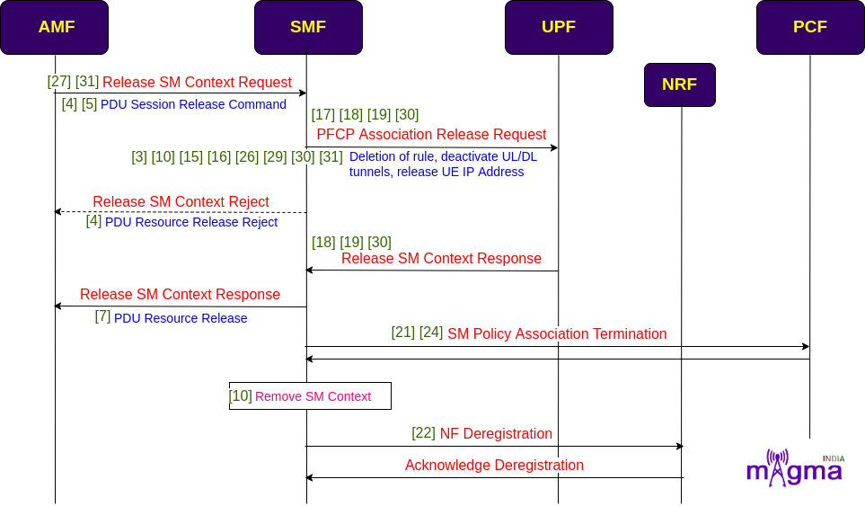
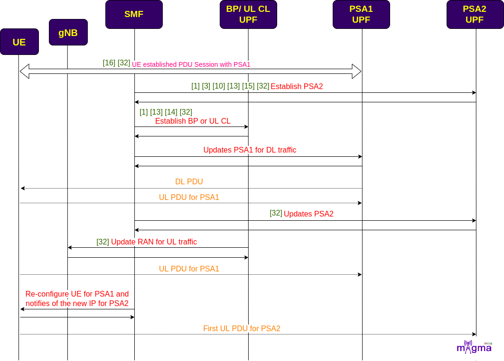

Session Management Function `[1] <https://github.com/free5gc/smf/tree/de70bf6cffa14eae582373e5010c8695dffb2f8d>`_
*********

.. image:: photos/smf.png
  :align: center
  :alt: Alternative text

SMF is a Control Plane(CP) function that manages the session-related context with the UPF. It creates, updates, and removes sessions. It also allocates the IP addresses to each PDU session. SMF provides all the session parameters and supports the functions of UPF. SMF functions are collectively performed by MME, SGW-U, and PGW-U in the 4G System. This NF enables CUPS(Control and User Plane Separation) which decentralized the control plane and data forwarding components of the 4G System. It obtained all the rules and policies from the PCF through the N7 interface and routed them to UPF to execute them in the respective sessions.

Protocols
=======

PFCP `[2] <https://github.com/free5gc/smf/tree/de70bf6cffa14eae582373e5010c8695dffb2f8d/internal/pfcp>`_
-------

Any kind of communication between SMF and UPF is managed by the PFCP(Packet Forwarding Control Protocol). It is one of the main protocols that separates the User Plane and Control Plane.

UDP `[3] <https://github.com/free5gc/smf/tree/de70bf6cffa14eae582373e5010c8695dffb2f8d/internal/pfcp/udp>`_
-------

User Datagram Protocol is a transport layer protocol, providing source and destination port addressing for the multiplexing/demultiplexing of higher-layer applications. This is the protocol responsible for the data transmission between gNB and UPF.

SBI(Service-based Interface) `[4] <https://github.com/free5gc/smf/tree/de70bf6cffa14eae582373e5010c8695dffb2f8d/internal/sbi>`_
-------

Service-Based Interface is the API-based communication between network functions.

Call Flow
=======

Session Establishment
-------

* At first, SMF registers with the NRF to locate the other Network Functions in the network. If the user wants to access 5G data facilities, it has to setup a PDU session with the network. UE sends PDU session establishment requests to the Core Network i.e. to the AMF. Then, AMF chooses the best SMF in the network to maintain its session-related information. 

* After selecting the best SMF, it requests the SMF to create an SM context. SMF retrieves SM subscription data from the UDM and generates an SM context. After that, SMF starts the PFCP session establishment procedure with the UPF and setup default values for session-related parameters. Then, SMF sends the session information to the gNB and UE via AMF to establish default PDU Session values. 

.. image:: photos/sessionEstablishment.png
  :alt: Alternative text

- `[22] <https://github.com/free5gc/smf/blob/de70bf6cffa14eae582373e5010c8695dffb2f8d/internal/sbi/consumer/nnrf.go>`_ Send NF Registration
- `[22] <https://github.com/free5gc/smf/blob/de70bf6cffa14eae582373e5010c8695dffb2f8d/internal/sbi/consumer/nnrf.go>`_ Retry Send NF Registration
- `[6] <https://github.com/free5gc/smf/blob/de70bf6cffa14eae582373e5010c8695dffb2f8d/internal/context/nf_profile.go>`_ Setup NF Profile

- `[22] <https://github.com/free5gc/smf/blob/de70bf6cffa14eae582373e5010c8695dffb2f8d/internal/sbi/consumer/nnrf.go>`_ Send NF Discovery Serving AMF
 
- `[5] <https://github.com/free5gc/smf/blob/de70bf6cffa14eae582373e5010c8695dffb2f8d/internal/context/gsm_handler.go>`_ Handle PDU Session Establishment Request
 
- `[4] <https://github.com/free5gc/smf/blob/de70bf6cffa14eae582373e5010c8695dffb2f8d/internal/context/gsm_build.go>`_ Build GSM PDU Session Establishment Reject
- `[30] <https://github.com/free5gc/smf/blob/de70bf6cffa14eae582373e5010c8695dffb2f8d/internal/sbi/producer/datapath.go>`_ Send PDU Session Establishment Reject
 
- `[28] <https://github.com/free5gc/smf/blob/de70bf6cffa14eae582373e5010c8695dffb2f8d/internal/sbi/pdusession/api_sm_contexts_collection.go>`_ HTTP Post SM Contexts - receive Create SM Context
- `[31] <https://github.com/free5gc/smf/blob/de70bf6cffa14eae582373e5010c8695dffb2f8d/internal/sbi/producer/pdu_session.go>`_ Handle PDU Session SM Context Create
 
- `[22] <https://github.com/free5gc/smf/blob/de70bf6cffa14eae582373e5010c8695dffb2f8d/internal/sbi/consumer/nnrf.go>`_ Send NF Discovery UDM
- `[27] <https://github.com/free5gc/smf/blob/de70bf6cffa14eae582373e5010c8695dffb2f8d/internal/sbi/pdusession/api_individual_sm_context.go>`_ Retrieve SM Context
- `[10] <https://github.com/free5gc/smf/blob/de70bf6cffa14eae582373e5010c8695dffb2f8d/internal/context/sm_context.go>`_ Build/Set Created Data 
- `[2] <https://github.com/free5gc/smf/blob/de70bf6cffa14eae582373e5010c8695dffb2f8d/internal/context/context.go>`_ Initialize SMF Context
- `[2] <https://github.com/free5gc/smf/blob/de70bf6cffa14eae582373e5010c8695dffb2f8d/internal/context/context.go>`_ Retrieve DNN Information
 
- `[4] <https://github.com/free5gc/smf/blob/de70bf6cffa14eae582373e5010c8695dffb2f8d/internal/context/gsm_build.go>`_ Build GSM PDU Session Establishment Accept
 
- `[22] <https://github.com/free5gc/smf/blob/de70bf6cffa14eae582373e5010c8695dffb2f8d/internal/sbi/consumer/nnrf.go>`_ Send NF Discovery PCF
- `[10] <https://github.com/free5gc/smf/blob/de70bf6cffa14eae582373e5010c8695dffb2f8d/internal/context/sm_context.go>`_ PCF Selection
 
- `[24] <https://github.com/free5gc/smf/blob/de70bf6cffa14eae582373e5010c8695dffb2f8d/internal/sbi/consumer/sm_policy.go>`_ Send SM Policy Association Create
- `[29] <https://github.com/free5gc/smf/blob/de70bf6cffa14eae582373e5010c8695dffb2f8d/internal/sbi/producer/callback.go>`_ Apply SM Policy From Decision
 
- `[16] <https://github.com/free5gc/smf/blob/de70bf6cffa14eae582373e5010c8695dffb2f8d/internal/context/user_plane_information.go>`_ create UPF List For Selection
- `[16] <https://github.com/free5gc/smf/blob/de70bf6cffa14eae582373e5010c8695dffb2f8d/internal/context/user_plane_information.go>`_ Sort UPF List By Name
- `[16] <https://github.com/free5gc/smf/blob/de70bf6cffa14eae582373e5010c8695dffb2f8d/internal/context/user_plane_information.go>`_ Select UPF And Allocate UE IP
- `[15] <https://github.com/free5gc/smf/blob/de70bf6cffa14eae582373e5010c8695dffb2f8d/internal/context/upf.go>`_ Select UPF By DNN
- `[16] <https://github.com/free5gc/smf/blob/de70bf6cffa14eae582373e5010c8695dffb2f8d/internal/context/user_plane_information.go>`_ Get UPF Name By IP
- `[16] <https://github.com/free5gc/smf/blob/de70bf6cffa14eae582373e5010c8695dffb2f8d/internal/context/user_plane_information.go>`_ Get UPF Node ID By Name
- `[16] <https://github.com/free5gc/smf/blob/de70bf6cffa14eae582373e5010c8695dffb2f8d/internal/context/user_plane_information.go>`_ Get UPF Node By IP
- `[16] <https://github.com/free5gc/smf/blob/de70bf6cffa14eae582373e5010c8695dffb2f8d/internal/context/user_plane_information.go>`_ Get UPF ID By IP
 
- `[18] <https://github.com/free5gc/smf/blob/de70bf6cffa14eae582373e5010c8695dffb2f8d/internal/pfcp/message/build.go>`_ Build PFCP Association Setup Request
- `[17] <https://github.com/free5gc/smf/blob/de70bf6cffa14eae582373e5010c8695dffb2f8d/internal/pfcp/handler/handler.go>`_ Handle PFCP Association Setup Request
- `[19] <https://github.com/free5gc/smf/blob/de70bf6cffa14eae582373e5010c8695dffb2f8d/internal/pfcp/message/send.go>`_ Send PFCP Association Setup Request
 
- `[18] <https://github.com/free5gc/smf/blob/de70bf6cffa14eae582373e5010c8695dffb2f8d/internal/pfcp/message/build.go>`_ Build PFCP Session Establishment Request
- `[19] <https://github.com/free5gc/smf/blob/de70bf6cffa14eae582373e5010c8695dffb2f8d/internal/pfcp/message/send.go>`_ Send PFCP Session Establishment Request
- `[20] <https://github.com/free5gc/smf/blob/de70bf6cffa14eae582373e5010c8695dffb2f8d/internal/pfcp/udp/udp.go>`_ Send PFCP Request
 
- `[18] <https://github.com/free5gc/smf/blob/de70bf6cffa14eae582373e5010c8695dffb2f8d/internal/pfcp/message/build.go>`_ PFCP creates PDR, FAR, QER, BAR
- `[10] <https://github.com/free5gc/smf/blob/de70bf6cffa14eae582373e5010c8695dffb2f8d/internal/context/sm_context.go>`_ Put PDR to PFCP Session
 
- `[13] <https://github.com/free5gc/smf/blob/de70bf6cffa14eae582373e5010c8695dffb2f8d/internal/context/ue_defaultPath.go>`_ `[16] <https://github.com/free5gc/smf/blob/de70bf6cffa14eae582373e5010c8695dffb2f8d/internal/context/user_plane_information.go>`_ Generate Default Data Path
 
- `[16] <https://github.com/free5gc/smf/blob/de70bf6cffa14eae582373e5010c8695dffb2f8d/internal/context/user_plane_information.go>`_ Generate Data Path
- `[15] <https://github.com/free5gc/smf/blob/de70bf6cffa14eae582373e5010c8695dffb2f8d/internal/context/upf.go>`_ Add Data Path
- `[15] <https://github.com/free5gc/smf/blob/de70bf6cffa14eae582373e5010c8695dffb2f8d/internal/context/upf.go>`_ Generate TEID
- `[2] <https://github.com/free5gc/smf/blob/de70bf6cffa14eae582373e5010c8695dffb2f8d/internal/context/context.go>`_ `[10] <https://github.com/free5gc/smf/blob/de70bf6cffa14eae582373e5010c8695dffb2f8d/internal/context/sm_context.go>`_ Allocate Local SEID
 
- `[10] <https://github.com/free5gc/smf/blob/de70bf6cffa14eae582373e5010c8695dffb2f8d/internal/context/sm_context.go>`_ Select Session Rule
 
- `[15] <https://github.com/free5gc/smf/blob/de70bf6cffa14eae582373e5010c8695dffb2f8d/internal/context/upf.go>`_ Select UPF parameters 
- `[15] <https://github.com/free5gc/smf/blob/de70bf6cffa14eae582373e5010c8695dffb2f8d/internal/context/upf.go>`_ Add PDR, FDR, BAR, QER
- `[29] <https://github.com/free5gc/smf/blob/de70bf6cffa14eae582373e5010c8695dffb2f8d/internal/sbi/producer/callback.go>`_ Handle session rules
 
- `[3] <https://github.com/free5gc/smf/blob/de70bf6cffa14eae582373e5010c8695dffb2f8d/internal/context/datapath.go>`_ Activate Tunnel And PDR
- `[3] <https://github.com/free5gc/smf/blob/de70bf6cffa14eae582373e5010c8695dffb2f8d/internal/context/datapath.go>`_ Activate UL/DL Tunnel
- `[16] <https://github.com/free5gc/smf/blob/de70bf6cffa14eae582373e5010c8695dffb2f8d/internal/context/user_plane_information.go>`_ Select UP Path Source
 
- `[30] <https://github.com/free5gc/smf/blob/de70bf6cffa14eae582373e5010c8695dffb2f8d/internal/sbi/producer/datapath.go>`_ Activate UPF Session 
 
- `[30] <https://github.com/free5gc/smf/blob/de70bf6cffa14eae582373e5010c8695dffb2f8d/internal/sbi/producer/datapath.go>`_ Establish PFCP Session
 
- `[18] <https://github.com/free5gc/smf/blob/de70bf6cffa14eae582373e5010c8695dffb2f8d/internal/pfcp/message/build.go>`_ Build PFCP Session Establishment Response
- `[19] <https://github.com/free5gc/smf/blob/de70bf6cffa14eae582373e5010c8695dffb2f8d/internal/pfcp/message/send.go>`_ Send PFCP Session Establishment Response
- `[20] <https://github.com/free5gc/smf/blob/de70bf6cffa14eae582373e5010c8695dffb2f8d/internal/pfcp/udp/udp.go>`_ Send PFCP Response
- `[18] <https://github.com/free5gc/smf/blob/de70bf6cffa14eae582373e5010c8695dffb2f8d/internal/pfcp/message/build.go>`_ Build PFCP Association Setup Response
- `[19] <https://github.com/free5gc/smf/blob/de70bf6cffa14eae582373e5010c8695dffb2f8d/internal/pfcp/message/send.go>`_ Send PFCP Association Setup Response
 
- `[2] <https://github.com/free5gc/smf/blob/de70bf6cffa14eae582373e5010c8695dffb2f8d/internal/context/context.go>`_ Get User Plane Information
- `[16] <https://github.com/free5gc/smf/blob/de70bf6cffa14eae582373e5010c8695dffb2f8d/internal/context/user_plane_information.go>`_ Get Default User Plane Path By DNN And UPF
- `[3] <https://github.com/free5gc/smf/blob/de70bf6cffa14eae582373e5010c8695dffb2f8d/internal/context/datapath.go>`_ Get UPF ID, Node IP, UL PDR, UL FAR
- `[3] <https://github.com/free5gc/smf/blob/de70bf6cffa14eae582373e5010c8695dffb2f8d/internal/context/datapath.go>`_ Copy First Data Path Node
 
- `[25] <https://github.com/free5gc/smf/blob/de70bf6cffa14eae582373e5010c8695dffb2f8d/internal/sbi/oam/api_get_ue_pdu_session_info.go>`_ HTTP Get UE PDU Session Info
- `[15] <https://github.com/free5gc/smf/blob/de70bf6cffa14eae582373e5010c8695dffb2f8d/internal/context/upf.go>`_ Get Interface to get UPF interface info
- `[15] <https://github.com/free5gc/smf/blob/de70bf6cffa14eae582373e5010c8695dffb2f8d/internal/context/upf.go>`_ Retrieve UPF Node By Node ID
- `[15] <https://github.com/free5gc/smf/blob/de70bf6cffa14eae582373e5010c8695dffb2f8d/internal/context/upf.go>`_ Get UPF IP, ID, PDR ID, FAR ID, BAR ID, QER ID
 
- `[2] <https://github.com/free5gc/smf/blob/de70bf6cffa14eae582373e5010c8695dffb2f8d/internal/context/context.go>`_ Get UE Default Path Pool
 
- `[30] <https://github.com/free5gc/smf/blob/de70bf6cffa14eae582373e5010c8695dffb2f8d/internal/sbi/producer/datapath.go>`_ Notify UE - send all datapaths to UPFs and send results to UE
 
- `[10] <https://github.com/free5gc/smf/blob/de70bf6cffa14eae582373e5010c8695dffb2f8d/internal/context/sm_context.go>`_ PDU Address To NAS
- `[12] <https://github.com/free5gc/smf/blob/de70bf6cffa14eae582373e5010c8695dffb2f8d/internal/context/ue_datapath.go>`_ New UE Data Path Node
- `[2] <https://github.com/free5gc/smf/blob/de70bf6cffa14eae582373e5010c8695dffb2f8d/internal/context/context.go>`_ Initialize SMF UE Routing
 
- `[7] <https://github.com/free5gc/smf/blob/de70bf6cffa14eae582373e5010c8695dffb2f8d/internal/context/ngap_build.go>`_ Build PDU Session Resource Setup Request Transfer 
- `[8] <https://github.com/free5gc/smf/blob/de70bf6cffa14eae582373e5010c8695dffb2f8d/internal/context/ngap_handler.go>`_ Handle PDU Session Resource Setup Unsuccessful Transfer
- `[8] <https://github.com/free5gc/smf/blob/de70bf6cffa14eae582373e5010c8695dffb2f8d/internal/context/ngap_handler.go>`_ Handle PDU Session Resource Setup Response Transfer

Session Modification
-------

* AMF keeps tracking whether sessions are working properly or not, in order to do so, it performs a heartbeat procedure with the SMF. UPF keeps updating the session-related changes at SMF by initializing PFCP Session Report procedure at some intervals.

* On the first data transmission, AMF update the session management context to the SMF. SMF then sent a session modification request to the UPF and registered the modified session context to the UDM. On the completion of session modification, SMF sends a confirmation response and also notifies SM context status to the AMF. The response message also contains the necessary parameters to update the session information at the gNB and UE. 

.. image:: photos/sessionModification.png
  :alt: Alternative text

- `[17] <https://github.com/free5gc/smf/blob/de70bf6cffa14eae582373e5010c8695dffb2f8d/internal/pfcp/handler/handler.go>`_ Handle PFCP Heartbeat Request
- `[19] <https://github.com/free5gc/smf/blob/de70bf6cffa14eae582373e5010c8695dffb2f8d/internal/pfcp/message/send.go>`_ Send Heartbeat Response

- `[17] <https://github.com/free5gc/smf/blob/de70bf6cffa14eae582373e5010c8695dffb2f8d/internal/pfcp/handler/handler.go>`_ Handle PFCP Session Report Request
- `[18] <https://github.com/free5gc/smf/blob/de70bf6cffa14eae582373e5010c8695dffb2f8d/internal/pfcp/message/build.go>`_ Build PFCP Session Report Response
- `[19] <https://github.com/free5gc/smf/blob/de70bf6cffa14eae582373e5010c8695dffb2f8d/internal/pfcp/message/send.go>`_ Send PFCP Session Report Response
- `[17] <https://github.com/free5gc/smf/blob/de70bf6cffa14eae582373e5010c8695dffb2f8d/internal/pfcp/handler/handler.go>`_ Handle PFCP Management Request
 
- `[27] <https://github.com/free5gc/smf/blob/de70bf6cffa14eae582373e5010c8695dffb2f8d/internal/sbi/pdusession/api_individual_sm_context.go>`_ HTTP Update SM Context
 
- `[31] <https://github.com/free5gc/smf/blob/de70bf6cffa14eae582373e5010c8695dffb2f8d/internal/sbi/producer/pdu_session.go>`_ Handle PDU Session SM Context Update
- `[31] <https://github.com/free5gc/smf/blob/de70bf6cffa14eae582373e5010c8695dffb2f8d/internal/sbi/producer/pdu_session.go>`_ Handle PDU Session SM Context Local Release - check duplicate SM context
 
- `[6] <https://github.com/free5gc/smf/blob/de70bf6cffa14eae582373e5010c8695dffb2f8d/internal/context/nf_profile.go>`_ S-NSSAI SMF Info
 
- `[17] <https://github.com/free5gc/smf/blob/de70bf6cffa14eae582373e5010c8695dffb2f8d/internal/pfcp/handler/handler.go>`_ Handle PFCP Association Update Request
- `[18] <https://github.com/free5gc/smf/blob/de70bf6cffa14eae582373e5010c8695dffb2f8d/internal/pfcp/message/build.go>`_ Build PFCP Session Modification Request
- `[19] <https://github.com/free5gc/smf/blob/de70bf6cffa14eae582373e5010c8695dffb2f8d/internal/pfcp/message/send.go>`_ Send PFCP Session Modification Request
 
- `[30] <https://github.com/free5gc/smf/blob/de70bf6cffa14eae582373e5010c8695dffb2f8d/internal/sbi/producer/datapath.go>`_ Update AN UPF PFCP Session Request
- `[30] <https://github.com/free5gc/smf/blob/de70bf6cffa14eae582373e5010c8695dffb2f8d/internal/sbi/producer/datapath.go>`_ Modify Existing PFCP Session
- `[18] <https://github.com/free5gc/smf/blob/de70bf6cffa14eae582373e5010c8695dffb2f8d/internal/pfcp/message/build.go>`_ Update PDR, FAR, QER, BAR
- `[9] <https://github.com/free5gc/smf/blob/de70bf6cffa14eae582373e5010c8695dffb2f8d/internal/context/pcc_rule.go>`_ New PCC Rule From Model
 
- `[29] <https://github.com/free5gc/smf/blob/de70bf6cffa14eae582373e5010c8695dffb2f8d/internal/sbi/producer/callback.go>`_ Handle modification session rule 
- `[30] <https://github.com/free5gc/smf/blob/de70bf6cffa14eae582373e5010c8695dffb2f8d/internal/sbi/producer/datapath.go>`_ Update AN UPF PFCP Session Response
 
- `[15] <https://github.com/free5gc/smf/blob/de70bf6cffa14eae582373e5010c8695dffb2f8d/internal/context/upf.go>`_ New UP Tunnel
 
- `[4] <https://github.com/free5gc/smf/blob/de70bf6cffa14eae582373e5010c8695dffb2f8d/internal/context/gsm_build.go>`_ Build GSM PDU Session Modification Command
- `[26] <https://github.com/free5gc/smf/blob/de70bf6cffa14eae582373e5010c8695dffb2f8d/internal/sbi/pdusession/api_individual_pdu_session_hsmf.go>`_ Update PDU Session
 
- `[19] <https://github.com/free5gc/smf/blob/de70bf6cffa14eae582373e5010c8695dffb2f8d/internal/pfcp/message/send.go>`_ Send PFCP Session Modification Response
- `[18] <https://github.com/free5gc/smf/blob/de70bf6cffa14eae582373e5010c8695dffb2f8d/internal/pfcp/message/build.go>`_ Build PFCP Session Modification Response
 
- `[10] <https://github.com/free5gc/smf/blob/de70bf6cffa14eae582373e5010c8695dffb2f8d/internal/context/sm_context.go>`_ New SM Context added in the pool
 
- `[23] <https://github.com/free5gc/smf/blob/de70bf6cffa14eae582373e5010c8695dffb2f8d/internal/sbi/consumer/nsmf_pdusession_callback.go>`_ Send SM Context Status Notification 
 
- `[12] <https://github.com/free5gc/smf/blob/de70bf6cffa14eae582373e5010c8695dffb2f8d/internal/context/ue_datapath.go>`_ Add New UE Pre Config Paths
- `[13] <https://github.com/free5gc/smf/blob/de70bf6cffa14eae582373e5010c8695dffb2f8d/internal/context/ue_defaultPath.go>`_ Create New UE Default Paths
- `[15] <https://github.com/free5gc/smf/blob/de70bf6cffa14eae582373e5010c8695dffb2f8d/internal/context/upf.go>`_ Update AN Information
 
- `[21] <https://github.com/free5gc/smf/blob/de70bf6cffa14eae582373e5010c8695dffb2f8d/internal/sbi/callback/api_default.go>`_ HTTP SM Policy Update Notification
- `[29] <https://github.com/free5gc/smf/blob/de70bf6cffa14eae582373e5010c8695dffb2f8d/internal/sbi/producer/callback.go>`_ Handle SM Policy Update Notify

Session Release
-------

* During deregistration, AMF requests for the release of SM context from the SMF. On receiving the request, SMF initiates a session release procedure with the UPF. After the deletion of the session, SMF sends a session release response to the AMF along with the release command of session-related parameters and resources at the UE and gNB levels.  

* SMF afterward releases the SM policy associated with the session and then removes the SM context on its completion. After completely disconnecting from each function, it deregisters with the network.

- `[27] <https://github.com/free5gc/smf/blob/de70bf6cffa14eae582373e5010c8695dffb2f8d/internal/sbi/pdusession/api_individual_sm_context.go>`_ HTTP Release SM Context
- `[31] <https://github.com/free5gc/smf/blob/de70bf6cffa14eae582373e5010c8695dffb2f8d/internal/sbi/producer/pdu_session.go>`_ Handle PDU Session SM Context Release

- `[5] <https://github.com/free5gc/smf/blob/de70bf6cffa14eae582373e5010c8695dffb2f8d/internal/context/gsm_handler.go>`_ Handle PDU Session Release Request
- `[4] <https://github.com/free5gc/smf/blob/de70bf6cffa14eae582373e5010c8695dffb2f8d/internal/context/gsm_build.go>`_ Build GSM PDU Session Release Command
 
- `[18] <https://github.com/free5gc/smf/blob/de70bf6cffa14eae582373e5010c8695dffb2f8d/internal/pfcp/message/build.go>`_ Build PFCP Association Release Request
- `[19] <https://github.com/free5gc/smf/blob/de70bf6cffa14eae582373e5010c8695dffb2f8d/internal/pfcp/message/send.go>`_ Send PFCP Association Release Request
 
- `[18] <https://github.com/free5gc/smf/blob/de70bf6cffa14eae582373e5010c8695dffb2f8d/internal/pfcp/message/build.go>`_ Build PFCP Session Deletion Request
- `[19] <https://github.com/free5gc/smf/blob/de70bf6cffa14eae582373e5010c8695dffb2f8d/internal/pfcp/message/send.go>`_ `[30] <https://github.com/free5gc/smf/blob/de70bf6cffa14eae582373e5010c8695dffb2f8d/internal/sbi/producer/datapath.go>`_  Send PFCP Session Deletion Request
 
- `[17] <https://github.com/free5gc/smf/blob/de70bf6cffa14eae582373e5010c8695dffb2f8d/internal/pfcp/handler/handler.go>`_ Handle PFCP Session Set Deletion Request
 
- `[29] <https://github.com/free5gc/smf/blob/de70bf6cffa14eae582373e5010c8695dffb2f8d/internal/sbi/producer/callback.go>`_ Handle deletion of session rule 
- `[10] <https://github.com/free5gc/smf/blob/de70bf6cffa14eae582373e5010c8695dffb2f8d/internal/context/sm_context.go>`_ Remove PDR from PFCP Session
- `[15] <https://github.com/free5gc/smf/blob/de70bf6cffa14eae582373e5010c8695dffb2f8d/internal/context/upf.go>`_ Remove PDR, FAR, BAR, QER
 
- `[3] <https://github.com/free5gc/smf/blob/de70bf6cffa14eae582373e5010c8695dffb2f8d/internal/context/datapath.go>`_ Deactivate UL/DL Tunnel
- `[30] <https://github.com/free5gc/smf/blob/de70bf6cffa14eae582373e5010c8695dffb2f8d/internal/sbi/producer/datapath.go>`_ ReleaseTunnel
- `[15] <https://github.com/free5gc/smf/blob/de70bf6cffa14eae582373e5010c8695dffb2f8d/internal/context/upf.go>`_ Remove UPF Node By Node ID
 
- `[16] <https://github.com/free5gc/smf/blob/de70bf6cffa14eae582373e5010c8695dffb2f8d/internal/context/user_plane_information.go>`_ Release UE IP Address from UPF
- `[26] <https://github.com/free5gc/smf/blob/de70bf6cffa14eae582373e5010c8695dffb2f8d/internal/sbi/pdusession/api_individual_pdu_session_hsmf.go>`_ `[31] <https://github.com/free5gc/smf/blob/de70bf6cffa14eae582373e5010c8695dffb2f8d/internal/sbi/producer/pdu_session.go>`_  Release PDU Session
 
- `[4] <https://github.com/free5gc/smf/blob/de70bf6cffa14eae582373e5010c8695dffb2f8d/internal/context/gsm_build.go>`_ Build GSM PDU Session Release Reject
 
- `[18] <https://github.com/free5gc/smf/blob/de70bf6cffa14eae582373e5010c8695dffb2f8d/internal/pfcp/message/build.go>`_ Build PFCP Session Deletion Response
- `[19] <https://github.com/free5gc/smf/blob/de70bf6cffa14eae582373e5010c8695dffb2f8d/internal/pfcp/message/send.go>`_ `[30] <https://github.com/free5gc/smf/blob/de70bf6cffa14eae582373e5010c8695dffb2f8d/internal/sbi/producer/datapath.go>`_ Send PFCP Session Deletion Response
 
- `[18] <https://github.com/free5gc/smf/blob/de70bf6cffa14eae582373e5010c8695dffb2f8d/internal/pfcp/message/build.go>`_ Build PFCP Association Release Response
- `[19] <https://github.com/free5gc/smf/blob/de70bf6cffa14eae582373e5010c8695dffb2f8d/internal/pfcp/message/send.go>`_ Send PFCP Association Release Response
 
- `[7] <https://github.com/free5gc/smf/blob/de70bf6cffa14eae582373e5010c8695dffb2f8d/internal/context/ngap_build.go>`_ Build PDU Session Resource Release Command Transfer 
 
- `[21] <https://github.com/free5gc/smf/blob/de70bf6cffa14eae582373e5010c8695dffb2f8d/internal/sbi/callback/api_default.go>`_ SM Policy Control Termination Request Notification
- `[24] <https://github.com/free5gc/smf/blob/de70bf6cffa14eae582373e5010c8695dffb2f8d/internal/sbi/consumer/sm_policy.go>`_ Send SM Policy AssociationTermination
 
- `[10] <https://github.com/free5gc/smf/blob/de70bf6cffa14eae582373e5010c8695dffb2f8d/internal/context/sm_context.go>`_ Remove SM Context
 
- `[22] <https://github.com/free5gc/smf/blob/de70bf6cffa14eae582373e5010c8695dffb2f8d/internal/sbi/consumer/nnrf.go>`_ Send NF Deregistration
- `[22] <https://github.com/free5gc/smf/blob/de70bf6cffa14eae582373e5010c8695dffb2f8d/internal/sbi/consumer/nnrf.go>`_ Send Deregister NF Instance

Addition of additional PSA and BP or UL CL 
-------

.. image:: photos/PSAinterface.png
  :alt: Alternative text

* UE first establish PDU Session with a UPF, which is capable of performing as PSA(PDU Session Anchor), lets call it UPF PSA1. At some point, there is need to selects another UPF(UPF PSA2) for example, due to UE mobility. SMF selects one more UPF and establish the BP(Branching Point) or UL CL(Uplink Classifier) for PDU Session. It forwards the necessary UL rules towards PSA1 and PSA2. 

* UL CL or BP is added to route the traffic towards the corresponding PSA1 and PSA2 in case of DL. SMF then updates the PSA1, and PSA2 and provides the BP or UL CL Core Network Tunnel info fo the DL traffic. SMF sends N2 SM information over N11 interface and provide new CN tunnel info corresponding to the UPF(BP or UL CL). SMF then notifies the availability of the new IP prefix and sends UE reconfiguration message.

- `[16] <https://github.com/free5gc/smf/blob/de70bf6cffa14eae582373e5010c8695dffb2f8d/internal/context/user_plane_information.go>`_ Select Anchor UPF
- `[32] <https://github.com/free5gc/smf/blob/de70bf6cffa14eae582373e5010c8695dffb2f8d/internal/sbi/producer/ulcl_procedure.go>`_ Add PDU Session Anchor 
 
- `[1] <https://github.com/free5gc/smf/blob/de70bf6cffa14eae582373e5010c8695dffb2f8d/internal/context/bp_manager.go>`_ Select PSA2
- `[10] <https://github.com/free5gc/smf/blob/de70bf6cffa14eae582373e5010c8695dffb2f8d/internal/context/sm_context.go>`_ Allocate Local SEID For Data Path
- `[3] <https://github.com/free5gc/smf/blob/de70bf6cffa14eae582373e5010c8695dffb2f8d/internal/context/datapath.go>`_ Activate Tunnel And PDR
- `[32] <https://github.com/free5gc/smf/blob/de70bf6cffa14eae582373e5010c8695dffb2f8d/internal/sbi/producer/ulcl_procedure.go>`_ Establish PSA 2
- `[15] <https://github.com/free5gc/smf/blob/de70bf6cffa14eae582373e5010c8695dffb2f8d/internal/context/upf.go>`_ New UPF returns a new UPF context in SMF
- `[13] <https://github.com/free5gc/smf/blob/de70bf6cffa14eae582373e5010c8695dffb2f8d/internal/context/ue_defaultPath.go>`_ Extract Anchor UPF For UL CL
 
- `[1] <https://github.com/free5gc/smf/blob/de70bf6cffa14eae582373e5010c8695dffb2f8d/internal/context/bp_manager.go>`_ Find UL CL 
- `[14] <https://github.com/free5gc/smf/blob/de70bf6cffa14eae582373e5010c8695dffb2f8d/internal/context/ulcl_group.go>`_ Get UL CL Group Name From SUPI
- `[13] <https://github.com/free5gc/smf/blob/de70bf6cffa14eae582373e5010c8695dffb2f8d/internal/context/ue_defaultPath.go>`_ Create UPF List For Selection UL CL
- `[32] <https://github.com/free5gc/smf/blob/de70bf6cffa14eae582373e5010c8695dffb2f8d/internal/sbi/producer/ulcl_procedure.go>`_ Add UL CL
- `[32] <https://github.com/free5gc/smf/blob/de70bf6cffa14eae582373e5010c8695dffb2f8d/internal/sbi/producer/ulcl_procedure.go>`_ Establish UL CL
- `[13] <https://github.com/free5gc/smf/blob/de70bf6cffa14eae582373e5010c8695dffb2f8d/internal/context/ue_defaultPath.go>`_ Select UPF For UL CL
- `[13] <https://github.com/free5gc/smf/blob/de70bf6cffa14eae582373e5010c8695dffb2f8d/internal/context/ue_defaultPath.go>`_ Allocate UE IP For UL CL
 
- `[32] <https://github.com/free5gc/smf/blob/de70bf6cffa14eae582373e5010c8695dffb2f8d/internal/sbi/producer/ulcl_procedure.go>`_ Update PSA 2 DownLink
 
- `[32] <https://github.com/free5gc/smf/blob/de70bf6cffa14eae582373e5010c8695dffb2f8d/internal/sbi/producer/ulcl_procedure.go>`_ Update RAN And I-UPF UpLink
- `[32] <https://github.com/free5gc/smf/blob/de70bf6cffa14eae582373e5010c8695dffb2f8d/internal/sbi/producer/ulcl_procedure.go>`_ Establish RAN Tunnel Info
 
Handover Procedure
-------

* When UE enters a new cell, gNB starts a handover procedure. During Handover, a session transfer request is sent to the SMF by the AMF, if the user is accessing 5G Data Plane resources. SMF then sends a path switch setup request to the UPF to divert the session tunnels to the target gNB.

.. image:: photos/handover.png
  :alt: Alternative text

- `[8] <https://github.com/free5gc/smf/blob/de70bf6cffa14eae582373e5010c8695dffb2f8d/internal/context/ngap_handler.go>`_ Handle Handover Required Transfer 
- `[7] <https://github.com/free5gc/smf/blob/de70bf6cffa14eae582373e5010c8695dffb2f8d/internal/context/ngap_build.go>`_ Build Handover Command Transfer 
- `[8] <https://github.com/free5gc/smf/blob/de70bf6cffa14eae582373e5010c8695dffb2f8d/internal/context/ngap_handler.go>`_ Handle Handover Request Acknowledge Transfer

- `[8] <https://github.com/free5gc/smf/blob/de70bf6cffa14eae582373e5010c8695dffb2f8d/internal/context/ngap_handler.go>`_ Handle Path Switch Request Setup Failed Transfer
- `[7] <https://github.com/free5gc/smf/blob/de70bf6cffa14eae582373e5010c8695dffb2f8d/internal/context/ngap_build.go>`_ Build Path Switch Request Unsuccessful Transfer 
- `[8] <https://github.com/free5gc/smf/blob/de70bf6cffa14eae582373e5010c8695dffb2f8d/internal/context/ngap_handler.go>`_ Handle Path Switch Request Transfer
- `[7] <https://github.com/free5gc/smf/blob/de70bf6cffa14eae582373e5010c8695dffb2f8d/internal/context/ngap_build.go>`_ Build Path Switch Request Acknowledge Transfer 