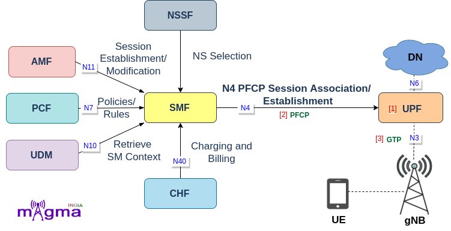
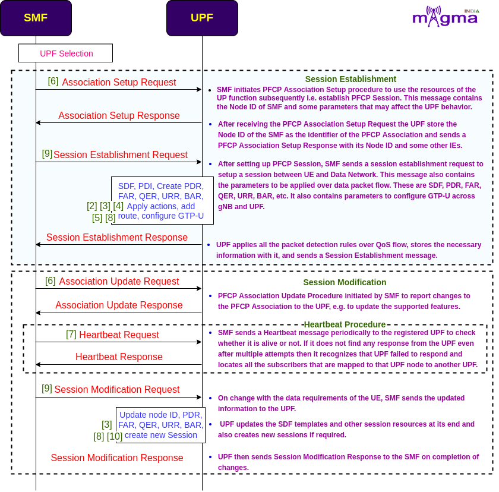
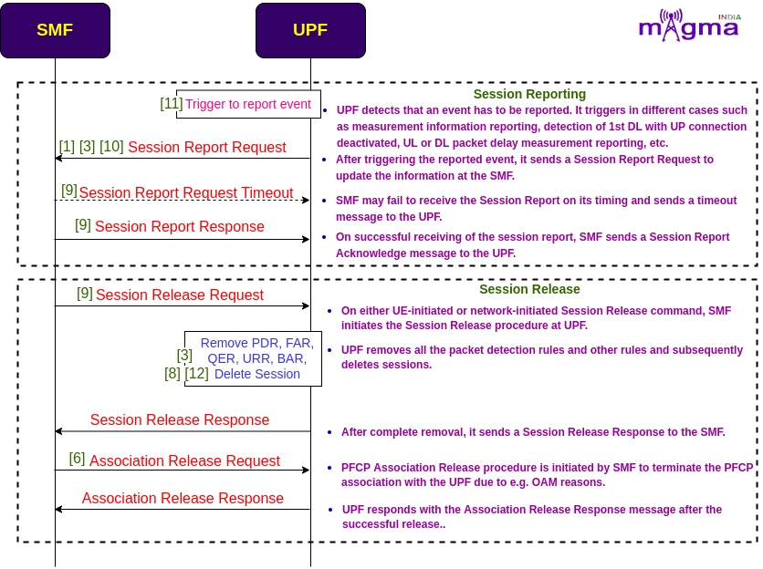

User Plane Function `[1] <https://github.com/free5gc/go-upf/tree/4972fffb016a092d569273d00c191a28d7afac26>`_
*********

The UPF (User Plane Function) is one of the most important NF(Network Function) of the 5G Core network. It is the second network function with which NR RAN interacts(during PDUs flow). UPF is the evolution of the CUPS(Control and User Plane Separation). It inspects, routes, and forwards the packets inside the QoS flows within the subscription policies. It also enforces the UL and DL traffic rules using SDF templates sent by the SMF over the N4 interface. It allocates or terminates the QoS Flows within the PDU Sessions when the corresponding services end.

Protocols
=======

PFCP `[2] <https://github.com/free5gc/go-upf/tree/4972fffb016a092d569273d00c191a28d7afac26/internal/pfcp>`_
-------

Any kind of communication between SMF and UPF is managed by the PFCP(Packet Forwarding Control Protocol). It is one of the main protocols that separates the User Plane and Control Plane.

GTP-U `[3] <https://github.com/free5gc/go-upf/tree/4972fffb016a092d569273d00c191a28d7afac26/internal/gtpv1>`_
-------

GTP-U is used to carry user plane data traffic between gNB and UPF.

User Plane Function `[1] <https://github.com/free5gc/go-upf/tree/4972fffb016a092d569273d00c191a28d7afac26>`_
*********

The UPF (User Plane Function) is one of the most important NF(Network Function) of the 5G Core network. It is the second network function with which NR RAN interacts(during PDUs flow). UPF is the evolution of the CUPS(Control and User Plane Separation). It inspects, routes, and forwards the packets inside the QoS flows within the subscription policies. It also enforces the UL and DL traffic rules using SDF templates sent by the SMF over the N4 interface. It allocates or terminates the QoS Flows within the PDU Sessions when the corresponding services end.

Protocols
=======

PFCP `[2] <https://github.com/free5gc/go-upf/tree/4972fffb016a092d569273d00c191a28d7afac26/internal/pfcp>`_
-------

Any kind of communication between SMF and UPF is managed by the PFCP(Packet Forwarding Control Protocol). It is one of the main protocols that separates the User Plane and Control Plane.

GTP-U `[3] <https://github.com/free5gc/go-upf/tree/4972fffb016a092d569273d00c191a28d7afac26/internal/gtpv1>`_
-------

Service-Based Interface is the API-based communication between network functions.

Call Flow
=======

- `[6] <https://github.com/free5gc/go-upf/blob/4972fffb016a092d569273d00c191a28d7afac26/internal/pfcp/association.go>`_ Handle Association Setup Request

- `[9] <https://github.com/free5gc/go-upf/blob/4972fffb016a092d569273d00c191a28d7afac26/internal/pfcp/session.go>`_ Handle Session Establishment Request
- `[3] <https://github.com/free5gc/go-upf/blob/4972fffb016a092d569273d00c191a28d7afac26/internal/forwarder/gtp5g.go>`_ New Flow Description
- `[3] <https://github.com/free5gc/go-upf/blob/4972fffb016a092d569273d00c191a28d7afac26/internal/forwarder/gtp5g.go>`_ New SDF Filter - filters flow description
- `[3] <https://github.com/free5gc/go-upf/blob/4972fffb016a092d569273d00c191a28d7afac26/internal/forwarder/gtp5g.go>`_ New PDI(Packet Detection Information)
- `[3] <https://github.com/free5gc/go-upf/blob/4972fffb016a092d569273d00c191a28d7afac26/internal/forwarder/gtp5g.go>`_ `[8] <https://github.com/free5gc/go-upf/blob/4972fffb016a092d569273d00c191a28d7afac26/internal/pfcp/node.go>`_ Create PDR, FAR, QER, URR, BAR
- `[3] <https://github.com/free5gc/go-upf/blob/4972fffb016a092d569273d00c191a28d7afac26/internal/forwarder/gtp5g.go>`_ New Forwarding Parameter
- `[3] <https://github.com/free5gc/go-upf/blob/4972fffb016a092d569273d00c191a28d7afac26/internal/forwarder/gtp5g.go>`_ Apply Action for forwarding, dropping, buffering
- `[3] <https://github.com/free5gc/go-upf/blob/4972fffb016a092d569273d00c191a28d7afac26/internal/forwarder/gtp5g.go>`_ Write Packet
- `[4] <https://github.com/free5gc/go-upf/blob/4972fffb016a092d569273d00c191a28d7afac26/internal/forwarder/gtp5glink.go>`_ Add route
- `[2] <https://github.com/free5gc/go-upf/blob/4972fffb016a092d569273d00c191a28d7afac26/internal/forwarder/driver.go>`_ NewDriver - Configure GTP-U
- `[5] <https://github.com/free5gc/go-upf/blob/4972fffb016a092d569273d00c191a28d7afac26/internal/gtpv1/msg.go>`_ Encode message
 
- `[6] <https://github.com/free5gc/go-upf/blob/4972fffb016a092d569273d00c191a28d7afac26/internal/pfcp/association.go>`_ Handle Association Update Request
 
- `[7] <https://github.com/free5gc/go-upf/blob/4972fffb016a092d569273d00c191a28d7afac26/internal/pfcp/heartbeat.go>`_ Handle Heartbeat Request
 
- `[9] <https://github.com/free5gc/go-upf/blob/4972fffb016a092d569273d00c191a28d7afac26/internal/pfcp/session.go>`_ Handle Session Modification Request
- `[10] <https://github.com/free5gc/go-upf/blob/4972fffb016a092d569273d00c191a28d7afac26/internal/pfcp/pfcp.go>`_ Update node ID
- `[3] <https://github.com/free5gc/go-upf/blob/4972fffb016a092d569273d00c191a28d7afac26/internal/forwarder/gtp5g.go>`_ `[8] <https://github.com/free5gc/go-upf/blob/4972fffb016a092d569273d00c191a28d7afac26/internal/pfcp/node.go>`_ Update PDR, FAR, QER, URR, BAR
- `[8] <https://github.com/free5gc/go-upf/blob/4972fffb016a092d569273d00c191a28d7afac26/internal/pfcp/node.go>`_ Create a new session

- `[11] <https://github.com/free5gc/go-upf/blob/4972fffb016a092d569273d00c191a28d7afac26/internal/pfcp/report.go>`_ Serve DL Data Report
- `[11] <https://github.com/free5gc/go-upf/blob/4972fffb016a092d569273d00c191a28d7afac26/internal/pfcp/report.go>`_ Serve session report

- `[3] <https://github.com/free5gc/go-upf/blob/4972fffb016a092d569273d00c191a28d7afac26/internal/forwarder/gtp5g.go>`_ Handle Report
- `[1] <https://github.com/free5gc/go-upf/blob/4972fffb016a092d569273d00c191a28d7afac26/internal/forwarder/buff/server_test.go>`_ `[10] <https://github.com/free5gc/go-upf/blob/4972fffb016a092d569273d00c191a28d7afac26/internal/pfcp/pfcp.go>`_ Notify Session Report
 
- `[9] <https://github.com/free5gc/go-upf/blob/4972fffb016a092d569273d00c191a28d7afac26/internal/pfcp/session.go>`_ Handle Session Report Request Timeout
 
- `[9] <https://github.com/free5gc/go-upf/blob/4972fffb016a092d569273d00c191a28d7afac26/internal/pfcp/session.go>`_ Handle Session Report Response
 
- `[9] <https://github.com/free5gc/go-upf/blob/4972fffb016a092d569273d00c191a28d7afac26/internal/pfcp/session.go>`_ Handle Session Deletion Request
 
- `[3] <https://github.com/free5gc/go-upf/blob/4972fffb016a092d569273d00c191a28d7afac26/internal/forwarder/gtp5g.go>`_ `[8] <https://github.com/free5gc/go-upf/blob/4972fffb016a092d569273d00c191a28d7afac26/internal/pfcp/node.go>`_ `[12] <https://github.com/free5gc/go-upf/blob/4972fffb016a092d569273d00c191a28d7afac26/internal/forwarder/empty.go>`_ Remove PDR, FAR, QER, URR, BAR
- `[8] <https://github.com/free5gc/go-upf/blob/4972fffb016a092d569273d00c191a28d7afac26/internal/pfcp/node.go>`_ Delete Session 
 
- `[6] <https://github.com/free5gc/go-upf/blob/4972fffb016a092d569273d00c191a28d7afac26/internal/pfcp/association.go>`_ Handle Association Release Request