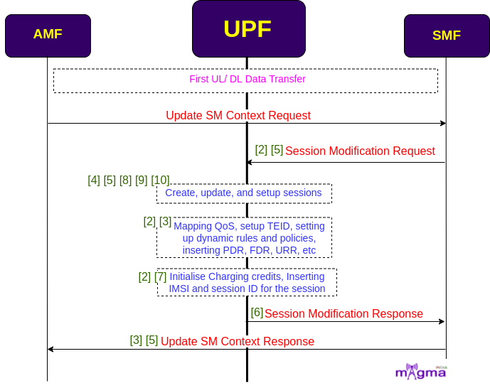

User Plane Function
*********

Overview
=======

The UPF (User Plane Function) is one of the most important NF(Network Function) of the 5G Core network. It is the second network function with which NR RAN interacts(during PDUs flow). UPF is the evolution of the CUPS(Control and User Plane Separation). It inspects, routes, and forwards the packets inside the QoS flows within the subscription policies. It also enforces the UL and DL traffic rules using SDF templates sent by the SMF over the N4 interface. It allocates or terminates the QoS Flows within the PDU Sessions when the corresponding services end.

|

User Plane Setup
=======

Initial User Plane Setup
-------

* When a UE wanted to access the 5G network, it undergoes a registration process. After completing all the control plane procedures, when it comes to user plane setup, SMF handles all the session-related information. AMF requests for the DL TEID for all the PDU sessions that passed to SMF. SMF then selects the best UPF for the UE in the range and sends a session establishment request containing all the parameters for the default PDU session setup.

* A session along with a default QoS flow of Non-GBR is created to exchange the best-effort traffic with the Data Network(DN). The best-effort traffic contains longer routes to figure out the latency and maintain the traffic.

.. image:: photos/upf1.png
  :alt: Alternative text

- `[5] <https://github.com/magma/magma/blob/master/lte/gateway/c/session_manager/SetMessageManagerHandler.cpp>`_ New UE establishment request, need to create session context
- `[1] <https://github.com/magma/magma/blob/master/lte/gateway/c/session_manager/UpfMsgManageHandler.cpp>`_ Setting up the UPF address
- `[5] <https://github.com/magma/magma/blob/master/lte/gateway/c/session_manager/SetMessageManagerHandler.cpp>`_ `[10] <https://github.com/magma/magma/blob/master/lte/gateway/c/session_manager/PipelinedClient.cpp>`_ Create a session request to UPF
- `[3] <https://github.com/magma/magma/blob/master/lte/gateway/c/session_manager/SessionStateEnforcer.cpp>`_ Session context response

- `[4] <https://github.com/magma/magma/blob/master/lte/gateway/c/session_manager/SessionStore.cpp>`_ `[5] <https://github.com/magma/magma/blob/master/lte/gateway/c/session_manager/SetMessageManagerHandler.cpp>`_ Get default session updates 
- `[3] <https://github.com/magma/magma/blob/master/lte/gateway/c/session_manager/SessionStateEnforcer.cpp>`_ Default QoS, AMBR
- `[3] <https://github.com/magma/magma/blob/master/lte/gateway/c/session_manager/SessionStateEnforcer.cpp>`_ Adding default DL and UL PDR rule for an IMSI

First UL/DL Data Transfer
-------

* When the actual data transfer takes place i.e. either UL or DL data, then AMF sends another SM context request to the SMF. SMF sends session modification requests containing information related to the type of session requested. UPF setup the PDU session according to the user needs within the rules and regulations. 

* After that, UPF maps QoS flows, setup TEID, insert different rules like PDR, FAR, URR, etc, and some session-related policies to the PDU session. It also charges per data packet exchange and adds a unique session ID which helps in differentiating it from other PDU sessions. UPF adds an IMSI number to identify the ongoing session belongs to which UE.

* The session context is prepared by the UPF which is sent to the AMF via SMF to transmit it to the gNB. It contains information like UPF local TEID, QoS context, messages for the release of the session, etc.

- `[2] <https://github.com/magma/magma/blob/master/lte/gateway/c/session_manager/SessionState.cpp>`_ QoS policy management(policy type)
- `[2] <https://github.com/magma/magma/blob/master/lte/gateway/c/session_manager/SessionState.cpp>`_ Setting up of dynamic rules
- `[2] <https://github.com/magma/magma/blob/master/lte/gateway/c/session_manager/SessionState.cpp>`_ Update the static and dynamic rules
- `[3] <https://github.com/magma/magma/blob/master/lte/gateway/c/session_manager/SessionStateEnforcer.cpp>`_ Mapping FDR, PDR, QDR, BAR, URR
- `[3] <https://github.com/magma/magma/blob/master/lte/gateway/c/session_manager/SessionStateEnforcer.cpp>`_ Attaching rules to the sessions

- `[3] <https://github.com/magma/magma/blob/master/lte/gateway/c/session_manager/SessionStateEnforcer.cpp>`_ Create a new TEID and insert PDR
- `[2] <https://github.com/magma/magma/blob/master/lte/gateway/c/session_manager/SessionState.cpp>`_ Setup TEID to pass to the UPF
- `[2] <https://github.com/magma/magma/blob/master/lte/gateway/c/session_manager/SessionState.cpp>`_ QoS/Bearer management
- `[5] <https://github.com/magma/magma/blob/master/lte/gateway/c/session_manager/SetMessageManagerHandler.cpp>`_ Create session request
- `[9] <https://github.com/magma/magma/blob/master/lte/gateway/c/session_manager/SessionEvents.cpp>`_ Update and create sessions
- `[6] <https://github.com/magma/magma/blob/master/lte/gateway/c/session_manager/LocalEnforcer.cpp>`_ Handle rule scheduling 
- `[7] <https://github.com/magma/magma/blob/master/lte/gateway/c/session_manager/ChargingGrant.cpp>`_ Receive charging grant
- `[2] <https://github.com/magma/magma/blob/master/lte/gateway/c/session_manager/SessionState.cpp>`_ Initialize charging credit
- `[2] <https://github.com/magma/magma/blob/master/lte/gateway/c/session_manager/SessionState.cpp>`_ Get all active policies
- `[10] <https://github.com/magma/magma/blob/master/lte/gateway/c/session_manager/PipelinedClient.cpp>`_ Setup UPF session

- `[4] <https://github.com/magma/magma/blob/master/lte/gateway/c/session_manager/SessionStore.cpp>`_ Read, create, update, and search sessions 
- `[8] <https://github.com/magma/magma/blob/master/lte/gateway/c/session_manager/RedisStoreClient.cpp>`_ Read, and write sessions and serialize, and deserialize all session vectors
- `[5] <https://github.com/magma/magma/blob/master/lte/gateway/c/session_manager/SetMessageManagerHandler.cpp>`_ PDU Session inactive when moved to the IDLE state 
- `[6] <https://github.com/magma/magma/blob/master/lte/gateway/c/session_manager/LocalEnforcer.cpp>`_ Handle session update response

- `[5] <https://github.com/magma/magma/blob/master/lte/gateway/c/session_manager/SetMessageManagerHandler.cpp>`_ Handling set messages(either initial request or existing PDU Session) from AMF
- `[3] <https://github.com/magma/magma/blob/master/lte/gateway/c/session_manager/SessionStateEnforcer.cpp>`_ Update the state change notification to AMF 
- `[3] <https://github.com/magma/magma/blob/master/lte/gateway/c/session_manager/SessionStateEnforcer.cpp>`_ Preparing response(session context) to the AMF to transmit it to gNB
- `[3] <https://github.com/magma/magma/blob/master/lte/gateway/c/session_manager/SessionStateEnforcer.cpp>`_ Sending UPF local TEID to AMF which are going to be used by gNB
- `[3] <https://github.com/magma/magma/blob/master/lte/gateway/c/session_manager/SessionStateEnforcer.cpp>`_ Sending corresponding QoS context to the AMF
- `[5] <https://github.com/magma/magma/blob/master/lte/gateway/c/session_manager/SetMessageManagerHandler.cpp>`_ Fetch PDU Session ID from the RAT context
- `[5] <https://github.com/magma/magma/blob/master/lte/gateway/c/session_manager/SetMessageManagerHandler.cpp>`_ Requested message from AMF to release the session  

Modification of the ongoing sessions
-------                                      

* In addition to any changes to the session, a modification request is sent to the UPF which consists of all the policies related to a session being re-authenticated, and updated rules and regulations are also added to the session. UPF dynamically allocates session rules to the PDU sessions. It updates the charging credits and requests for charging re-authentication.    

* UPF deactivates all the QoS flows and TEID when the services ended or when the user no longer wanted to access the 5G network. It removes all the static and dynamic rules that are inserted into the session. It also terminates the session and the rules related to the termination of the session.

.. image:: photos/upf3.png
  :alt: Alternative text

- `[3] <https://github.com/magma/magma/blob/master/lte/gateway/c/session_manager/SessionStateEnforcer.cpp>`_ `[6] <https://github.com/magma/magma/blob/master/lte/gateway/c/session_manager/LocalEnforcer.cpp>`_ Initialize policy reauthentication
- `[3] <https://github.com/magma/magma/blob/master/lte/gateway/c/session_manager/SessionStateEnforcer.cpp>`_ `[6] <https://github.com/magma/magma/blob/master/lte/gateway/c/session_manager/LocalEnforcer.cpp>`_ Policy reauthentication for the session
- `[6] <https://github.com/magma/magma/blob/master/lte/gateway/c/session_manager/LocalEnforcer.cpp>`_ Scheduling static rules activation/ deactivation
- `[3] <https://github.com/magma/magma/blob/master/lte/gateway/c/session_manager/SessionStateEnforcer.cpp>`_ Updating session rules
- `[3] <https://github.com/magma/magma/blob/master/lte/gateway/c/session_manager/SessionStateEnforcer.cpp>`_ Change PDR and update UPF
- `[3] <https://github.com/magma/magma/blob/master/lte/gateway/c/session_manager/SessionStateEnforcer.cpp>`_ Insert PDR along with TEID into the session
- `[6] <https://github.com/magma/magma/blob/master/lte/gateway/c/session_manager/LocalEnforcer.cpp>`_ Insert IMSI and Session ID for the sessions 
- `[3] <https://github.com/magma/magma/blob/master/lte/gateway/c/session_manager/SessionStateEnforcer.cpp>`_ Configure subscribed QoS
- `[3] <https://github.com/magma/magma/blob/master/lte/gateway/c/session_manager/SessionStateEnforcer.cpp>`_ `[6] <https://github.com/magma/magma/blob/master/lte/gateway/c/session_manager/LocalEnforcer.cpp>`_ Update session with policy
- `[6] <https://github.com/magma/magma/blob/master/lte/gateway/c/session_manager/LocalEnforcer.cpp>`_ Update charging credits
- `[6] <https://github.com/magma/magma/blob/master/lte/gateway/c/session_manager/LocalEnforcer.cpp>`_ Initiating charging reauthentication
- `[5] <https://github.com/magma/magma/blob/master/lte/gateway/c/session_manager/SetMessageManagerHandler.cpp>`_ Update the session changes back to the session store

- `[10] <https://github.com/magma/magma/blob/master/lte/gateway/c/session_manager/PipelinedClient.cpp>`_ Deactivate flow request
- `[10] <https://github.com/magma/magma/blob/master/lte/gateway/c/session_manager/PipelinedClient.cpp>`_ Deactivate request by TEID 
- `[6] <https://github.com/magma/magma/blob/master/lte/gateway/c/session_manager/LocalEnforcer.cpp>`_ Deactivate QoS flows for dead sessions
- `[6] <https://github.com/magma/magma/blob/master/lte/gateway/c/session_manager/LocalEnforcer.cpp>`_ Schedule static and dynamic rule deactivation
- `[2] <https://github.com/magma/magma/blob/master/lte/gateway/c/session_manager/SessionState.cpp>`_ Removal of dynamic rules
- `[4] <https://github.com/magma/magma/blob/master/lte/gateway/c/session_manager/SessionStore.cpp>`_ Read session for deletion
- `[5] <https://github.com/magma/magma/blob/master/lte/gateway/c/session_manager/SetMessageManagerHandler.cpp>`_ Initiate session release  
- `[3] <https://github.com/magma/magma/blob/master/lte/gateway/c/session_manager/SessionStateEnforcer.cpp>`_ `[6] <https://github.com/magma/magma/blob/master/lte/gateway/c/session_manager/LocalEnforcer.cpp>`_ Release and termination of sessions
- `[6] <https://github.com/magma/magma/blob/master/lte/gateway/c/session_manager/LocalEnforcer.cpp>`_ Complete termination for the released sessions
- `[2] <https://github.com/magma/magma/blob/master/lte/gateway/c/session_manager/SessionState.cpp>`_ Removal of rules related to the termination of the session
- `[6] <https://github.com/magma/magma/blob/master/lte/gateway/c/session_manager/LocalEnforcer.cpp>`_ Delete session from session map
- `[1] <https://github.com/magma/magma/blob/master/lte/gateway/c/session_manager/UpfMsgManageHandler.cpp>`_ Periodic messages about UPF Session configuration
