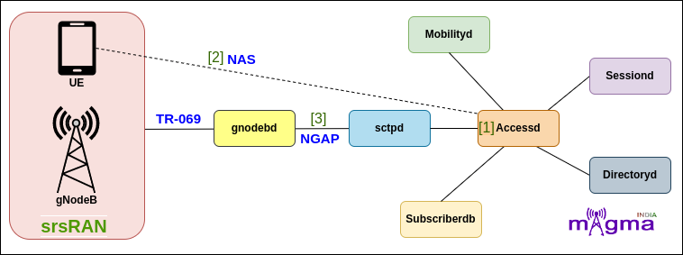
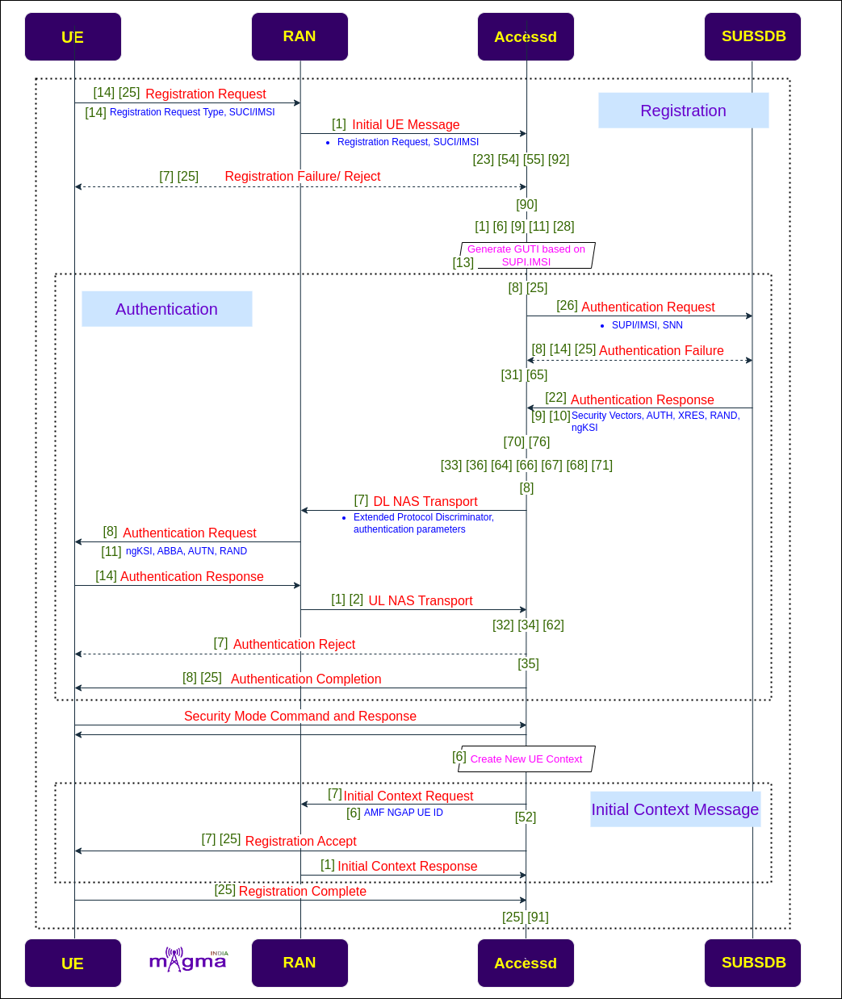
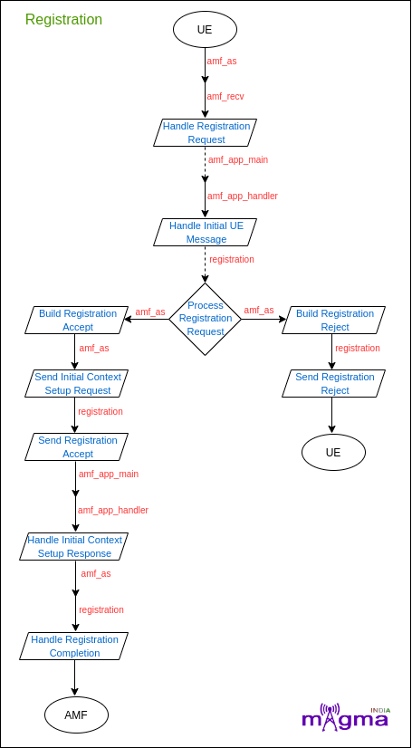
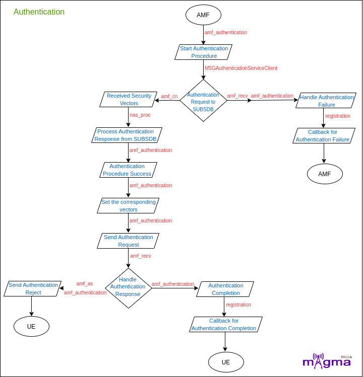
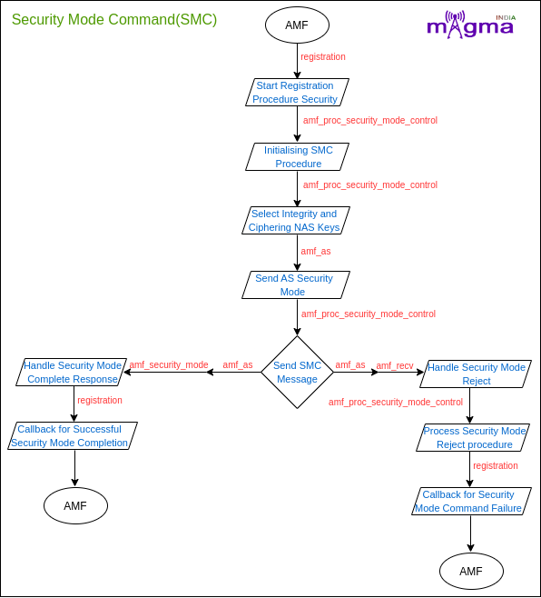
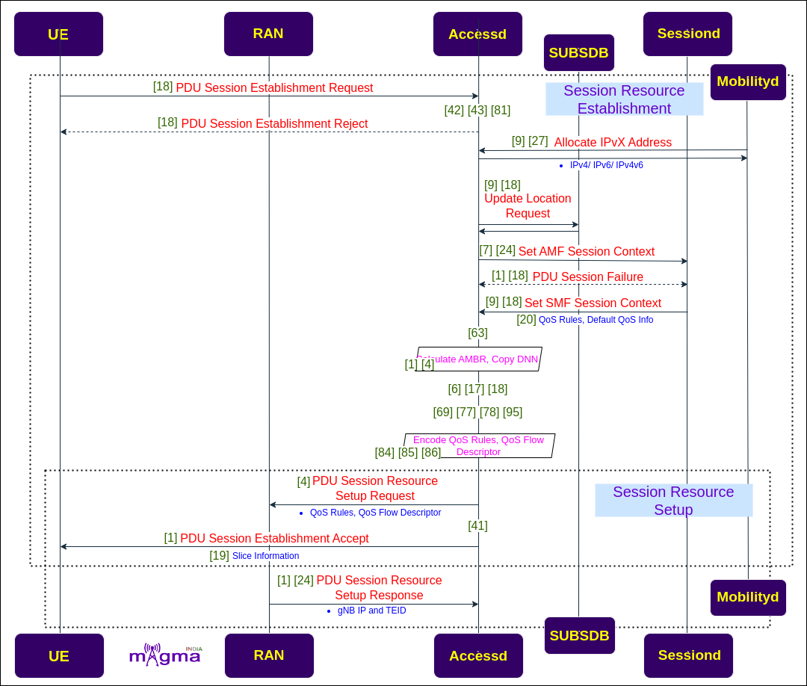
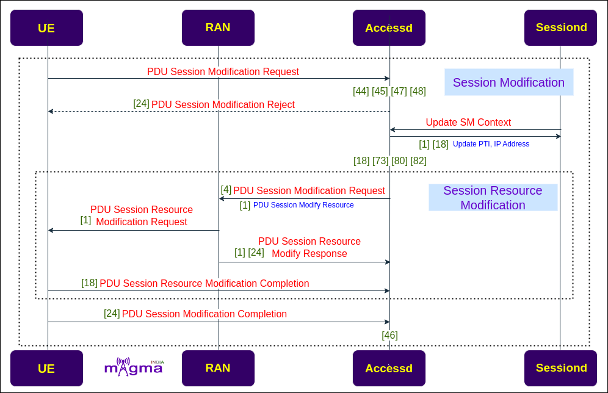
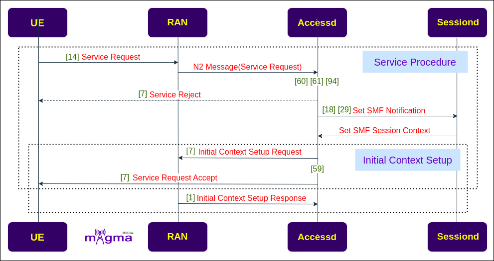

AccessD Service `[1] <https://github.com/magma/magma/tree/master/lte/gateway/c/core/oai/tasks/amf>`_
*********

Accessd is one of the main magma service that plays the role of the MME and AMF of the 4G and 5G System respectively. It supports registration, mobility, access authentication and authorization, lawful inspect and transporting session management messages between the UE(CPE) and Sessiond.

Protocols
=======

NAS `[2] <https://github.com/magma/magma/tree/master/lte/gateway/c/core/oai/tasks/nas5g>`_
-------

The 5G NAS(Non-Access Stratum) is a control plane protocol that is present at the Radio Interface(N1 Interface) between UE and AMF. This manages the mobility and session-related context within 5GS(5G System).

NGAP `[3] <https://github.com/magma/magma/tree/master/lte/gateway/c/core/oai/tasks/ngap>`_
-------

The Next-Generation Application Protocol(NGAP) is a Control Plane(CP) protocol signaling between gNB and the AMF. It handles the UE-associated and non-UE-associated services.

Call Flow
=======

Registration with SUCI as Mobile Identity
-------

* When UE is powered on, it first undergoes the registration process. UE sends the registration request to the gNB. gNB then sends the initial UE message carrying the registration request to Accessd. Since the UE identity(SUCI/IMSI) was included in the registration request, Accessd initiates the authentication procedure. It retrieves the authentication vectors and algorithm information from the SUBSDB. Accessd then sends the authentication parameters to the UE to setup a mutual authentication between the user and the network. On successful validation by the network, the UE is considered authenticated and secure communication is set up between the UE and the network. 

* After authentication, the SMC procedure is initiated, and after that Accessd creates a new UE Context and allocates an AMF NGAP UE ID to the UE. Accessd then initiates an Initial UE context setup procedure with the gNB.  After this, the registration procedure is completed.

- `[14] <https://github.com/magma/magma/blob/master/lte/gateway/c/core/oai/tasks/amf/amf_recv.cpp>`_ `[25] <https://github.com/magma/magma/blob/master/lte/gateway/c/core/oai/tasks/amf/Registration.cpp>`_ Handle Registration Request from UE
- `[14] <https://github.com/magma/magma/blob/master/lte/gateway/c/core/oai/tasks/amf/amf_recv.cpp>`_ Handle Registration Type Request
 
- `[1] <https://github.com/magma/magma/blob/master/lte/gateway/c/core/oai/tasks/amf/amf_app_handler.cpp>`_ Handle Initial UE message
 
- `[23] <https://github.com/magma/magma/blob/master/lte/gateway/c/core/oai/tasks/amf/nas5g_message.cpp>`_ Decode plain NAS message
- `[55] <https://github.com/magma/magma/blob/master/lte/gateway/c/core/oai/tasks/nas5g/src/M5GRegistrationRequest.cpp>`_ Decode Registration Request
- `[92] <https://github.com/magma/magma/blob/master/lte/gateway/c/core/oai/tasks/nas5g/src/ies/M5GSRegistrationType.cpp>`_ Decode Registration Type Message
 
- `[54] <https://github.com/magma/magma/blob/master/lte/gateway/c/core/oai/tasks/nas5g/src/M5GRegistrationReject.cpp>`_  Encode Registration Reject
 
- `[25] <https://github.com/magma/magma/blob/master/lte/gateway/c/core/oai/tasks/amf/Registration.cpp>`_ Handler to trigger registration reject
- `[7] <https://github.com/magma/magma/blob/master/lte/gateway/c/core/oai/tasks/amf/amf_as.cpp>`_ Send Registration Reject
- `[25] <https://github.com/magma/magma/blob/master/lte/gateway/c/core/oai/tasks/amf/Registration.cpp>`_ Abort Registration procedure for timer failure
- `[25] <https://github.com/magma/magma/blob/master/lte/gateway/c/core/oai/tasks/amf/Registration.cpp>`_ Notify AS-SAP about the Registration Reject message
 
- `[90] <https://github.com/magma/magma/blob/master/lte/gateway/c/core/oai/tasks/nas5g/src/ies/M5GSMobileIdentity.cpp>`_  Decode SUCI Mobile Identity Message
- `[90] <https://github.com/magma/magma/blob/master/lte/gateway/c/core/oai/tasks/nas5g/src/ies/M5GSMobileIdentity.cpp>`_ Decode TMSI Mobile Identity Message
- `[90] <https://github.com/magma/magma/blob/master/lte/gateway/c/core/oai/tasks/nas5g/src/ies/M5GSMobileIdentity.cpp>`_ Decode Mobile Identity Message
 
- `[9] <https://github.com/magma/magma/blob/master/lte/gateway/c/core/oai/tasks/amf/amf_client_servicer.cpp>`_ `[28] <https://github.com/magma/magma/blob/master/lte/gateway/c/core/oai/lib/n11/M5GSUCIRegistrationServiceClient.cpp>`_ Decrypt IMSI Info
- `[11] <https://github.com/magma/magma/blob/master/lte/gateway/c/core/oai/tasks/amf/amf_data.cpp>`_ Set IMSI as valid 
- `[6] <https://github.com/magma/magma/blob/master/lte/gateway/c/core/oai/tasks/amf/amf_app_ue_context.cpp>`_ Upsert IMSI in AMF Context
- `[1] <https://github.com/magma/magma/blob/master/lte/gateway/c/core/oai/tasks/amf/amf_app_handler.cpp>`_ Insert IMSI into the IMSI UE table
 
- `[6] <https://github.com/magma/magma/blob/master/lte/gateway/c/core/oai/tasks/amf/amf_app_ue_context.cpp>`_ Checks if UE context exists for IMSI or not 
- `[6] <https://github.com/magma/magma/blob/master/lte/gateway/c/core/oai/tasks/amf/amf_app_ue_context.cpp>`_ Get AMF UE ID from IMSI
- `[6] <https://github.com/magma/magma/blob/master/lte/gateway/c/core/oai/tasks/amf/amf_app_ue_context.cpp>`_ Register the UE Context
 
- `[13] <https://github.com/magma/magma/blob/master/lte/gateway/c/core/oai/tasks/amf/amf_identity.cpp>`_ Generate GUTI based on SUPI/IMSI received 
 
- `[25] <https://github.com/magma/magma/blob/master/lte/gateway/c/core/oai/tasks/amf/Registration.cpp>`_ Create Registration Request Procedure
- `[25] <https://github.com/magma/magma/blob/master/lte/gateway/c/core/oai/tasks/amf/Registration.cpp>`_ Allocate and initialize AMF procedures
 
- `[8] <https://github.com/magma/magma/blob/master/lte/gateway/c/core/oai/tasks/amf/amf_authentication.cpp>`_ `[25] <https://github.com/magma/magma/blob/master/lte/gateway/c/core/oai/tasks/amf/Registration.cpp>`_ Validate AMF Context and invokes authentication procedure
 
- `[26] <https://github.com/magma/magma/blob/master/lte/gateway/c/core/oai/lib/n11/M5GAuthenticationServiceClient.cpp>`_ Create Subscriber Authentication Request(SNN)
 
- `[8] <https://github.com/magma/magma/blob/master/lte/gateway/c/core/oai/tasks/amf/amf_authentication.cpp>`_ `[14] <https://github.com/magma/magma/blob/master/lte/gateway/c/core/oai/tasks/amf/amf_recv.cpp>`_ Handle Authentication Failure 
- `[8] <https://github.com/magma/magma/blob/master/lte/gateway/c/core/oai/tasks/amf/amf_authentication.cpp>`_ Abort Authentication Procedure
- `[25] <https://github.com/magma/magma/blob/master/lte/gateway/c/core/oai/tasks/amf/Registration.cpp>`_ Callback for Authentication Failure
 
- `[31] <https://github.com/magma/magma/blob/master/lte/gateway/c/core/oai/tasks/nas5g/src/M5GAuthenticationFailure.cpp>`_ `[65] <https://github.com/magma/magma/blob/master/lte/gateway/c/core/oai/tasks/nas5g/src/ies/M5GAuthenticationFailureIE.cpp>`_ Decode Authentication Failure Message
 
- `[22] <https://github.com/magma/magma/blob/master/lte/gateway/c/core/oai/tasks/amf/nas_proc.cpp>`_ Authentication Response received from SUBSDB
- `[9] <https://github.com/magma/magma/blob/master/lte/gateway/c/core/oai/tasks/amf/amf_client_servicer.cpp>`_ Get Subscriber Authentication Information
- `[10] <https://github.com/magma/magma/blob/master/lte/gateway/c/core/oai/tasks/amf/amf_cn.cpp>`_ Receive Security Vector from SUBSDB
- `[22] <https://github.com/magma/magma/blob/master/lte/gateway/c/core/oai/tasks/amf/nas_proc.cpp>`_ `[26] <https://github.com/magma/magma/blob/master/lte/gateway/c/core/oai/lib/n11/M5GAuthenticationServiceClient.cpp>`_ Create an Authentication answer from SUBSDB
 
- `[70] <https://github.com/magma/magma/blob/master/lte/gateway/c/core/oai/tasks/nas5g/src/ies/M5GEAPMessage.cpp>`_ Decode EAP Message
- `[76] <https://github.com/magma/magma/blob/master/lte/gateway/c/core/oai/tasks/nas5g/src/ies/M5GNasKeySetIdentifier.cpp>`_ Decode NAS Key Set identifier
 
- `[36] <https://github.com/magma/magma/blob/master/lte/gateway/c/core/oai/tasks/nas5g/src/M5GDLNASTransport.cpp>`_ Encode DL NAS Transport Message
- `[71] <https://github.com/magma/magma/blob/master/lte/gateway/c/core/oai/tasks/nas5g/src/ies/M5GExtendedProtocolDiscriminator.cpp>`_ Encode Extended Protocol Discriminator
- `[33] <https://github.com/magma/magma/blob/master/lte/gateway/c/core/oai/tasks/nas5g/src/M5GAuthenticationRequest.cpp>`_ Encode Authentication Request Message
 
- `[64] <https://github.com/magma/magma/blob/master/lte/gateway/c/core/oai/tasks/nas5g/src/ies/M5GABBA.cpp>`_ Encode ABBA Message
- `[66] <https://github.com/magma/magma/blob/master/lte/gateway/c/core/oai/tasks/nas5g/src/ies/M5GAuthenticationParameterAUTN.cpp>`_ Encode Authentication Parameter AUTN
- `[67] <https://github.com/magma/magma/blob/master/lte/gateway/c/core/oai/tasks/nas5g/src/ies/M5GAuthenticationParameterRAND.cpp>`_ Encode Authentication Parameter RAND
- `[68] <https://github.com/magma/magma/blob/master/lte/gateway/c/core/oai/tasks/nas5g/src/ies/M5GAuthenticationResponseParameter.cpp>`_ Encode Authentication Response Parameter 
 
- `[8] <https://github.com/magma/magma/blob/master/lte/gateway/c/core/oai/tasks/amf/amf_authentication.cpp>`_ Handle NAS Authentication Procedure
 
- `[7] <https://github.com/magma/magma/blob/master/lte/gateway/c/core/oai/tasks/amf/amf_as.cpp>`_ Builds DL NAS Transport message
- `[8] <https://github.com/magma/magma/blob/master/lte/gateway/c/core/oai/tasks/amf/amf_authentication.cpp>`_ Send Authentication Request
- `[11] <https://github.com/magma/magma/blob/master/lte/gateway/c/core/oai/tasks/amf/amf_data.cpp>`_ Set Security  ngKSI
 
- `[14] <https://github.com/magma/magma/blob/master/lte/gateway/c/core/oai/tasks/amf/amf_recv.cpp>`_ Handle Authentication Response
- `[1] <https://github.com/magma/magma/blob/master/lte/gateway/c/core/oai/tasks/amf/amf_app_handler.cpp>`_ `[2] <https://github.com/magma/magma/blob/master/lte/gateway/c/core/oai/tasks/amf/amf_app_main.cpp>`_ Handle UL NAS message
 
- `[62] <https://github.com/magma/magma/blob/master/lte/gateway/c/core/oai/tasks/nas5g/src/M5GULNASTransport.cpp>`_ Decode UL NAS Transport Message
- `[34] <https://github.com/magma/magma/blob/master/lte/gateway/c/core/oai/tasks/nas5g/src/M5GAuthenticationResponse.cpp>`_ Decode Authentication Response Message
 
- `[32] <https://github.com/magma/magma/blob/master/lte/gateway/c/core/oai/tasks/nas5g/src/M5GAuthenticationReject.cpp>`_ Encode Authentication Reject Message
 
- `[7] <https://github.com/magma/magma/blob/master/lte/gateway/c/core/oai/tasks/amf/amf_as.cpp>`_ Send authentication Reject 
 
- `[35] <https://github.com/magma/magma/blob/master/lte/gateway/c/core/oai/tasks/nas5g/src/M5GAuthenticationResult.cpp>`_ Encode Authentication Result Message
 
- `[8] <https://github.com/magma/magma/blob/master/lte/gateway/c/core/oai/tasks/amf/amf_authentication.cpp>`_ Authentication Completion Response
- `[25] <https://github.com/magma/magma/blob/master/lte/gateway/c/core/oai/tasks/amf/Registration.cpp>`_ Callback for successful Authentication
 
- `[6] <https://github.com/magma/magma/blob/master/lte/gateway/c/core/oai/tasks/amf/amf_app_ue_context.cpp>`_ Create new UE Context
 
- `[7] <https://github.com/magma/magma/blob/master/lte/gateway/c/core/oai/tasks/amf/amf_as.cpp>`_ Send Initial Context Setup Request
- `[6] <https://github.com/magma/magma/blob/master/lte/gateway/c/core/oai/tasks/amf/amf_app_ue_context.cpp>`_ Send AMF NGAP UE ID 
 
- `[52] <https://github.com/magma/magma/blob/master/lte/gateway/c/core/oai/tasks/nas5g/src/M5GRegistrationAccept.cpp>`_ Encode Registration Accept
 
- `[7] <https://github.com/magma/magma/blob/master/lte/gateway/c/core/oai/tasks/amf/amf_as.cpp>`_ `[25] <https://github.com/magma/magma/blob/master/lte/gateway/c/core/oai/tasks/amf/Registration.cpp>`_ Builds Registration Accept message and sent it to UE
 
- `[1] <https://github.com/magma/magma/blob/master/lte/gateway/c/core/oai/tasks/amf/amf_app_handler.cpp>`_ Handle Initial Context Setup Response 
- `[25] <https://github.com/magma/magma/blob/master/lte/gateway/c/core/oai/tasks/amf/Registration.cpp>`_ Handle Registration Complete Response 
- `[91] <https://github.com/magma/magma/blob/master/lte/gateway/c/core/oai/tasks/nas5g/src/ies/M5GSRegistrationResult.cpp>`_ Decode Registration Result
- `[25] <https://github.com/magma/magma/blob/master/lte/gateway/c/core/oai/tasks/amf/Registration.cpp>`_ Store Registration information is received and processed once old UE gets deregistered 

Registration with GUTI as Mobile Identity
-------

* When the registration request contains GUTI as a mobile identity, then Accessd initiates an identification procedure with the UE to get a permanent UE ID(SUCI). After the identity process, Accessd setup a mutual authentication with the UE and initiates the SMC procedure. 

* NAS SMC procedure is designed to protect the registration process from alteration by a middleman. It also set up AS security, and selects the integrity and ciphering algorithm for the NAS protection. After the SMC procedure, the initial UE context is setup in gNB and registration completes.

.. image:: photos/guti.png
  :align: center
  :alt: Alternative text

- `[22] <https://github.com/magma/magma/blob/master/lte/gateway/c/core/oai/tasks/amf/nas_proc.cpp>`_ Invoke Identification Procedure
- `[7] <https://github.com/magma/magma/blob/master/lte/gateway/c/core/oai/tasks/amf/amf_as.cpp>`_ Builds DL NAS Transport message
- `[7] <https://github.com/magma/magma/blob/master/lte/gateway/c/core/oai/tasks/amf/amf_as.cpp>`_ `[22] <https://github.com/magma/magma/blob/master/lte/gateway/c/core/oai/tasks/amf/nas_proc.cpp>`_ Send Identity Request to UE
- `[39] <https://github.com/magma/magma/blob/master/lte/gateway/c/core/oai/tasks/nas5g/src/M5GIdentityRequest.cpp>`_ Encode Identity Request 
- `[88] <https://github.com/magma/magma/blob/master/lte/gateway/c/core/oai/tasks/nas5g/src/ies/M5GSIdentityType.cpp>`_ Encode Identity Type Message
 
- `[1] <https://github.com/magma/magma/blob/master/lte/gateway/c/core/oai/tasks/amf/amf_app_handler.cpp>`_ Handle UL NAS message
- `[14] <https://github.com/magma/magma/blob/master/lte/gateway/c/core/oai/tasks/amf/amf_recv.cpp>`_ Handle Identity Response
 
- `[40] <https://github.com/magma/magma/blob/master/lte/gateway/c/core/oai/tasks/nas5g/src/M5GIdentityResponse.cpp>`_ Decode Identity Response
 
- `[25] <https://github.com/magma/magma/blob/master/lte/gateway/c/core/oai/tasks/amf/Registration.cpp>`_ Callback for Identification Failure
 
- `[13] <https://github.com/magma/magma/blob/master/lte/gateway/c/core/oai/tasks/amf/amf_identity.cpp>`_ Identification Completion
- `[25] <https://github.com/magma/magma/blob/master/lte/gateway/c/core/oai/tasks/amf/Registration.cpp>`_ Callback for successful Identification

- `[90] <https://github.com/magma/magma/blob/master/lte/gateway/c/core/oai/tasks/nas5g/src/ies/M5GSMobileIdentity.cpp>`_ Decode GUTI Mobile Identity Message 
- `[6] <https://github.com/magma/magma/blob/master/lte/gateway/c/core/oai/tasks/amf/amf_app_ue_context.cpp>`_ Checks if UE context exists for GUTI or not
- `[6] <https://github.com/magma/magma/blob/master/lte/gateway/c/core/oai/tasks/amf/amf_app_ue_context.cpp>`_ Fetch the GUTI based on UE Id
- `[6] <https://github.com/magma/magma/blob/master/lte/gateway/c/core/oai/tasks/amf/amf_app_ue_context.cpp>`_ Get the AMF Context based on UE Identity
- `[1] <https://github.com/magma/magma/blob/master/lte/gateway/c/core/oai/tasks/amf/amf_app_handler.cpp>`_ Insert GUTI into UE Context Table
 
- `[16] <https://github.com/magma/magma/blob/master/lte/gateway/c/core/oai/tasks/amf/amf_security_mode_control.cpp>`_ `[25] <https://github.com/magma/magma/blob/master/lte/gateway/c/core/oai/tasks/amf/Registration.cpp>`_ Create and initiates SMC Procedure 
- `[56] <https://github.com/magma/magma/blob/master/lte/gateway/c/core/oai/tasks/nas5g/src/M5GSecurityModeCommand.cpp>`_ Encode Security Mode Command
- `[16] <https://github.com/magma/magma/blob/master/lte/gateway/c/core/oai/tasks/amf/amf_security_mode_control.cpp>`_ Send SMC(Security Mode Command) Message
 
- `[23] <https://github.com/magma/magma/blob/master/lte/gateway/c/core/oai/tasks/amf/nas5g_message.cpp>`_ Encode plain NAS message
- `[7] <https://github.com/magma/magma/blob/master/lte/gateway/c/core/oai/tasks/amf/amf_as.cpp>`_ Setup the security header of the given NAS message
- `[93] <https://github.com/magma/magma/blob/master/lte/gateway/c/core/oai/tasks/nas5g/src/ies/M5GSecurityHeaderType.cpp>`_ Encode Security Header Type Message
- `[74] <https://github.com/magma/magma/blob/master/lte/gateway/c/core/oai/tasks/nas5g/src/ies/M5GNASSecurityAlgorithms.cpp>`_ Encode NAS Security Algorithm
- `[90] <https://github.com/magma/magma/blob/master/lte/gateway/c/core/oai/tasks/nas5g/src/ies/M5GSMobileIdentity.cpp>`_ Encode IMEI Mobile Identity Message
- `[72] <https://github.com/magma/magma/blob/master/lte/gateway/c/core/oai/tasks/nas5g/src/ies/M5GIMEISVRequest.cpp>`_ Encode IMEISV Request
- `[96] <https://github.com/magma/magma/blob/master/lte/gateway/c/core/oai/tasks/nas5g/src/ies/M5GUESecurityCapability.cpp>`_ Encode UE Security Capability
 
- `[11] <https://github.com/magma/magma/blob/master/lte/gateway/c/core/oai/tasks/amf/amf_data.cpp>`_ Set Security ngKSI
- `[11] <https://github.com/magma/magma/blob/master/lte/gateway/c/core/oai/tasks/amf/amf_data.cpp>`_ Set Security Type
- `[16] <https://github.com/magma/magma/blob/master/lte/gateway/c/core/oai/tasks/amf/amf_security_mode_control.cpp>`_ Set Security algorithms(Integrity and Security Algorithm based on Security Capabilities)
- `[7] <https://github.com/magma/magma/blob/master/lte/gateway/c/core/oai/tasks/amf/amf_as.cpp>`_ Send AS Security Request
- `[15] <https://github.com/magma/magma/blob/master/lte/gateway/c/core/oai/tasks/amf/amf_sap.cpp>`_ Set AS Security Data
 
- `[58] <https://github.com/magma/magma/blob/master/lte/gateway/c/core/oai/tasks/nas5g/src/M5GSecurityModeReject.cpp>`_ Encode Security Mode Reject
 
- `[14] <https://github.com/magma/magma/blob/master/lte/gateway/c/core/oai/tasks/amf/amf_recv.cpp>`_ `[16] <https://github.com/magma/magma/blob/master/lte/gateway/c/core/oai/tasks/amf/amf_security_mode_control.cpp>`_ Handle Security Mode Reject
- `[25] <https://github.com/magma/magma/blob/master/lte/gateway/c/core/oai/tasks/amf/Registration.cpp>`_ Callback for Security Mode Command Failure
- `[7] <https://github.com/magma/magma/blob/master/lte/gateway/c/core/oai/tasks/amf/amf_as.cpp>`_ AS Security Reject
 
- `[17] <https://github.com/magma/magma/blob/master/lte/gateway/c/core/oai/tasks/amf/amf_Security_Mode.cpp>`_ Handle Security Mode Complete
- `[25] <https://github.com/magma/magma/blob/master/lte/gateway/c/core/oai/tasks/amf/Registration.cpp>`_ Callback for successful Security Mode Complete
- `[57] <https://github.com/magma/magma/blob/master/lte/gateway/c/core/oai/tasks/nas5g/src/M5GSecurityModeComplete.cpp>`_ Decode Security Mode Complete
 
- `[23] <https://github.com/magma/magma/blob/master/lte/gateway/c/core/oai/tasks/amf/nas5g_message.cpp>`_ Decode header of a Security protected NAS message
- `[8] <https://github.com/magma/magma/blob/master/lte/gateway/c/core/oai/tasks/amf/amf_authentication.cpp>`_ Fetch New Security Context
- `[5] <https://github.com/magma/magma/blob/master/lte/gateway/c/core/oai/tasks/amf/amf_app_transport.cpp>`_ Handle NAS Encoded message

.. image:: photos/idenF.png
  :align: center
  :alt: Alternative text

PDU Session Establishment 
-------

* UE sends a PDU Session Establishment request to Accessd for the first time to establish a user plane. Accessd sends the IP address of the UE to the mobilityd to keep track of the location of the UE and update the location in the SUBSDB. It then sets SM context with the sessiond and setup PDU Session Resource at the UE and gNB. 

 
- `[18] <https://github.com/magma/magma/blob/master/lte/gateway/c/core/oai/tasks/amf/amf_smf_send.cpp>`_ Handle PDU Session Establishment Request from UE
- `[43] <https://github.com/magma/magma/blob/master/lte/gateway/c/core/oai/tasks/nas5g/src/M5GPDUSessionEstablishmentRequest.cpp>`_ Decode PDU Session Establishment Request Message
- `[81] <https://github.com/magma/magma/blob/master/lte/gateway/c/core/oai/tasks/nas5g/src/ies/M5GPDUSessionType.cpp>`_ Decode PDU Session Type
 
- `[42] <https://github.com/magma/magma/blob/master/lte/gateway/c/core/oai/tasks/nas5g/src/M5GPDUSessionEstablishmentReject.cpp>`_ Encode PDU Session Establishment Reject Message
 
- `[18] <https://github.com/magma/magma/blob/master/lte/gateway/c/core/oai/tasks/amf/amf_smf_send.cpp>`_ Send PDU Session Establishment Reject
 
- `[9] <https://github.com/magma/magma/blob/master/lte/gateway/c/core/oai/tasks/amf/amf_client_servicer.cpp>`_ `[27] <https://github.com/magma/magma/blob/master/lte/gateway/c/core/oai/lib/n11/M5GMobilityServiceClient.cpp>`_ Allocate IPv4/IPv6/IPv4v6 Address Async 
- `[27] <https://github.com/magma/magma/blob/master/lte/gateway/c/core/oai/lib/n11/M5GMobilityServiceClient.cpp>`_ Handle allocate IPv4/IPv6/IPv4v6 Address Status
 
- `[9] <https://github.com/magma/magma/blob/master/lte/gateway/c/core/oai/tasks/amf/amf_client_servicer.cpp>`_ `[18] <https://github.com/magma/magma/blob/master/lte/gateway/c/core/oai/tasks/amf/amf_smf_send.cpp>`_ Update Location Request
 
- `[7] <https://github.com/magma/magma/blob/master/lte/gateway/c/core/oai/tasks/amf/amf_as.cpp>`_ `[24] <https://github.com/magma/magma/blob/master/lte/gateway/c/core/oai/tasks/amf/prepare_request_for_smf.cpp>`_ Send Session Request to SMF
 
- `[1] <https://github.com/magma/magma/blob/master/lte/gateway/c/core/oai/tasks/amf/amf_app_handler.cpp>`_ `[18] <https://github.com/magma/magma/blob/master/lte/gateway/c/core/oai/tasks/amf/amf_smf_send.cpp>`_ Handle PDU Session Failure
 
- `[9] <https://github.com/magma/magma/blob/master/lte/gateway/c/core/oai/tasks/amf/amf_client_servicer.cpp>`_ `[18] <https://github.com/magma/magma/blob/master/lte/gateway/c/core/oai/tasks/amf/amf_smf_send.cpp>`_ Set SMF Session Context
 
- `[20] <https://github.com/magma/magma/blob/master/lte/gateway/c/core/oai/tasks/amf/amf_smf_session_qos.cpp>`_ Get QoS Rules and Default QoS Info from SMF Context
 
- `[63] <https://github.com/magma/magma/blob/master/lte/gateway/c/core/oai/tasks/nas5g/src/SmfMessage.cpp>`_ Decode SMF Message
 
- `[4] <https://github.com/magma/magma/blob/master/lte/gateway/c/core/oai/tasks/amf/amf_app_pdu_resource_setup_req_rel.cpp>`_ Calculate PDU Session AMBR
- `[1] <https://github.com/magma/magma/blob/master/lte/gateway/c/core/oai/tasks/amf/amf_app_handler.cpp>`_ Convert AMBR format one defined in create PDU Session Response to one defined in PDU Session Establishment Accept message
 
- `[17] <https://github.com/magma/magma/blob/master/lte/gateway/c/core/oai/tasks/amf/amf_Security_Mode.cpp>`_ `[18] <https://github.com/magma/magma/blob/master/lte/gateway/c/core/oai/tasks/amf/amf_smf_send.cpp>`_ Copy DNN and AMBR info in SMF Context
- `[6] <https://github.com/magma/magma/blob/master/lte/gateway/c/core/oai/tasks/amf/amf_app_ue_context.cpp>`_ Insert SM Context in the map
 
- `[95] <https://github.com/magma/magma/blob/master/lte/gateway/c/core/oai/tasks/nas5g/src/ies/M5GSessionAMBR.cpp>`_ Encode Session AMBR
- `[69] <https://github.com/magma/magma/blob/master/lte/gateway/c/core/oai/tasks/nas5g/src/ies/M5GDNN.cpp>`_ Encode DNN
- `[78] <https://github.com/magma/magma/blob/master/lte/gateway/c/core/oai/tasks/nas5g/src/ies/M5GPDUSessionIdentity.cpp>`_ Encode PDU Session Identity Message
- `[77] <https://github.com/magma/magma/blob/master/lte/gateway/c/core/oai/tasks/nas5g/src/ies/M5GPDUAddress.cpp>`_ Encode PDU Session Address Message
 
- `[84] <https://github.com/magma/magma/blob/master/lte/gateway/c/core/oai/tasks/nas5g/src/ies/M5GQOSRules.cpp>`_ Encode QoS Rules 
- `[85] <https://github.com/magma/magma/blob/master/lte/gateway/c/core/oai/tasks/nas5g/src/ies/M5GQosFlowDescriptor.cpp>`_ Encode QoS Flow Descriptor 
- `[86] <https://github.com/magma/magma/blob/master/lte/gateway/c/core/oai/tasks/nas5g/src/ies/M5GQosFlowParam.cpp>`_ Encode QoS Flow Parameter 
 
- `[4] <https://github.com/magma/magma/blob/master/lte/gateway/c/core/oai/tasks/amf/amf_app_pdu_resource_setup_req_rel.cpp>`_ Send PDU Session Resource Setup Request to RAN
 
- `[41] <https://github.com/magma/magma/blob/master/lte/gateway/c/core/oai/tasks/nas5g/src/M5GPDUSessionEstablishmentAccept.cpp>`_ Encode PDU Session Establishment Accept Message
- `[83] <https://github.com/magma/magma/blob/master/lte/gateway/c/core/oai/tasks/nas5g/src/ies/M5GProtocolConfigurationOptions.cpp>`_ Encode Protocol Configuration Options
 
- `[1] <https://github.com/magma/magma/blob/master/lte/gateway/c/core/oai/tasks/amf/amf_app_handler.cpp>`_ Send the PDU Establishment Accept
- `[19] <https://github.com/magma/magma/blob/master/lte/gateway/c/core/oai/tasks/amf/amf_smf_session_context.cpp>`_ Send Slice Information in PDU Session Establishment Accept Message

- `[1] <https://github.com/magma/magma/blob/master/lte/gateway/c/core/oai/tasks/amf/amf_app_handler.cpp>`_ `[24] <https://github.com/magma/magma/blob/master/lte/gateway/c/core/oai/tasks/amf/prepare_request_for_smf.cpp>`_ Handle PDU Resource Setup Response containing gNB IP and TEID

.. image:: photos/sessionEstF.png
  :align: center
  :alt: Alternative text

PDU Session Modification
-------

* Accessd sends the session modification request inside the session context update message. After getting the response from the sessiond, it initiates the session resource modification request with the RAN and UE.

- `[44] <https://github.com/magma/magma/blob/master/lte/gateway/c/core/oai/tasks/nas5g/src/M5GPDUSessionModificationCommand.cpp>`_ `[48] <https://github.com/magma/magma/blob/master/lte/gateway/c/core/oai/tasks/nas5g/src/M5GPDUSessionModificationRequest.cpp>`_ Decode PDU Session Modification Request
 
- `[45] <https://github.com/magma/magma/blob/master/lte/gateway/c/core/oai/tasks/nas5g/src/M5GPDUSessionModificationCommandReject.cpp>`_ `[47] <https://github.com/magma/magma/blob/master/lte/gateway/c/core/oai/tasks/nas5g/src/M5GPDUSessionModificationReject.cpp>`_ Encode PDU Session Modification Command Reject
- `[24] <https://github.com/magma/magma/blob/master/lte/gateway/c/core/oai/tasks/amf/prepare_request_for_smf.cpp>`_ Handle PDU Session Modification Command Reject Message
 
- `[1] <https://github.com/magma/magma/blob/master/lte/gateway/c/core/oai/tasks/amf/amf_app_handler.cpp>`_ Update SMF Session PTI Procedure
- `[18] <https://github.com/magma/magma/blob/master/lte/gateway/c/core/oai/tasks/amf/amf_smf_send.cpp>`_ Update IP Address information in SMF Context 
 
- `[80] <https://github.com/magma/magma/blob/master/lte/gateway/c/core/oai/tasks/nas5g/src/ies/M5GPDUSessionStatus.cpp>`_ Decode PDU Session Status
- `[82] <https://github.com/magma/magma/blob/master/lte/gateway/c/core/oai/tasks/nas5g/src/ies/M5GPTI.cpp>`_ Decode PTI Message
- `[73] <https://github.com/magma/magma/blob/master/lte/gateway/c/core/oai/tasks/nas5g/src/ies/M5GMaxNumOfSupportedPacketFilters.cpp>`_ Decode Maximum Number of Supported Packet Filters
- `[18] <https://github.com/magma/magma/blob/master/lte/gateway/c/core/oai/tasks/amf/amf_smf_send.cpp>`_ Check if maximum PDU Sessions are not reached
 
- `[1] <https://github.com/magma/magma/blob/master/lte/gateway/c/core/oai/tasks/amf/amf_app_handler.cpp>`_ Send PDU Session Modification Request 
- `[4] <https://github.com/magma/magma/blob/master/lte/gateway/c/core/oai/tasks/amf/amf_app_pdu_resource_setup_req_rel.cpp>`_ Send PDU Session Resource Modify Request
 
- `[1] <https://github.com/magma/magma/blob/master/lte/gateway/c/core/oai/tasks/amf/amf_app_handler.cpp>`_ `[24] <https://github.com/magma/magma/blob/master/lte/gateway/c/core/oai/tasks/amf/prepare_request_for_smf.cpp>`_ Handle PDU Session Resource Modify Response 
- `[18] <https://github.com/magma/magma/blob/master/lte/gateway/c/core/oai/tasks/amf/amf_smf_send.cpp>`_ Handle PDU Session Resource Modify Completion
 
- `[24] <https://github.com/magma/magma/blob/master/lte/gateway/c/core/oai/tasks/amf/prepare_request_for_smf.cpp>`_ Handle PDU Session Modification Complete Message
- `[46] <https://github.com/magma/magma/blob/master/lte/gateway/c/core/oai/tasks/nas5g/src/M5GPDUSessionModificationComplete.cpp>`_ Decode PDU Session Modification Complete

Service Request
-------

* The service request message is sent by the UE to the network to request the establishment of a NAS signaling connection and of the radio and signaling bearers. The UE sends the service request message when it is in IDLE mode and has pending user data to be sent. Accessd updates this information in the SM Context and sends it to the sessiond to modify the session. After the successful service procedure, accessd initiates the initial UE context setup message with the gNB.

- `[14] <https://github.com/magma/magma/blob/master/lte/gateway/c/core/oai/tasks/amf/amf_recv.cpp>`_ Handle Service Request 
- `[61] <https://github.com/magma/magma/blob/master/lte/gateway/c/core/oai/tasks/nas5g/src/M5GServiceRequest.cpp>`_ Decode Service Request
- `[94] <https://github.com/magma/magma/blob/master/lte/gateway/c/core/oai/tasks/nas5g/src/ies/M5GServiceType.cpp>`_ Decode Service Type Message
 
- `[60] <https://github.com/magma/magma/blob/master/lte/gateway/c/core/oai/tasks/nas5g/src/M5GServiceReject.cpp>`_ Encode Service Reject
- `[7] <https://github.com/magma/magma/blob/master/lte/gateway/c/core/oai/tasks/amf/amf_as.cpp>`_  Builds Service reject message
 
- `[18] <https://github.com/magma/magma/blob/master/lte/gateway/c/core/oai/tasks/amf/amf_smf_send.cpp>`_ `[29] <https://github.com/magma/magma/blob/master/lte/gateway/c/core/oai/lib/n11/SmfServiceClient.cpp>`_ Set SMF Notification
 
- `[7] <https://github.com/magma/magma/blob/master/lte/gateway/c/core/oai/tasks/amf/amf_as.cpp>`_ Send Initial Context Setup Request
 
- `[59] <https://github.com/magma/magma/blob/master/lte/gateway/c/core/oai/tasks/nas5g/src/M5GServiceAccept.cpp>`_ Encode Service Accept
 
- `[7] <https://github.com/magma/magma/blob/master/lte/gateway/c/core/oai/tasks/amf/amf_as.cpp>`_ Service Request Accept to UE
 
- `[1] <https://github.com/magma/magma/blob/master/lte/gateway/c/core/oai/tasks/amf/amf_app_handler.cpp>`_ Handle Initial Context Setup Response from gNB

.. image:: photos/serviceF.png
  :align: center
  :alt: Alternative text

UE-Initiated Session Release
-------

* UE initiates the release of PDU Session by sending a release request to the accessd. Accessd sends release requests to the sessiond. On receiving the release response from sessiond, it forwards the PDU session release command to the RAN and UE. Accessd then sends the release of the IPv4/IPv6/IPv4v6 address of the UE from the mobilityd service.

.. image:: photos/sessionRel.png
  :align: center
  :alt: Alternative text

- `[18] <https://github.com/magma/magma/blob/master/lte/gateway/c/core/oai/tasks/amf/amf_smf_send.cpp>`_ Handle PDU Session Release Request 
- `[49] <https://github.com/magma/magma/blob/master/lte/gateway/c/core/oai/tasks/nas5g/src/M5GPDUSessionReleaseCommand.cpp>`_ `[51] <https://github.com/magma/magma/blob/master/lte/gateway/c/core/oai/tasks/nas5g/src/M5GPDUSessionReleaseRequest.cpp>`_ Decode PDU Session Release Request
 
- `[50] <https://github.com/magma/magma/blob/master/lte/gateway/c/core/oai/tasks/nas5g/src/M5GPDUSessionReleaseReject.cpp>`_  Encode PDU Session Release Reject
 
- `[18] <https://github.com/magma/magma/blob/master/lte/gateway/c/core/oai/tasks/amf/amf_smf_send.cpp>`_ `[29] <https://github.com/magma/magma/blob/master/lte/gateway/c/core/oai/lib/n11/SmfServiceClient.cpp>`_ Set SMF Notification
- `[18] <https://github.com/magma/magma/blob/master/lte/gateway/c/core/oai/tasks/amf/amf_smf_send.cpp>`_ Clear SMF Context
 
- `[4] <https://github.com/magma/magma/blob/master/lte/gateway/c/core/oai/tasks/amf/amf_app_pdu_resource_setup_req_rel.cpp>`_ PDU Session Resource Release Request 
 
- `[1] <https://github.com/magma/magma/blob/master/lte/gateway/c/core/oai/tasks/amf/amf_app_handler.cpp>`_ Handle PDU Session Release Response 

- `[9] <https://github.com/magma/magma/blob/master/lte/gateway/c/core/oai/tasks/amf/amf_client_servicer.cpp>`_ `[27] <https://github.com/magma/magma/blob/master/lte/gateway/c/core/oai/lib/n11/M5GMobilityServiceClient.cpp>`_ Release IPv4/IPv6/IPv4v6 Address 

UE-Initiated Deregistration
-------

* When UE does not want to access the 5GS any longer, it sends a deregistration request to the network. Accessd requests for the release of SM context along with resource release messages to the sessiond. After the successful deregistration procedure, it sends the UE context release command to the RAN to delete the UE-related information at gNB.

.. image:: photos/dereg.png
  :align: center
  :alt: Alternative text

- `[21] <https://github.com/magma/magma/blob/master/lte/gateway/c/core/oai/tasks/amf/deregistration_request.cpp>`_ Handle Deregistration Request 
- `[38] <https://github.com/magma/magma/blob/master/lte/gateway/c/core/oai/tasks/nas5g/src/M5GDeRegistrationRequestUEInit.cpp>`_ Decode De-registration Request Message
- `[87] <https://github.com/magma/magma/blob/master/lte/gateway/c/core/oai/tasks/nas5g/src/ies/M5GSDeRegistrationType.cpp>`_ Decode Deregistration Type Message
 
- `[21] <https://github.com/magma/magma/blob/master/lte/gateway/c/core/oai/tasks/amf/deregistration_request.cpp>`_ `[24] <https://github.com/magma/magma/blob/master/lte/gateway/c/core/oai/tasks/amf/prepare_request_for_smf.cpp>`_ Set SMF Session(release)
 
- `[37] <https://github.com/magma/magma/blob/master/lte/gateway/c/core/oai/tasks/nas5g/src/M5GDeRegistrationAcceptUEInit.cpp>`_ Encode De-registration Accept Message
- `[7] <https://github.com/magma/magma/blob/master/lte/gateway/c/core/oai/tasks/amf/amf_as.cpp>`_ Builds De-Registration Accept message by Network
 
- `[1] <https://github.com/magma/magma/blob/master/lte/gateway/c/core/oai/tasks/amf/amf_app_handler.cpp>`_ `[3] <https://github.com/magma/magma/blob/master/lte/gateway/c/core/oai/tasks/amf/amf_app_msg.cpp>`_ `[6] <https://github.com/magma/magma/blob/master/lte/gateway/c/core/oai/tasks/amf/amf_app_ue_context.cpp>`_ Send UE Context Release Command 
- `[1] <https://github.com/magma/magma/blob/master/lte/gateway/c/core/oai/tasks/amf/amf_app_handler.cpp>`_ Handle UE Context Release Complete
 
- `[1] <https://github.com/magma/magma/blob/master/lte/gateway/c/core/oai/tasks/amf/amf_app_handler.cpp>`_ Handle gNB deregister Indication
- `[6] <https://github.com/magma/magma/blob/master/lte/gateway/c/core/oai/tasks/amf/amf_app_ue_context.cpp>`_ `[21] <https://github.com/magma/magma/blob/master/lte/gateway/c/core/oai/tasks/amf/deregistration_request.cpp>`_ Delete the UE Context

- `[11] <https://github.com/magma/magma/blob/master/lte/gateway/c/core/oai/tasks/amf/amf_data.cpp>`_ Clear AMF Security Context
- `[22] <https://github.com/magma/magma/blob/master/lte/gateway/c/core/oai/tasks/amf/nas_proc.cpp>`_ Clear AMF Context

.. image:: photos/deregF.png
  :align: center
  :alt: Alternative text

IDLE Mode and Paging
-------

.. image:: photos/paging.png
  :align: center
  :alt: Alternative text

- `[6] <https://github.com/magma/magma/blob/master/lte/gateway/c/core/oai/tasks/amf/amf_app_ue_context.cpp>`_ Get UE Context Release Cause

- `[6] <https://github.com/magma/magma/blob/master/lte/gateway/c/core/oai/tasks/amf/amf_app_ue_context.cpp>`_ `[21] <https://github.com/magma/magma/blob/master/lte/gateway/c/core/oai/tasks/amf/deregistration_request.cpp>`_ Delete the UE Context
- `[18] <https://github.com/magma/magma/blob/master/lte/gateway/c/core/oai/tasks/amf/amf_smf_send.cpp>`_ `[29] <https://github.com/magma/magma/blob/master/lte/gateway/c/core/oai/lib/n11/SmfServiceClient.cpp>`_ Set SMF Notification
- `[1] <https://github.com/magma/magma/blob/master/lte/gateway/c/core/oai/tasks/amf/amf_app_handler.cpp>`_ Handle AMF Notification
- `[6] <https://github.com/magma/magma/blob/master/lte/gateway/c/core/oai/tasks/amf/amf_app_ue_context.cpp>`_ Transition to IDLE State
