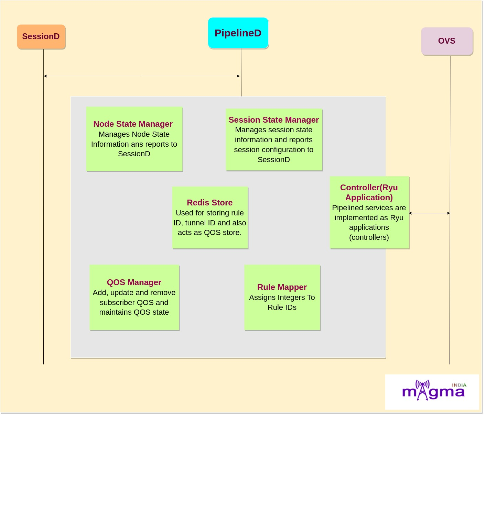
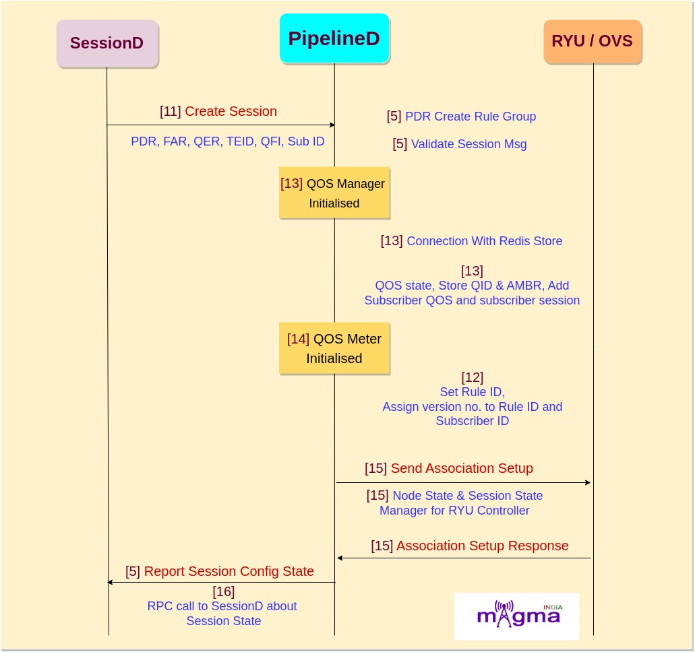

Magma PipelineD Service `[0] <https://github.com/magma/magma/tree/master/lte/gateway/python/magma/pipelined>`_
*********

.. image:: photos/pipelineD.png
 :align: center
 :alt: Alternative text

| *Pipelined* is the control application that programs rules in the Open vSwitch (OVS). pipelineD takes PDR rules from sessionD. In implementation, Pipelined is a set of network services that are chained together. These services can be chained and enabled/disabled through the REST API in the orchestrator. 
| PipelineD talks with ``sessionD``, ``OVS``, ``directoryD``, ``mobilityD``. 
| Provides paging functionality without buffering support for 5G. 

Interface of PipelineD with Other Services:
=======

sessionD ←→pipelineD
-------

| sessiond is responsible for lifecycle management of the session state(credit and rules) associated with an user.
| It interact with PCEF datapath throught pipelineD for ``L2-L4`` and DPid for ``L4-L7`` policies.

OVS←→pipelineD
-------

| Implements the OpenFlow protocol.
| Pipelined services program rules in OVS to implement basic PCEF functionality for user plane traffic.
| OpenFlow pipeline of OVS contains 255 flow tables:
|	Main table (Table 1 - 20)
|	Scratch table (Table 21 - 254)

| Each flow table is programmed by a single service through OpenFlow and it can contain multiple flow entries.

directoryD ←→pipelineD
-------

| Adds a directoryD call to pipelined to allow: for associating a learned IP for a given subscriber IMSI.
| By adding this mapping, sessiond can fetch from directoryD to allow: for redirection to work properly
| Used to push all different keys and attribute pair for each key(ex *Subscriber ID* and *Session ID*)
| Add session id from sessionD to subscribers record..

mobilityD ←→pipelineD
-------

| *pipelined* use api from mobility for default gw info.
| This patch would use monilityD APIs rather than accessing redis directly from pipelineD for retrieving GW info.
| patch has following related changes:
| 	Add mobilityD service dependency for pipelineD
|	change ARP egress dev to uplink_br0
|	add mobilityd_client
|	cmock mobilityd api in in-out unit test

| mobilityD interface with the orchestrator to receive IP address block.
| Can Allocate/release IP of subscribers on request of SPGW.

Architecture of PipelineD
=======

*PipelineD* is created by combining different components. Some of the main components are:

- **Session State Manager** `[5] <https://github.com/magma/magma/blob/master/lte/gateway/python/magma/pipelined/ng_manager/session_state_manager.py>`_: This controller manages session state information and reports session configuration to SMF.
- **Node State Manager** `[6] <https://github.com/magma/magma/blob/master/lte/gateway/python/magma/pipelined/ng_manager/node_state_manager.py>`_: Manages node state informationand reports to SMF.
- **QOS Manager** `[7] <https://github.com/magma/magma/blob/master/lte/gateway/python/magma/pipelined/qos/common.py>`_: Add, update and remove subscriber QOS and maintains QOS state as well as Subscriber Session state. Also manages QOS store(redis).
- **QOS Meter** `[8] <https://github.com/magma/magma/blob/master/lte/gateway/python/magma/pipelined/qos/qos_meter_impl.py>`_: Utility class for managing IDs and meters qos information.

- **Rule Mapper** `[9] <https://github.com/magma/magma/blob/master/lte/gateway/python/magma/pipelined/rule_mappers.py>`_: This class assigns integers to rule ids so that they can be identified in   an openflow register. The methods can be called from multiple threads.

- **Redis Store**: Used for storing rule id, tunnel id and also acts as QOS store.

- **Ryu Applications(Controllers)** `[10] <https://github.com/magma/magma/tree/master/lte/gateway/python/magma/pipelined/app>`_: Pipelined services are implemented as Ryu applications (controllers) under the hood. Ryu apps are single-threaded entities that communicate using an event model. Generally, each controller is assigned a table and manages the its flows. Some of the controllers are: 
	- Access Control Controller
	- ARP Controller
	- Quota Check Controller
	- Classifier
	- DPI Controller
	- Ingress/Egress Controller
	- Header Enrichment Controller
	- NG Service Controller
	- Uplink Bridge Controller

Call Flow
=======

1. Session Establishment
-------

- `[11] <https://github.com/magma/magma/blob/master/lte/gateway/python/magma/pipelined/ng_set_session_msg.py>`_ Create Session
- `[11] <https://github.com/magma/magma/blob/master/lte/gateway/python/magma/pipelined/ng_set_session_msg.py>`_ Create Add QER in PDR
- `[11] <https://github.com/magma/magma/blob/master/lte/gateway/python/magma/pipelined/ng_set_session_msg.py>`_ Create FAR in PDR
- `[11] <https://github.com/magma/magma/blob/master/lte/gateway/python/magma/pipelined/ng_set_session_msg.py>`_ According to PDR state, Create PDR
- `[11] <https://github.com/magma/magma/blob/master/lte/gateway/python/magma/pipelined/ng_set_session_msg.py>`_ Create Session Msg
- `[5] <https://github.com/magma/magma/blob/master/lte/gateway/python/magma/pipelined/ng_manager/session_state_manager.py>`_ PDR create rule group
- `[5] <https://github.com/magma/magma/blob/master/lte/gateway/python/magma/pipelined/ng_manager/session_state_manager.py>`_ Validate session msg
- `[5] <https://github.com/magma/magma/blob/master/lte/gateway/python/magma/pipelined/ng_manager/session_state_manager.py>`_ Process session message
- `[13] <https://github.com/magma/magma/blob/master/lte/gateway/python/magma/pipelined/qos/common.py>`_ Initialize QOS manager
- `[13] <https://github.com/magma/magma/blob/master/lte/gateway/python/magma/pipelined/qos/common.py>`_ Setup connnection with redis store
- `[13] <https://github.com/magma/magma/blob/master/lte/gateway/python/magma/pipelined/qos/common.py>`_ Initial qos state
- `[13] <https://github.com/magma/magma/blob/master/lte/gateway/python/magma/pipelined/qos/common.py>`_ Store QID
- `[13] <https://github.com/magma/magma/blob/master/lte/gateway/python/magma/pipelined/qos/common.py>`_ Store AMBR
- `[13] <https://github.com/magma/magma/blob/master/lte/gateway/python/magma/pipelined/qos/common.py>`_ Get or create subscriber
- `[13] <https://github.com/magma/magma/blob/master/lte/gateway/python/magma/pipelined/qos/common.py>`_ Add subscriber QOS
- `[13] <https://github.com/magma/magma/blob/master/lte/gateway/python/magma/pipelined/qos/common.py>`_ Get or create subscriber session
- `[14] <https://github.com/magma/magma/blob/master/lte/gateway/python/magma/pipelined/qos/qos_meter_impl.py>`_ Initialise QOS meter
- `[14] <https://github.com/magma/magma/blob/master/lte/gateway/python/magma/pipelined/qos/qos_meter_impl.py>`_ Set ID manager
- `[12] <https://github.com/magma/magma/blob/master/lte/gateway/python/magma/pipelined/rule_mappers.py>`_ Rule ID to number mapper 
- `[12] <https://github.com/magma/magma/blob/master/lte/gateway/python/magma/pipelined/rule_mappers.py>`_ Setup redis
- `[12] <https://github.com/magma/magma/blob/master/lte/gateway/python/magma/pipelined/rule_mappers.py>`_ Register rule
- `[12] <https://github.com/magma/magma/blob/master/lte/gateway/python/magma/pipelined/rule_mappers.py>`_ Create or get rule num
- `[12] <https://github.com/magma/magma/blob/master/lte/gateway/python/magma/pipelined/rule_mappers.py>`_ Get rule id
- `[12] <https://github.com/magma/magma/blob/master/lte/gateway/python/magma/pipelined/rule_mappers.py>`_ Assign version number to rule id and subscriber id combinations
- `[12] <https://github.com/magma/magma/blob/master/lte/gateway/python/magma/pipelined/rule_mappers.py>`_ Subscriber + rule id to rule version
- `[15] <https://github.com/magma/magma/blob/master/lte/gateway/python/magma/pipelined/app/ng_services.py>`_ initialize node state and session state manager with datapath connect event
- `[15] <https://github.com/magma/magma/blob/master/lte/gateway/python/magma/pipelined/app/ng_services.py>`_ Send association setup
- `[15] <https://github.com/magma/magma/blob/master/lte/gateway/python/magma/pipelined/app/ng_services.py>`_ Session message handler
- `[5] <https://github.com/magma/magma/blob/master/lte/gateway/python/magma/pipelined/ng_manager/session_state_manager.py>`_ report session config state
- `[16] <https://github.com/magma/magma/blob/master/lte/gateway/python/magma/pipelined/set_interface_client.py>`_ RPC call to sessionD about session state.

2. Session Modification
-------

.. image:: photos/Modification.jpg
  :alt: Alternative text

- `[5] <https://github.com/magma/magma/blob/master/lte/gateway/python/magma/pipelined/ng_manager/session_state_manager.py>`_ Update PDR rules
- `[5] <https://github.com/magma/magma/blob/master/lte/gateway/python/magma/pipelined/ng_manager/session_state_manager.py>`_ PDR create rule entry w.r.t PDR ID
- `[5] <https://github.com/magma/magma/blob/master/lte/gateway/python/magma/pipelined/ng_manager/session_state_manager.py>`_ Process session message
- `[5] <https://github.com/magma/magma/blob/master/lte/gateway/python/magma/pipelined/ng_manager/session_state_manager.py>`_ Find session with rule
- `[13] <https://github.com/magma/magma/blob/master/lte/gateway/python/magma/pipelined/qos/common.py>`_ Update rule
- `[13] <https://github.com/magma/magma/blob/master/lte/gateway/python/magma/pipelined/qos/common.py>`_ Update QOS data
- `[13] <https://github.com/magma/magma/blob/master/lte/gateway/python/magma/pipelined/qos/common.py>`_ Update data in redis store
- `[13] <https://github.com/magma/magma/blob/master/lte/gateway/python/magma/pipelined/qos/common.py>`_ Update rules map
- `[12] <https://github.com/magma/magma/blob/master/lte/gateway/python/magma/pipelined/rule_mappers.py>`_ increment the version number for a given subscriber and rule 
- `[12] <https://github.com/magma/magma/blob/master/lte/gateway/python/magma/pipelined/rule_mappers.py>`_ Save version for the rule id
- `[12] <https://github.com/magma/magma/blob/master/lte/gateway/python/magma/pipelined/rule_mappers.py>`_ Add to redis store
- `[15] <https://github.com/magma/magma/blob/master/lte/gateway/python/magma/pipelined/app/ng_services.py>`_ Send association setup message
- `[5] <https://github.com/magma/magma/blob/master/lte/gateway/python/magma/pipelined/ng_manager/session_state_manager.py>`_ report session config state
- `[16] <https://github.com/magma/magma/blob/master/lte/gateway/python/magma/pipelined/set_interface_client.py>`_ RPC call to sessionD about session state

3. Session Termination
-------

.. image:: photos/Termination.jpg
  :alt: Alternative text

- `[11] <https://github.com/magma/magma/blob/master/lte/gateway/python/magma/pipelined/ng_set_session_msg.py>`_ Deactivate session
- `[11] <https://github.com/magma/magma/blob/master/lte/gateway/python/magma/pipelined/ng_set_session_msg.py>`_ Delete QER in PDR
- `[11] <https://github.com/magma/magma/blob/master/lte/gateway/python/magma/pipelined/ng_set_session_msg.py>`_ Deactivate flow
- `[13] <https://github.com/magma/magma/blob/master/lte/gateway/python/magma/pipelined/qos/common.py>`_ remove subscriber QOS
- `[13] <https://github.com/magma/magma/blob/master/lte/gateway/python/magma/pipelined/qos/common.py>`_ Removing QOS for rule num
- `[13] <https://github.com/magma/magma/blob/master/lte/gateway/python/magma/pipelined/qos/common.py>`_ Remove QID
- `[13] <https://github.com/magma/magma/blob/master/lte/gateway/python/magma/pipelined/qos/common.py>`_ Remove QOS data
- `[13] <https://github.com/magma/magma/blob/master/lte/gateway/python/magma/pipelined/qos/common.py>`_ Remove rules
- `[13] <https://github.com/magma/magma/blob/master/lte/gateway/python/magma/pipelined/qos/common.py>`_ Purge session with no rules
- `[13] <https://github.com/magma/magma/blob/master/lte/gateway/python/magma/pipelined/qos/common.py>`_ Get all empty sessions
- `[13] <https://github.com/magma/magma/blob/master/lte/gateway/python/magma/pipelined/qos/common.py>`_ Remove root AMBR QOS handle
- `[13] <https://github.com/magma/magma/blob/master/lte/gateway/python/magma/pipelined/qos/common.py>`_ Purge Subscriber state with no rules
- `[14] <https://github.com/magma/magma/blob/master/lte/gateway/python/magma/pipelined/qos/qos_meter_impl.py>`_ Destroying all meters
- `[14] <https://github.com/magma/magma/blob/master/lte/gateway/python/magma/pipelined/qos/qos_meter_impl.py>`_ Remove QOS from QOS meter
- `[12] <https://github.com/magma/magma/blob/master/lte/gateway/python/magma/pipelined/rule_mappers.py>`_ Remove all versions
- `[12] <https://github.com/magma/magma/blob/master/lte/gateway/python/magma/pipelined/rule_mappers.py>`_ Remove element from redis store
- `[15] <https://github.com/magma/magma/blob/master/lte/gateway/python/magma/pipelined/app/ng_services.py>`_ Delete all flows
- `[15] <https://github.com/magma/magma/blob/master/lte/gateway/python/magma/pipelined/app/ng_services.py>`_ Cleanup state
- `[15] <https://github.com/magma/magma/blob/master/lte/gateway/python/magma/pipelined/app/ng_services.py>`_ Stop NG services
- `[15] <https://github.com/magma/magma/blob/master/lte/gateway/python/magma/pipelined/app/ng_services.py>`_ Cleanup on disconnect
- `[15] <https://github.com/magma/magma/blob/master/lte/gateway/python/magma/pipelined/app/ng_services.py>`_ Send notification to sesisonD about release message
- `[5] <https://github.com/magma/magma/blob/master/lte/gateway/python/magma/pipelined/ng_manager/session_state_manager.py>`_  report session config state
- `[16] <https://github.com/magma/magma/blob/master/lte/gateway/python/magma/pipelined/set_interface_client.py>`_ RPC call to sessionD about session state

4. Paging Procedure
-------

.. image:: photos/Paging.jpg
  :alt: Alternative text

- `[17] <https://github.com/magma/magma/blob/master/lte/gateway/python/magma/pipelined/app/classifier.py>`_ Send paging message interface
- `[17] <https://github.com/magma/magma/blob/master/lte/gateway/python/magma/pipelined/app/classifier.py>`_ UPF paging info
- `[17] <https://github.com/magma/magma/blob/master/lte/gateway/python/magma/pipelined/app/classifier.py>`_ Local F-TEID
- `[16] <https://github.com/magma/magma/blob/master/lte/gateway/python/magma/pipelined/set_interface_client.py>`_ Send paging initiated notification
- `[16] <https://github.com/magma/magma/blob/master/lte/gateway/python/magma/pipelined/set_interface_client.py>`_ RPC call to send paging notification
- `[16] <https://github.com/magma/magma/blob/master/lte/gateway/python/magma/pipelined/set_interface_client.py>`_ Set paging initiated
- `[17] <https://github.com/magma/magma/blob/master/lte/gateway/python/magma/pipelined/app/classifier.py>`_ Paging msg sent callback
- `[17] <https://github.com/magma/magma/blob/master/lte/gateway/python/magma/pipelined/app/classifier.py>`_ Install Paging flow
- `[17] <https://github.com/magma/magma/blob/master/lte/gateway/python/magma/pipelined/app/classifier.py>`_ Pass controller ID value as action

