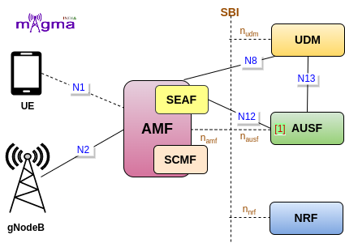
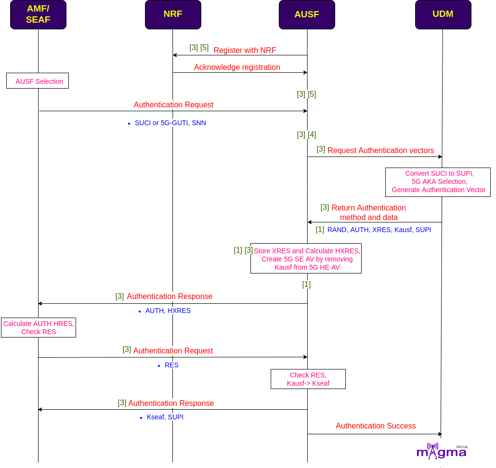

Authentication Server Function `[1] <https://gitlab.eurecom.fr/oai/cn5g/oai-cn5g-ausf>`_
*********

AUSF is a Control Plane(CP) function, and as its name sounds, it manages the authentication-related procedures in the 5GS(5G System). It provides a UE authentication service to the AMF and derives cryptographic keys to protect the signaling and user plane data. It is connected with the AMF and UDM through SBI(Service Based Interface).

Authentication Procedure
=======

Sending Temporary Identifier 
-------

* On receiving the registration request by the AMF, it chooses the best AUSF in the network for serving the user and initiates an authentication process in which a temporary identifier such as SUCI or 5G-GUTI and SNN(Service Network Name) is sent to the AUSF. AMF won’t be able to find the AUSF URL without NRF so the AUSF must be registered with it before the authentication starts.

* AMF is not involved directly in the authentication procedure, it communicates with the AUSF through SEAF(Security Anchor Function). AUSF then requests the authentication vector from the UDM. UDM converts the SUCI to SUPI, generates authentication vectors, and selects 5G AKA as the authentication procedure.

Retrieving Authentication Parameters 
-------

* The authentication data received from the UDM is used by the AUSF to derive the authentication vector, different keys, and necessary authentication parameters from the UDM. The AUSF then stores XRES(Expected Response), calculates HXRES(Hash of the Expected Response token) from it, and creates SE(Serving Environment) AV(Authentication Vector) from HE(Home Environment) AV.

* The AMF sends the AUTH token, HXRES in the authentication response to the SEAF. The SUPI is not sent to the SEAF in this response, it is only sent to the SEAF after the UE authentication succeeds. The SEAF stores the HXRES and sends the AUTN in an authentication request to the UE. The UE validates the AUTN by using the secret keys and if the validation succeeds, it sends the RES token to the SEAF, which is validated by the SEAF. Upon successful validation, it is last sent to the AMF, to validate RES and end up with some authentication conclusion. If the RES is valid, it derives an anchor key Kseaf to send it to the SEAF, along with the SUPI. AUSF also informs the UDM about the authentication completion.
 
Deriving Keys
-------

* Upon receiving the Kseaf, the SEAF derives the Kamf(AMF Key) to send it to the AMF. SEAF also deletes the Kseaf before sending the AMF key. The AMF derives the Kamf to protect the signaling messages between the UE and AMF and Kgnb(gNB key) is derived to send it to the gNB. gNB derives the Kgnb to protect the communication that takes place between the UE and the gNB. The UE can derive all the above keys to access the network resources.

 
- `[3] <https://gitlab.eurecom.fr/oai/cn5g/oai-cn5g-ausf/-/blob/master/src/ausf_app/ausf_app.cpp>`_ `[5] <https://gitlab.eurecom.fr/oai/cn5g/oai-cn5g-ausf/-/blob/master/src/ausf_app/ausf_nrf.cpp>`_ Register to NRF
- `[5] <https://gitlab.eurecom.fr/oai/cn5g/oai-cn5g-ausf/-/blob/master/src/ausf_app/ausf_nrf.cpp>`_ send NF registration request  with NRF
- `[4] <https://gitlab.eurecom.fr/oai/cn5g/oai-cn5g-ausf/-/blob/master/src/ausf_app/ausf_config.cpp>`_ AUSF config NRF
- `[5] <https://gitlab.eurecom.fr/oai/cn5g/oai-cn5g-ausf/-/blob/master/src/ausf_app/ausf_nrf.cpp>`_ Generate AUSF profile

- `[4] <https://gitlab.eurecom.fr/oai/cn5g/oai-cn5g-ausf/-/blob/master/src/ausf_app/ausf_config.cpp>`_ Config AUSF
- `[4] <https://gitlab.eurecom.fr/oai/cn5g/oai-cn5g-ausf/-/blob/master/src/ausf_app/ausf_config.cpp>`_ config AUSF SBI

- `[2] <https://gitlab.eurecom.fr/oai/cn5g/oai-cn5g-ausf/-/blob/master/src/api_server/model/AuthenticationInfo.cpp>`_ Get Authentication info

- `[4] <https://gitlab.eurecom.fr/oai/cn5g/oai-cn5g-ausf/-/blob/master/src/ausf_app/ausf_config.cpp>`_ AUSF config UDM
- `[3] <https://gitlab.eurecom.fr/oai/cn5g/oai-cn5g-ausf/-/blob/master/src/ausf_app/ausf_app.cpp>`_ Create authentication to send to UDM
- `[3] <https://gitlab.eurecom.fr/oai/cn5g/oai-cn5g-ausf/-/blob/master/src/ausf_app/ausf_app.cpp>`_ Send a request to UDM
- `[3] <https://gitlab.eurecom.fr/oai/cn5g/oai-cn5g-ausf/-/blob/master/src/ausf_app/ausf_app.cpp>`_ Getting parameters from UDM 
 
- `[3] <https://gitlab.eurecom.fr/oai/cn5g/oai-cn5g-ausf/-/blob/master/src/ausf_app/ausf_app.cpp>`_ Get authentication-related info

- `[1] <https://gitlab.eurecom.fr/oai/cn5g/oai-cn5g-ausf/-/blob/master/src/5gaka/authentication_algorithms_with_5gaka.cpp>`_ Derive Kausf
- `[1] <https://gitlab.eurecom.fr/oai/cn5g/oai-cn5g-ausf/-/blob/master/src/5gaka/authentication_algorithms_with_5gaka.cpp>`_ Generate Vector
- `[1] <https://gitlab.eurecom.fr/oai/cn5g/oai-cn5g-ausf/-/blob/master/src/5gaka/authentication_algorithms_with_5gaka.cpp>`_ Generate AUTN
- `[1] <https://gitlab.eurecom.fr/oai/cn5g/oai-cn5g-ausf/-/blob/master/src/5gaka/authentication_algorithms_with_5gaka.cpp>`_ Derive SQN MS 
- `[1] <https://gitlab.eurecom.fr/oai/cn5g/oai-cn5g-ausf/-/blob/master/src/5gaka/authentication_algorithms_with_5gaka.cpp>`_ Generate RAND
- `[1] <https://gitlab.eurecom.fr/oai/cn5g/oai-cn5g-ausf/-/blob/master/src/5gaka/authentication_algorithms_with_5gaka.cpp>`_ Generate HXRES
- `[3] <https://gitlab.eurecom.fr/oai/cn5g/oai-cn5g-ausf/-/blob/master/src/ausf_app/ausf_app.cpp>`_ Generate HXRES*
- `[3] <https://gitlab.eurecom.fr/oai/cn5g/oai-cn5g-ausf/-/blob/master/src/ausf_app/ausf_app.cpp>`_ Generating 5G AV from 5G HE AV

- `[3] <https://gitlab.eurecom.fr/oai/cn5g/oai-cn5g-ausf/-/blob/master/src/ausf_app/ausf_app.cpp>`_ Send authentication context to SEAF
- `[3] <https://gitlab.eurecom.fr/oai/cn5g/oai-cn5g-ausf/-/blob/master/src/ausf_app/ausf_app.cpp>`_ Handle UE authentication
- `[3] <https://gitlab.eurecom.fr/oai/cn5g/oai-cn5g-ausf/-/blob/master/src/ausf_app/ausf_app.cpp>`_ Handle UE authentication confirmation

- `[3] <https://gitlab.eurecom.fr/oai/cn5g/oai-cn5g-ausf/-/blob/master/src/ausf_app/ausf_app.cpp>`_ Send Kseaf to SEAF

- `[3] <https://gitlab.eurecom.fr/oai/cn5g/oai-cn5g-ausf/-/blob/master/src/ausf_app/ausf_app.cpp>`_ Set context id to the security context
- `[3] <https://gitlab.eurecom.fr/oai/cn5g/oai-cn5g-ausf/-/blob/master/src/ausf_app/ausf_app.cpp>`_ Set SUPI to the security context 

- `[1] <https://gitlab.eurecom.fr/oai/cn5g/oai-cn5g-ausf/-/blob/master/src/5gaka/authentication_algorithms_with_5gaka.cpp>`_ Derive Kseaf                                    
- `[1] <https://gitlab.eurecom.fr/oai/cn5g/oai-cn5g-ausf/-/blob/master/src/5gaka/authentication_algorithms_with_5gaka.cpp>`_ Derive Kamf 
- `[1] <https://gitlab.eurecom.fr/oai/cn5g/oai-cn5g-ausf/-/blob/master/src/5gaka/authentication_algorithms_with_5gaka.cpp>`_ Derive Knas
- `[1] <https://gitlab.eurecom.fr/oai/cn5g/oai-cn5g-ausf/-/blob/master/src/5gaka/authentication_algorithms_with_5gaka.cpp>`_ Derive Kgnb

- `[3] <https://gitlab.eurecom.fr/oai/cn5g/oai-cn5g-ausf/-/blob/master/src/ausf_app/ausf_app.cpp>`_ Get info from the security context stored in AUSF
