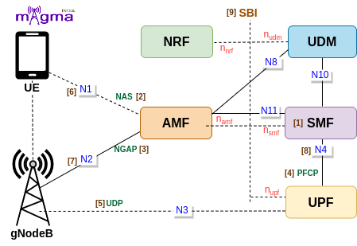
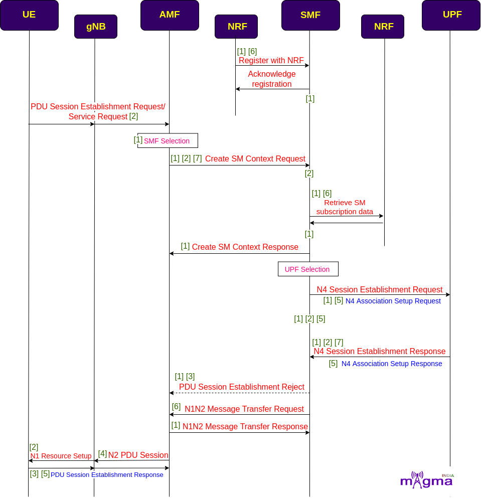
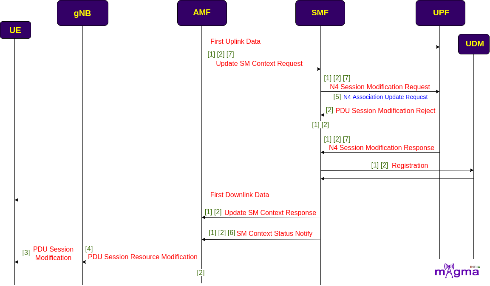

Session Management Function `[1] <https://gitlab.eurecom.fr/oai/cn5g/oai-cn5g-smf>`_
*********

SMF is a Control Plane(CP) function that manages the session-related context with the UPF. It creates, updates, and removes sessions. It also allocates the IP addresses to each PDU session. SMF provides all the session parameters and supports the functions of UPF. SMF functions are collectively performed by MME, SGW-U, and PGW-U in the 4G System. This NF enables CUPS(Control and User Plane Separation) which decentralized the control plane and data forwarding components of the 4G System. It obtained all the rules and policies from the PCF through the N7 interface and routed them to UPF to execute them in the respective sessions.

Interface
=======

N1 `[6] <https://gitlab.eurecom.fr/oai/cn5g/oai-cn5g-smf/-/blob/master/src/smf_app/smf_n1.cpp>`_
-------

All the connections and session-related information between UE and AMF are transmitted over the N1 interface. SMF transmits all the session parameters to the UE and gNB via AMF.

N2 `[7] <https://gitlab.eurecom.fr/oai/cn5g/oai-cn5g-smf/-/blob/master/src/smf_app/smf_n2.cpp>`_
-------

Session parameters and context are transmitted from the AMF to the gNB over the N2 interface. SMF sends the Session-related parameters to the AMF to setup the user plane resource at gNB and UE.

N4 `[8] <https://gitlab.eurecom.fr/oai/cn5g/oai-cn5g-smf/-/blob/master/src/smf_app/smf_n4.cpp>`_
-------

Session Management context and necessary parameters are transmitted to the UPF(User Plane Function) from the SMF, once the user plane is setup.

N11
-------

This is the interface between AMF and SMF. All the session resources required by the gNB and UE is transfer via AMF through this interface.

N10
-------

SMF retrieves all the SM subscription data from the UDM through this interface. SMF also stores ongoing PDU session records in the UDM.

SBI `[9] <https://gitlab.eurecom.fr/oai/cn5g/oai-cn5g-smf/-/blob/master/src/smf_app/smf_sbi.cpp>`_
-------

Service-Based Interface is the API-based communication between network functions.

Protocols
=======

NAS `[2] <https://gitlab.eurecom.fr/oai/cn5g/oai-cn5g-smf/-/tree/master/src/nas>`_
-------

The 5G NAS(Non-Access Stratum) is a control plane protocol that is present at the radio interface(N1 interface) between UE and AMF. This manages the mobility and session-related context within 5GS(5G System).

NGAP `[3] <https://gitlab.eurecom.fr/oai/cn5g/oai-cn5g-smf/-/tree/master/src/ngap>`_
-------

The Next-Generation Application Protocol(NGAP) is a Control Plane(CP) protocol signaling between gNB and the AMF. It handles the UE-associated and non-UE-associated services such as handover, sending session-related context, etc.

PFCP `[4] <https://gitlab.eurecom.fr/oai/cn5g/oai-cn5g-smf/-/tree/master/src/pfcp>`_
-------

Any kind of communication between SMF and UPF is managed by the PFCP(Packet Forwarding Control Protocol). It is one of the main protocols that separates the User Plane and Control Plane.

UDP `[5] <https://gitlab.eurecom.fr/oai/cn5g/oai-cn5g-smf/-/tree/master/src/udp>`_
-------

User Datagram Protocol is a transport layer protocol, providing source and destination port addressing for the multiplexing/demultiplexing of higher-layer applications. This is the protocol responsible for the data transmission between gNB and UPF.

ITTI Message `[10] <https://gitlab.eurecom.fr/oai/cn5g/oai-cn5g-smf/-/tree/master/src/itti>`_
-------

Inter Task Interface is used for sending messages between tasks.

Call Flow
=======

Session Establishment
-------

* At first, SMF registers with the NRF to locate the other Network Functions in the network. If the user wants to access 5G data facilities, it has to setup a PDU session with the network. UE sends PDU session establishment requests to the Core Network i.e. to the AMF. Then, AMF chooses the best SMF in the network to maintain its session-related information. 

* On selecting the best SMF, it requests the SMF to create an SM context. SMF retrieves SM subscription data from the UDM and generates an SM context. After that, SMF starts the N4 session establishment procedure with the UPF and setup default values for session-related parameters. Then, SMF sends the session information to the gNB and UE via AMF to establish default PDU Session values. 

 
- `[1] <https://gitlab.eurecom.fr/oai/cn5g/oai-cn5g-smf/-/blob/master/src/smf_app/smf_app.cpp>`_ Start NF registration discovery
- `[6] <https://gitlab.eurecom.fr/oai/cn5g/oai-cn5g-smf/-/blob/master/src/smf_app/smf_sbi.cpp>`_ Send Registration to NRF 
- `[1] <https://gitlab.eurecom.fr/oai/cn5g/oai-cn5g-smf/-/blob/master/src/smf_app/smf_app.cpp>`_ Handle NF status notification(nrf)
- `[1] <https://gitlab.eurecom.fr/oai/cn5g/oai-cn5g-smf/-/blob/master/src/smf_app/smf_app.cpp>`_ generate SMF profile
 
- `[1] <https://gitlab.eurecom.fr/oai/cn5g/oai-cn5g-smf/-/blob/master/src/smf_app/smf_app.cpp>`_ Trigger NF registration request(n11)
- `[1] <https://gitlab.eurecom.fr/oai/cn5g/oai-cn5g-smf/-/blob/master/src/smf_app/smf_app.cpp>`_ N11 register NF instance response
 
- `[2] <https://gitlab.eurecom.fr/oai/cn5g/oai-cn5g-smf/-/blob/master/src/smf_app/smf_context.cpp>`_ Handle service request
 
- `[7] <https://gitlab.eurecom.fr/oai/cn5g/oai-cn5g-smf/-/blob/master/src/smf_app/smf_procedure.cpp>`_ Create SM context request
- `[1] <https://gitlab.eurecom.fr/oai/cn5g/oai-cn5g-smf/-/blob/master/src/smf_app/smf_app.cpp>`_ `[2] <https://gitlab.eurecom.fr/oai/cn5g/oai-cn5g-smf/-/blob/master/src/smf_app/smf_context.cpp>`_ Handle PDU session create SM context request
- `[2] <https://gitlab.eurecom.fr/oai/cn5g/oai-cn5g-smf/-/blob/master/src/smf_app/smf_context.cpp>`_ Verify SM context request
 
- `[1] <https://gitlab.eurecom.fr/oai/cn5g/oai-cn5g-smf/-/blob/master/src/smf_app/smf_app.cpp>`_ Retrieve SM Subscription data from udm
- `[1] <https://gitlab.eurecom.fr/oai/cn5g/oai-cn5g-smf/-/blob/master/src/smf_app/smf_app.cpp>`_ Get SM subscription data
- `[6] <https://gitlab.eurecom.fr/oai/cn5g/oai-cn5g-smf/-/blob/master/src/smf_app/smf_sbi.cpp>`_ Get SM data
 
- `[1] <https://gitlab.eurecom.fr/oai/cn5g/oai-cn5g-smf/-/blob/master/src/smf_app/smf_app.cpp>`_ Generate SMF context 
- `[1] <https://gitlab.eurecom.fr/oai/cn5g/oai-cn5g-smf/-/blob/master/src/smf_app/smf_app.cpp>`_ Trigger Session create SM context response 
- `[1] <https://gitlab.eurecom.fr/oai/cn5g/oai-cn5g-smf/-/blob/master/src/smf_app/smf_app.cpp>`_ N11 create SM context response
 
- `[5] <https://gitlab.eurecom.fr/oai/cn5g/oai-cn5g-smf/-/blob/master/src/smf_app/smf_n4.cpp>`_ Handle receive N4 association setup request
- `[1] <https://gitlab.eurecom.fr/oai/cn5g/oai-cn5g-smf/-/blob/master/src/smf_app/smf_app.cpp>`_ Start UPF association(n4 association setup request)
- `[5] <https://gitlab.eurecom.fr/oai/cn5g/oai-cn5g-smf/-/blob/master/src/smf_app/smf_n4.cpp>`_ Receive PFCP msg
- `[1] <https://gitlab.eurecom.fr/oai/cn5g/oai-cn5g-smf/-/blob/master/src/smf_app/smf_app.cpp>`_ Generate SEID
- `[2] <https://gitlab.eurecom.fr/oai/cn5g/oai-cn5g-smf/-/blob/master/src/smf_app/smf_context.cpp>`_ Get PDU Session
- `[2] <https://gitlab.eurecom.fr/oai/cn5g/oai-cn5g-smf/-/blob/master/src/smf_app/smf_context.cpp>`_ Get default QoS flow description
- `[2] <https://gitlab.eurecom.fr/oai/cn5g/oai-cn5g-smf/-/blob/master/src/smf_app/smf_context.cpp>`_ Get default QoS rule
- `[2] <https://gitlab.eurecom.fr/oai/cn5g/oai-cn5g-smf/-/blob/master/src/smf_app/smf_context.cpp>`_ Get default QoS
- `[2] <https://gitlab.eurecom.fr/oai/cn5g/oai-cn5g-smf/-/blob/master/src/smf_app/smf_context.cpp>`_ Get Session AMBR
- `[2] <https://gitlab.eurecom.fr/oai/cn5g/oai-cn5g-smf/-/blob/master/src/smf_app/smf_context.cpp>`_ Add QoS rule
- `[5] <https://gitlab.eurecom.fr/oai/cn5g/oai-cn5g-smf/-/blob/master/src/smf_app/smf_n4.cpp>`_ Handle receive N4 association setup response
- `[1] <https://gitlab.eurecom.fr/oai/cn5g/oai-cn5g-smf/-/blob/master/src/smf_app/smf_app.cpp>`_ `[2] <https://gitlab.eurecom.fr/oai/cn5g/oai-cn5g-smf/-/blob/master/src/smf_app/smf_context.cpp>`_ `[7] <https://gitlab.eurecom.fr/oai/cn5g/oai-cn5g-smf/-/blob/master/src/smf_app/smf_procedure.cpp>`_ N4 Session establishment response
 
- `[1] <https://gitlab.eurecom.fr/oai/cn5g/oai-cn5g-smf/-/blob/master/src/smf_app/smf_app.cpp>`_ `[3] <https://gitlab.eurecom.fr/oai/cn5g/oai-cn5g-smf/-/blob/master/src/smf_app/smf_n1.cpp>`_ Create N1 PDU Session establishment reject
 
- `[6] <https://gitlab.eurecom.fr/oai/cn5g/oai-cn5g-smf/-/blob/master/src/smf_app/smf_sbi.cpp>`_ Send N1N2 message transfer request
- `[1] <https://gitlab.eurecom.fr/oai/cn5g/oai-cn5g-smf/-/blob/master/src/smf_app/smf_app.cpp>`_ N1N2 message transfer response status
 
- `[3] <https://gitlab.eurecom.fr/oai/cn5g/oai-cn5g-smf/-/blob/master/src/smf_app/smf_n1.cpp>`_ Create N1 PDU Session establishment accept
- `[5] <https://gitlab.eurecom.fr/oai/cn5g/oai-cn5g-smf/-/blob/master/src/smf_app/smf_n4.cpp>`_ Handle receive session establishment response
- `[4] <https://gitlab.eurecom.fr/oai/cn5g/oai-cn5g-smf/-/blob/master/src/smf_app/smf_n2.cpp>`_ Create N2 PDU Session resource setup request transfer
- `[2] <https://gitlab.eurecom.fr/oai/cn5g/oai-cn5g-smf/-/blob/master/src/smf_app/smf_context.cpp>`_ Handle PDU Session resource setup response transfer
  
Session Modification
-------

* On the first data transmission, AMF update the session management context to the SMF. SMF then sends a session modification request to the UPF and registered the modified session context to the UDM. On the completion of session modification, SMF sends a confirmation response and also notifies SM context status to the AMF. The response message also contains the necessary parameters to update the session information at the gNB and UE.
 

- `[7] <https://gitlab.eurecom.fr/oai/cn5g/oai-cn5g-smf/-/blob/master/src/smf_app/smf_procedure.cpp>`_ Update SM context request 
- `[1] <https://gitlab.eurecom.fr/oai/cn5g/oai-cn5g-smf/-/blob/master/src/smf_app/smf_app.cpp>`_ `[2] <https://gitlab.eurecom.fr/oai/cn5g/oai-cn5g-smf/-/blob/master/src/smf_app/smf_context.cpp>`_ Handle PDU Session update SM context request
- `[2] <https://gitlab.eurecom.fr/oai/cn5g/oai-cn5g-smf/-/blob/master/src/smf_app/smf_context.cpp>`_ Handle PDU Session modification network requested
- `[5] <https://gitlab.eurecom.fr/oai/cn5g/oai-cn5g-smf/-/blob/master/src/smf_app/smf_n4.cpp>`_ Handle receive N4 association update request
- `[1] <https://gitlab.eurecom.fr/oai/cn5g/oai-cn5g-smf/-/blob/master/src/smf_app/smf_app.cpp>`_ trigger PDU session modification
- `[2] <https://gitlab.eurecom.fr/oai/cn5g/oai-cn5g-smf/-/blob/master/src/smf_app/smf_context.cpp>`_ Handle PDU session modification request
 
- `[2] <https://gitlab.eurecom.fr/oai/cn5g/oai-cn5g-smf/-/blob/master/src/smf_app/smf_context.cpp>`_ Handle PDU session modification command reject
 
- `[2] <https://gitlab.eurecom.fr/oai/cn5g/oai-cn5g-smf/-/blob/master/src/smf_app/smf_context.cpp>`_ Add PDU Session
- `[2] <https://gitlab.eurecom.fr/oai/cn5g/oai-cn5g-smf/-/blob/master/src/smf_app/smf_context.cpp>`_ Update QoS info
- `[2] <https://gitlab.eurecom.fr/oai/cn5g/oai-cn5g-smf/-/blob/master/src/smf_app/smf_context.cpp>`_ update QoS rule
- `[1] <https://gitlab.eurecom.fr/oai/cn5g/oai-cn5g-smf/-/blob/master/src/smf_app/smf_app.cpp>`_ Restore N4 session
- `[1] <https://gitlab.eurecom.fr/oai/cn5g/oai-cn5g-smf/-/blob/master/src/smf_app/smf_app.cpp>`_ `[2] <https://gitlab.eurecom.fr/oai/cn5g/oai-cn5g-smf/-/blob/master/src/smf_app/smf_context.cpp>`_ `[7] <https://gitlab.eurecom.fr/oai/cn5g/oai-cn5g-smf/-/blob/master/src/smf_app/smf_procedure.cpp>`_ N4 Session modification response
- `[2] <https://gitlab.eurecom.fr/oai/cn5g/oai-cn5g-smf/-/blob/master/src/smf_app/smf_context.cpp>`_ Handle PDU Session resource modify response transfer 
- `[5] <https://gitlab.eurecom.fr/oai/cn5g/oai-cn5g-smf/-/blob/master/src/smf_app/smf_n4.cpp>`_ handle receive session modification response
 
- `[1] <https://gitlab.eurecom.fr/oai/cn5g/oai-cn5g-smf/-/blob/master/src/smf_app/smf_app.cpp>`_ Generate an SMF context Id and store the corresponding information
- `[2] <https://gitlab.eurecom.fr/oai/cn5g/oai-cn5g-smf/-/blob/master/src/smf_app/smf_context.cpp>`_ DNN SNSSAI subscription data 
- `[2] <https://gitlab.eurecom.fr/oai/cn5g/oai-cn5g-smf/-/blob/master/src/smf_app/smf_context.cpp>`_ Insert DNN Subscription
 
- `[1] <https://gitlab.eurecom.fr/oai/cn5g/oai-cn5g-smf/-/blob/master/src/smf_app/smf_app.cpp>`_ Trigger session update SM context response
- `[1] <https://gitlab.eurecom.fr/oai/cn5g/oai-cn5g-smf/-/blob/master/src/smf_app/smf_app.cpp>`_ N11 update SM context response 
- `[2] <https://gitlab.eurecom.fr/oai/cn5g/oai-cn5g-smf/-/blob/master/src/smf_app/smf_context.cpp>`_ Handle PDU session modification complete
 
- `[1] <https://gitlab.eurecom.fr/oai/cn5g/oai-cn5g-smf/-/blob/master/src/smf_app/smf_app.cpp>`_ Update PDU Session status
- `[2] <https://gitlab.eurecom.fr/oai/cn5g/oai-cn5g-smf/-/blob/master/src/smf_app/smf_context.cpp>`_ Handle SM context status change
- `[6] <https://gitlab.eurecom.fr/oai/cn5g/oai-cn5g-smf/-/blob/master/src/smf_app/smf_sbi.cpp>`_ Send SM context status notification 
 
- `[4] <https://gitlab.eurecom.fr/oai/cn5g/oai-cn5g-smf/-/blob/master/src/smf_app/smf_n2.cpp>`_ Create N2 PDU Session resource modify request transfer
- `[3] <https://gitlab.eurecom.fr/oai/cn5g/oai-cn5g-smf/-/blob/master/src/smf_app/smf_n1.cpp>`_ Create N1 PDU Session modification command
 
- `[2] <https://gitlab.eurecom.fr/oai/cn5g/oai-cn5g-smf/-/blob/master/src/smf_app/smf_context.cpp>`_ Handle UE IP change  
 
Session Release
-------

* During deregistration, AMF requests for the release of SM context from the SMF. On receiving the request, SMF initiates a session release procedure with the UPF. After the deletion of the session, SMF sends a session release response to the AMF along with the release command of session-related parameters and resources at the UE and gNB levels. 

.. image:: photos/smf3.png
  :alt: Alternative text

- `[1] <https://gitlab.eurecom.fr/oai/cn5g/oai-cn5g-smf/-/blob/master/src/smf_app/smf_app.cpp>`_ Trigger NF deregistration(n11)

- `[1] <https://gitlab.eurecom.fr/oai/cn5g/oai-cn5g-smf/-/blob/master/src/smf_app/smf_app.cpp>`_ `[2] <https://gitlab.eurecom.fr/oai/cn5g/oai-cn5g-smf/-/blob/master/src/smf_app/smf_context.cpp>`_ Handle PDU Session release SM context request
- `[7] <https://gitlab.eurecom.fr/oai/cn5g/oai-cn5g-smf/-/blob/master/src/smf_app/smf_procedure.cpp>`_ Release SM context request 
- `[1] <https://gitlab.eurecom.fr/oai/cn5g/oai-cn5g-smf/-/blob/master/src/smf_app/smf_app.cpp>`_ Delete SMF context 

- `[2] <https://gitlab.eurecom.fr/oai/cn5g/oai-cn5g-smf/-/blob/master/src/smf_app/smf_context.cpp>`_ Handle PDU Session release request 
- `[5] <https://gitlab.eurecom.fr/oai/cn5g/oai-cn5g-smf/-/blob/master/src/smf_app/smf_n4.cpp>`_ Send release request
- `[2] <https://gitlab.eurecom.fr/oai/cn5g/oai-cn5g-smf/-/blob/master/src/smf_app/smf_context.cpp>`_ Remove PDU Session
- `[5] <https://gitlab.eurecom.fr/oai/cn5g/oai-cn5g-smf/-/blob/master/src/smf_app/smf_n4.cpp>`_ Handle receive session deletion response
- `[1] <https://gitlab.eurecom.fr/oai/cn5g/oai-cn5g-smf/-/blob/master/src/smf_app/smf_app.cpp>`_ `[2] <https://gitlab.eurecom.fr/oai/cn5g/oai-cn5g-smf/-/blob/master/src/smf_app/smf_context.cpp>`_ N4 Session deletion response
- `[2] <https://gitlab.eurecom.fr/oai/cn5g/oai-cn5g-smf/-/blob/master/src/smf_app/smf_context.cpp>`_ Handle PDU session release complete
- `[5] <https://gitlab.eurecom.fr/oai/cn5g/oai-cn5g-smf/-/blob/master/src/smf_app/smf_n4.cpp>`_ Handle receive N4 association release response

- `[3] <https://gitlab.eurecom.fr/oai/cn5g/oai-cn5g-smf/-/blob/master/src/smf_app/smf_n1.cpp>`_ Create N1 PDU Session release reject 

- `[1] <https://gitlab.eurecom.fr/oai/cn5g/oai-cn5g-smf/-/blob/master/src/smf_app/smf_app.cpp>`_ Trigger session release SM context response
- `[1] <https://gitlab.eurecom.fr/oai/cn5g/oai-cn5g-smf/-/blob/master/src/smf_app/smf_app.cpp>`_ N11 release SM context response

- `[4] <https://gitlab.eurecom.fr/oai/cn5g/oai-cn5g-smf/-/blob/master/src/smf_app/smf_n2.cpp>`_ Create N2 PDU Session resource release command transfer
- `[2] <https://gitlab.eurecom.fr/oai/cn5g/oai-cn5g-smf/-/blob/master/src/smf_app/smf_context.cpp>`_ Handle PDU session resource release response transfer
- `[3] <https://gitlab.eurecom.fr/oai/cn5g/oai-cn5g-smf/-/blob/master/src/smf_app/smf_n1.cpp>`_ create N1 PDU Session release command

Handover Handling
-------

* SMF keeps on sending heartbeat requests at a regular interval of time to the UPF to check the UPF availability in the network. When UE enters a new cell, gNB starts a handover procedure. During Handover, if the user is accessing 5G Data Plane resources, a session transfer request is sent to the SMF. SMF reports any issue if there occurs during session handover otherwise, it acknowledges the path switch and continues sending the remaining data.   

.. image:: photos/smf4.png
  :alt: Alternative text

- `[5] <https://gitlab.eurecom.fr/oai/cn5g/oai-cn5g-smf/-/blob/master/src/smf_app/smf_n4.cpp>`_ Handle heartbeat request
- `[5] <https://gitlab.eurecom.fr/oai/cn5g/oai-cn5g-smf/-/blob/master/src/smf_app/smf_n4.cpp>`_ Handle receive heartbeat response

- `[2] <https://gitlab.eurecom.fr/oai/cn5g/oai-cn5g-smf/-/blob/master/src/smf_app/smf_context.cpp>`_ Handle HO preparation request
- `[2] <https://gitlab.eurecom.fr/oai/cn5g/oai-cn5g-smf/-/blob/master/src/smf_app/smf_context.cpp>`_ Handle HO Cancellation
- `[2] <https://gitlab.eurecom.fr/oai/cn5g/oai-cn5g-smf/-/blob/master/src/smf_app/smf_context.cpp>`_ Handle HO Execution

- `[1] <https://gitlab.eurecom.fr/oai/cn5g/oai-cn5g-smf/-/blob/master/src/smf_app/smf_app.cpp>`_ `[2] <https://gitlab.eurecom.fr/oai/cn5g/oai-cn5g-smf/-/blob/master/src/smf_app/smf_context.cpp>`_ N4 Session Report request 
- `[5] <https://gitlab.eurecom.fr/oai/cn5g/oai-cn5g-smf/-/blob/master/src/smf_app/smf_n4.cpp>`_ Handle receive session report request

- `[4] <https://gitlab.eurecom.fr/oai/cn5g/oai-cn5g-smf/-/blob/master/src/smf_app/smf_n2.cpp>`_ Create N2 path switch request ack
- `[4] <https://gitlab.eurecom.fr/oai/cn5g/oai-cn5g-smf/-/blob/master/src/smf_app/smf_n2.cpp>`_ Create N2 Handover command transfer
