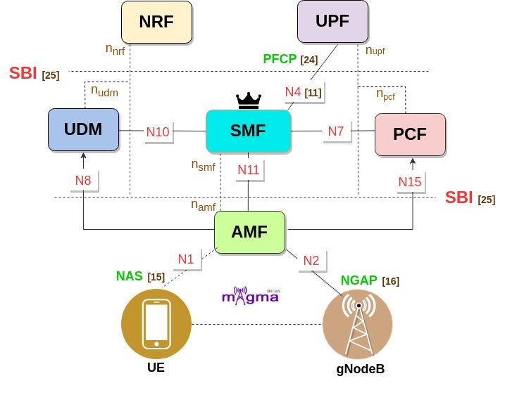
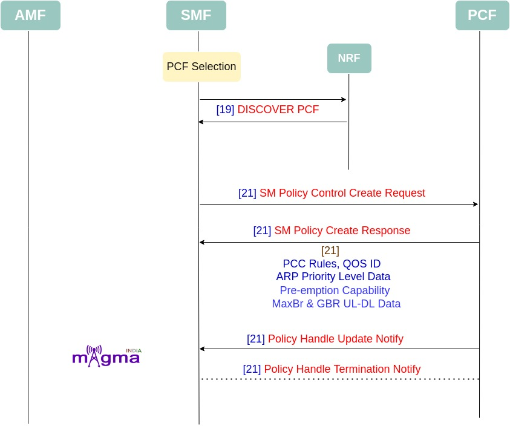
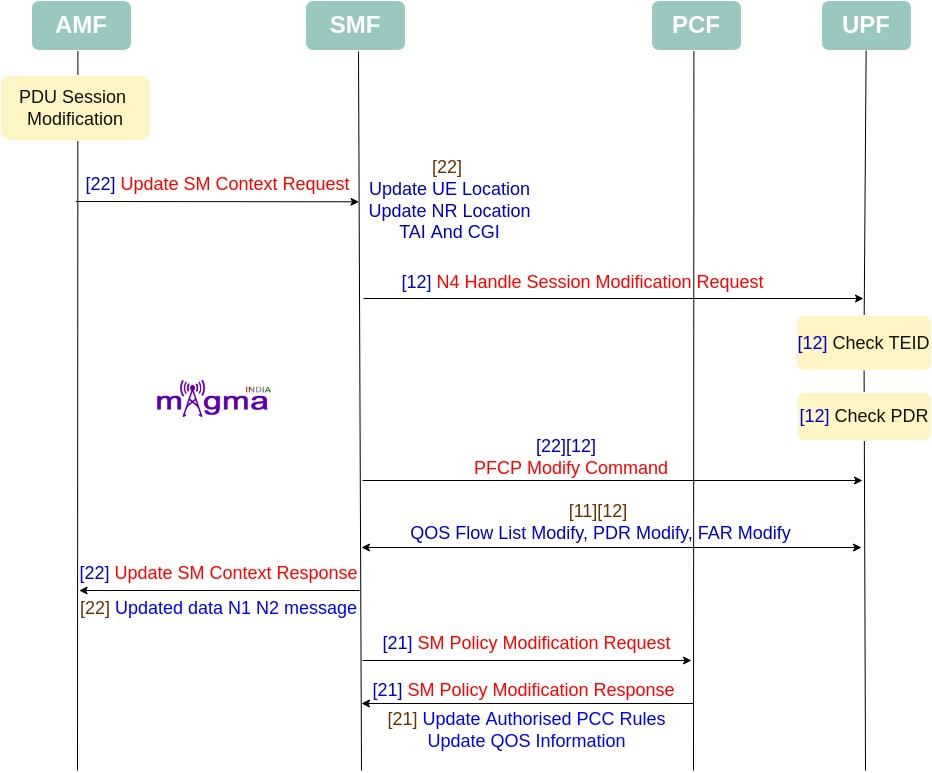
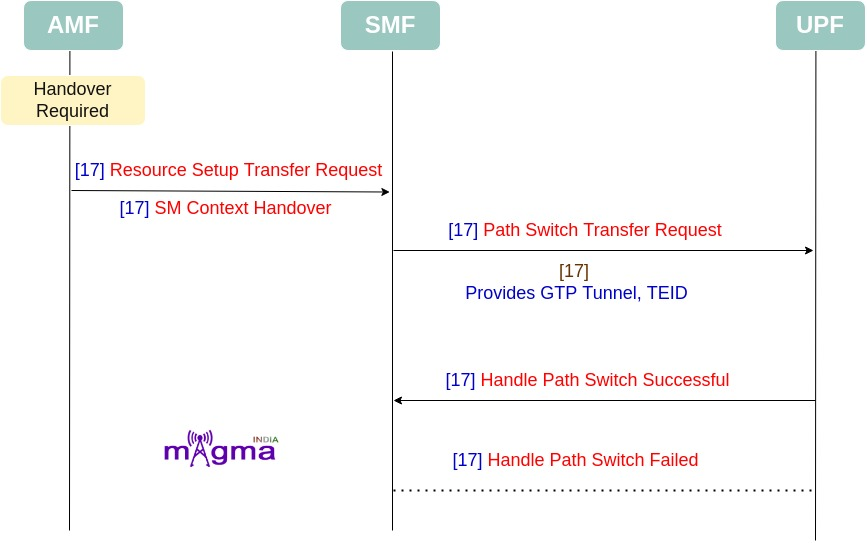

Session Management Function `[0] <https://github.com/open5gs/open5gs/tree/main/src/smf>`_
*********

SMF is a Control Plane(CP) function that manages the session-related context with the UPF. It creates, updates, and removes sessions. It also allocates the IP addresses to each PDU session. SMF provides all the session parameters and supports the functions of UPF. SMF functions are collectively performed by MME, SGW-U, and PGW-U in the 4G System. This NF enables CUPS(Control and User Plane Separation) which decentralized the control plane and data forwarding components of the 4G System. It obtained all the rules and policies from the PCF through the N7 interface and routed them to UPF to execute them in the respective sessions.

Interface & Protocols
=======

N4 `[11] <https://github.com/open5gs/open5gs/blob/main/src/smf/n4-build.c>`_
-------

Session Management context and necessary parameters are transmitted to the UPF(User Plane Function) from the SMF, once the user plane is setup.

PFCP `[24] <https://github.com/open5gs/open5gs/blob/main/src/smf/pfcp-path.c>`_
-------

Any kind of communication between SMF and UPF is managed by the PFCP(Packet Forwarding Control Protocol). It is one of the main protocols that separates the User Plane and Control Plane.

NAS `[15] <https://github.com/open5gs/open5gs/blob/main/src/smf/nas-path.c>`_
-------

SMF uses Non Access Stratum (NAS) signalling messages to communicate with the UE. Both the base station and AMF act as transparent routers for these messages which are relayed between the SMF and UE.

NGAP `[16] <https://github.com/open5gs/open5gs/blob/main/src/smf/nas-path.c>`_ `[18] <https://github.com/open5gs/open5gs/blob/main/src/smf/ngap-path.c>`_
-------

The Next-Generation Application Protocol(NGAP) is a Control Plane(CP) protocol signaling between gNB and the AMF. It handles the UE-associated and non-UE-associated services such as handover, sending session-related context, etc.

SBI(Service-based Interface) `[25] <https://github.com/open5gs/open5gs/blob/main/src/smf/sbi-path.c>`_
-------

Service-Based Interface is the API-based communication between network functions.

Call Flow
=======

Session Establishment
-------

* PDU session establishment starts with UE and gNB making PDU session establishment request to the AMF and then AMF selecting the best SMF, then AMF making SM context creation request to SMF.

.. image:: photos/SM-Context.jpg
  :alt: Alternative text

- `[8] <https://github.com/open5gs/open5gs/blob/main/src/smf/gsm-handler.c>`_ PDU session establishment request
- `[19] <https://github.com/open5gs/open5gs/blob/main/src/smf/nnrf-handler.c>`_ NRF network function discover
- `[19] <https://github.com/open5gs/open5gs/blob/main/src/smf/nnrf-handler.c>`_ NRF search result
- `[25] <https://github.com/open5gs/open5gs/blob/main/src/smf/sbi-path.c>`_ SBI open
- `[10] <https://github.com/open5gs/open5gs/blob/main/src/smf/init.c>`_ SMF initialized
- `[10] <https://github.com/open5gs/open5gs/blob/main/src/smf/init.c>`_ Gtp context init
- `[10] <https://github.com/open5gs/open5gs/blob/main/src/smf/init.c>`_ Pfcp context init
- `[10] <https://github.com/open5gs/open5gs/blob/main/src/smf/init.c>`_ Sbi context init

- `[3] <https://github.com/open5gs/open5gs/blob/main/src/smf/context.c>`_ SMF UE add by SUPI or SMF UE pool

- `[22] <https://github.com/open5gs/open5gs/blob/main/src/smf/nsmf-handler.c>`_ NSMF create sm context request
- `[22] <https://github.com/open5gs/open5gs/blob/main/src/smf/nsmf-handler.c>`_ Sm context create data
- `[22] <https://github.com/open5gs/open5gs/blob/main/src/smf/nsmf-handler.c>`_ UE recognition and session recognition using PSI
- `[22] <https://github.com/open5gs/open5gs/blob/main/src/smf/nsmf-handler.c>`_ Checks NSSAI

- `[23] <https://github.com/open5gs/open5gs/blob/main/src/smf/nudm-handler.c>`_ Retrieve sm context: dnn config list, ssc mode list, session type, Session AMBR, qos profile
- `[23] <https://github.com/open5gs/open5gs/blob/main/src/smf/nudm-handler.c>`_ UDM send HTTP sm context created

- `[7] <https://github.com/open5gs/open5gs/blob/main/src/smf/gsm-build.c>`_ Succeeded to get pdu session
- `[7] <https://github.com/open5gs/open5gs/blob/main/src/smf/gsm-build.c>`_ Pdu session establishment reject

* SMF then performs the PCF selection to create sm policy association and to get all PCC rules and other things.

- `[21] <https://github.com/open5gs/open5gs/blob/main/src/smf/npcf-handler.c>`_ SM policy control create req
- `[21] <https://github.com/open5gs/open5gs/blob/main/src/smf/npcf-handler.c>`_ PCC rules
- `[21] <https://github.com/open5gs/open5gs/blob/main/src/smf/npcf-handler.c>`_ Qos id
- `[21] <https://github.com/open5gs/open5gs/blob/main/src/smf/npcf-handler.c>`_ Flow info
- `[21] <https://github.com/open5gs/open5gs/blob/main/src/smf/npcf-handler.c>`_ QOS index
- `[21] <https://github.com/open5gs/open5gs/blob/main/src/smf/npcf-handler.c>`_ Data like arp priority level, pre-emption capability
- `[21] <https://github.com/open5gs/open5gs/blob/main/src/smf/npcf-handler.c>`_ Maxbr, gbr for uplink and downlink
- `[21] <https://github.com/open5gs/open5gs/blob/main/src/smf/npcf-handler.c>`_ Npcf policy handle update notify
- `[21] <https://github.com/open5gs/open5gs/blob/main/src/smf/npcf-handler.c>`_ Npcf sm policy termination notify

* Then there is PFCP session that connects the control plane to the user plane.

.. image:: photos/PFCP.jpeg
  :alt: Alternative text

- `[3] <https://github.com/open5gs/open5gs/blob/main/src/smf/context.c>`_ SMF selects UPF
- `[11] <https://github.com/open5gs/open5gs/blob/main/src/smf/n4-build.c>`_ PFCP session establishment req
- `[11] <https://github.com/open5gs/open5gs/blob/main/src/smf/n4-build.c>`_ Provides PFCP node ID
- `[11] <https://github.com/open5gs/open5gs/blob/main/src/smf/n4-build.c>`_ Set SEID
- `[11] <https://github.com/open5gs/open5gs/blob/main/src/smf/n4-build.c>`_ Create and setup PDR
- `[11] <https://github.com/open5gs/open5gs/blob/main/src/smf/n4-build.c>`_ Create and setup FAR
- `[11] <https://github.com/open5gs/open5gs/blob/main/src/smf/n4-build.c>`_ Create and setup URR
- `[11] <https://github.com/open5gs/open5gs/blob/main/src/smf/n4-build.c>`_ Create and setup QER
- `[21] <https://github.com/open5gs/open5gs/blob/main/src/smf/npcf-handler.c>`_ Setup DL PDR, UL PDR, cp2up pdr and up2cp PDR
- `[11] <https://github.com/open5gs/open5gs/blob/main/src/smf/n4-build.c>`_ Mbr uplink, mbr downlink
- `[11] <https://github.com/open5gs/open5gs/blob/main/src/smf/n4-build.c>`_ Set UE ip address to the default dl pdr
- `[21] <https://github.com/open5gs/open5gs/blob/main/src/smf/npcf-handler.c>`_ Set UPF-n3 TEID
- `[12] <https://github.com/open5gs/open5gs/blob/main/src/smf/n4-handler.c>`_ PFCP session establishment response
- `[12] <https://github.com/open5gs/open5gs/blob/main/src/smf/n4-handler.c>`_ Check SEID
- `[12] <https://github.com/open5gs/open5gs/blob/main/src/smf/n4-handler.c>`_ PFCP cause request accepted else failure
- `[24.0] <https://github.com/open5gs/open5gs/blob/main/src/smf/pfcp-sm.c>`_ `[7] <https://github.com/open5gs/open5gs/blob/main/src/smf/gsm-build.c>`_ pfcp state associated
- `[12] <https://github.com/open5gs/open5gs/blob/main/src/smf/n4-handler.c>`_ SBI status from PFCP
- `[3] <https://github.com/open5gs/open5gs/blob/main/src/smf/context.c>`_ Allocate QFI
- `[3] <https://github.com/open5gs/open5gs/blob/main/src/smf/context.c>`_ PFCP pool init
- `[13] <https://github.com/open5gs/open5gs/blob/main/src/smf/namf-build.c>`_ N1N2 message transfer request data
- `[13] <https://github.com/open5gs/open5gs/blob/main/src/smf/namf-build.c>`_ N1 message container
- `[14] <https://github.com/open5gs/open5gs/blob/main/src/smf/namf-handler.c>`_ N1N2 message transfer response
- `[14] <https://github.com/open5gs/open5gs/blob/main/src/smf/namf-handler.c>`_ N1N2 message transfer failure notify

Session Modification
-------

- `[7] <https://github.com/open5gs/open5gs/blob/main/src/smf/gsm-build.c>`_ PDU session modification command
- `[22] <https://github.com/open5gs/open5gs/blob/main/src/smf/nsmf-handler.c>`_ NSMF handle update SM context
- `[22] <https://github.com/open5gs/open5gs/blob/main/src/smf/nsmf-handler.c>`_ Update UE location and NR location
- `[22] <https://github.com/open5gs/open5gs/blob/main/src/smf/nsmf-handler.c>`_ Parse NR location (TAI and CGI)
- `[7] <https://github.com/open5gs/open5gs/blob/main/src/smf/gsm-build.c>`_ PDU session modification reject
- `[12] <https://github.com/open5gs/open5gs/blob/main/src/smf/n4-handler.c>`_ N4 handle session modification request
- `[12] <https://github.com/open5gs/open5gs/blob/main/src/smf/n4-handler.c>`_ Check PDR
- `[12] <https://github.com/open5gs/open5gs/blob/main/src/smf/n4-handler.c>`_ Check TEID
- `[12] <https://github.com/open5gs/open5gs/blob/main/src/smf/n4-handler.c>`_ Check PFCP Node and Interface access
- `[12] <https://github.com/open5gs/open5gs/blob/main/src/smf/n4-handler.c>`_ `[22] <https://github.com/open5gs/open5gs/blob/main/src/smf/nsmf-handler.c>`_ PFCP modify command 
- `[12] <https://github.com/open5gs/open5gs/blob/main/src/smf/n4-handler.c>`_ PFCP send QOS flow list modify
- `[11] <https://github.com/open5gs/open5gs/blob/main/src/smf/n4-build.c>`_ `[12] <https://github.com/open5gs/open5gs/blob/main/src/smf/n4-handler.c>`_ PDR modification
- `[11] <https://github.com/open5gs/open5gs/blob/main/src/smf/n4-build.c>`_ `[12] <https://github.com/open5gs/open5gs/blob/main/src/smf/n4-handler.c>`_ QOS flow modification
- `[11] <https://github.com/open5gs/open5gs/blob/main/src/smf/n4-build.c>`_ `[12] <https://github.com/open5gs/open5gs/blob/main/src/smf/n4-handler.c>`_ FAR modification
- `[22] <https://github.com/open5gs/open5gs/blob/main/src/smf/nsmf-handler.c>`_ SMF send SM context updated data N1 N2 message
- `[14] <https://github.com/open5gs/open5gs/blob/main/src/smf/namf-handler.c>`_ Update SM context response to AMF
- `[21] <https://github.com/open5gs/open5gs/blob/main/src/smf/npcf-handler.c>`_ SM policy modification request
- `[21] <https://github.com/open5gs/open5gs/blob/main/src/smf/npcf-handler.c>`_ Update authorised PCC rules
- `[21] <https://github.com/open5gs/open5gs/blob/main/src/smf/npcf-handler.c>`_ Update QOS info
- `[21] <https://github.com/open5gs/open5gs/blob/main/src/smf/npcf-handler.c>`_ Response sent

Session Deletion
-------

.. image:: photos/Deletion.jpeg
  :alt: Alternative text

- `[7] <https://github.com/open5gs/open5gs/blob/main/src/smf/gsm-build.c>`_ PDU session release command
- `[22] <https://github.com/open5gs/open5gs/blob/main/src/smf/nsmf-handler.c>`_ Nsmf handle release sm context
- `[11] <https://github.com/open5gs/open5gs/blob/main/src/smf/n4-build.c>`_ N4 session deletion Request
- `[24] <https://github.com/open5gs/open5gs/blob/main/src/smf/pfcp-path.c>`_ Smf pfcp send session deletion request: Delete SM context
- `[11] <https://github.com/open5gs/open5gs/blob/main/src/smf/n4-build.c>`_ Remove PDR
- `[11] <https://github.com/open5gs/open5gs/blob/main/src/smf/n4-build.c>`_ Remove FAR
- `[11] <https://github.com/open5gs/open5gs/blob/main/src/smf/n4-build.c>`_ Remove QER
- `[20] <https://github.com/open5gs/open5gs/blob/main/src/smf/npcf-build.c>`_ SM policy control deletion
- `[20] <https://github.com/open5gs/open5gs/blob/main/src/smf/npcf-build.c>`_ SM policy delete data

Handover Procedure
-------

* The SMF supports the Xn-based and N2-based handover procedures to hand over a UE from a source NG-RAN node to a target NG-RAN node using the Xn or N2 reference points. Initiation of this procedure can be due to new radio conditions, load balancing or due to a specific service.

* The SMF releases the QoS flows that failed to set up on the target NG-RAN during Xn and N2 handovers on the respective interfaces N4 (UPF) and N1 (UE). The SMF sends appropriate notification to N7 (PCF) based on the triggers if armed. The SMF also sends the usage report to N40 (CHF) for the released QoS flows.

- `[17] <https://github.com/open5gs/open5gs/blob/main/src/smf/ngap-handler.c>`_ Handle handover required transfer
- `[17] <https://github.com/open5gs/open5gs/blob/main/src/smf/ngap-handler.c>`_ Handle resource setup transfer request
- `[17] <https://github.com/open5gs/open5gs/blob/main/src/smf/ngap-handler.c>`_ Resource setup unsuccessful transfer
- `[17] <https://github.com/open5gs/open5gs/blob/main/src/smf/ngap-handler.c>`_ Provides GTP tunnel
- `[17] <https://github.com/open5gs/open5gs/blob/main/src/smf/ngap-handler.c>`_ GTP- TEID
- `[17] <https://github.com/open5gs/open5gs/blob/main/src/smf/ngap-handler.c>`_ Setup FAR
- `[17] <https://github.com/open5gs/open5gs/blob/main/src/smf/ngap-handler.c>`_ Handle path switch request transfer
- `[17] <https://github.com/open5gs/open5gs/blob/main/src/smf/ngap-handler.c>`_ Path switch transfer successful
- `[17] <https://github.com/open5gs/open5gs/blob/main/src/smf/ngap-handler.c>`_ Path switch transfer Failed
