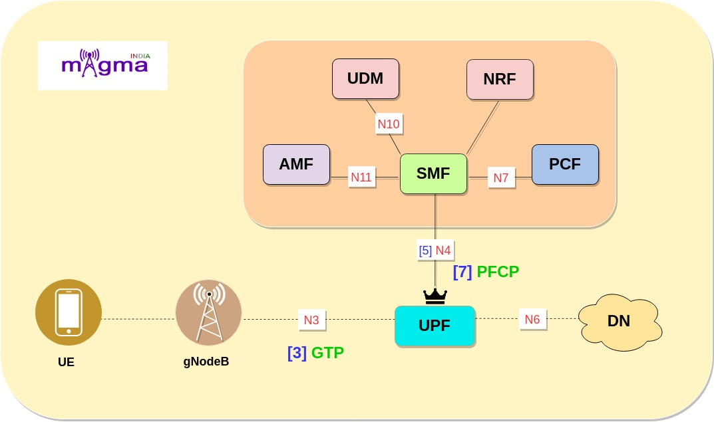
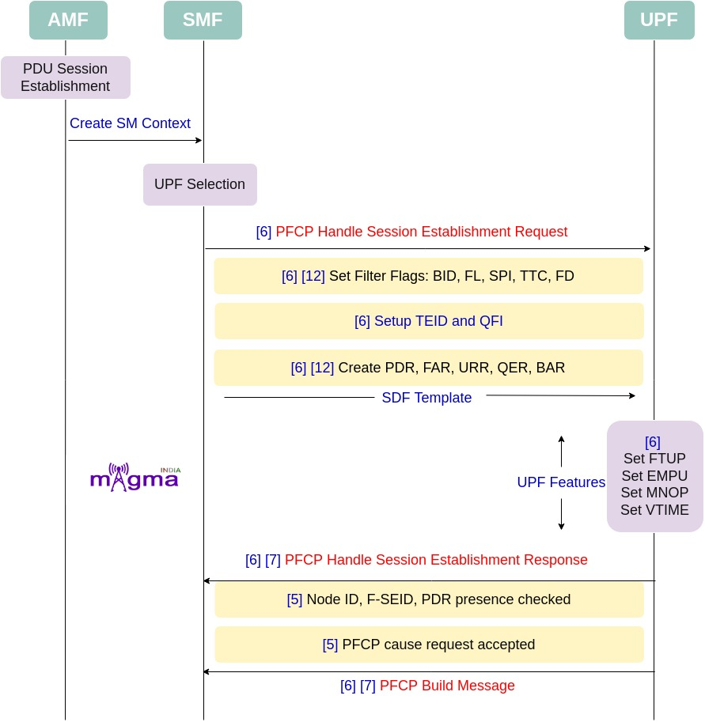
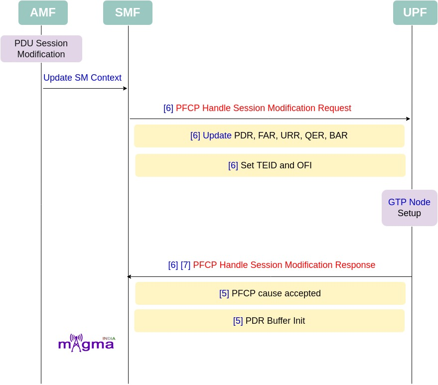
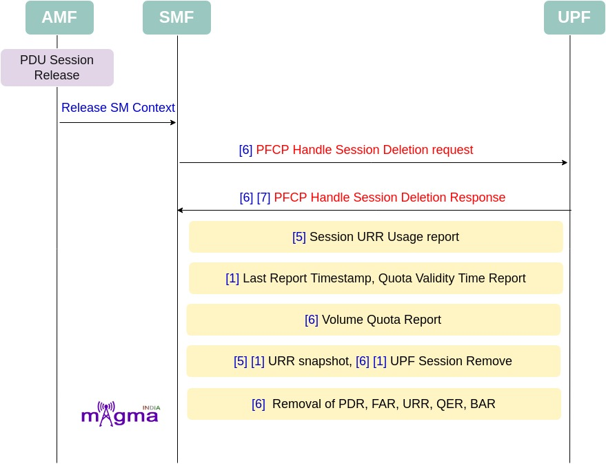

User Plane Function `[0] <https://github.com/open5gs/open5gs/tree/main/src/upf>`_
*********

The UPF (User Plane Function) is one of the most important NF(Network Function) of the 5G Core network. It is the second network function with which NR RAN interacts(during PDUs flow). UPF is the evolution of the CUPS(Control and User Plane Separation). It inspects, routes, and forwards the packets inside the QoS flows within the subscription policies. It also enforces the UL and DL traffic rules using SDF templates sent by the SMF over the N4 interface. It allocates or terminates the QoS Flows within the PDU Sessions when the corresponding services end..

Interface & Protocols
=======

N4 `[5] <https://github.com/open5gs/open5gs/blob/main/src/smf/n4-build.c>`_
-------

Session Management context and necessary parameters are transmitted to the UPF(User Plane Function) from the SMF, once the user plane is setup.

PFCP `[7] <https://github.com/open5gs/open5gs/blob/main/src/smf/pfcp-path.c>`_
-------

Any kind of communication between SMF and UPF is managed by the PFCP(Packet Forwarding Control Protocol). It is one of the main protocols that separates the User Plane and Control Plane.

GTP `[3] <https://github.com/open5gs/open5gs/blob/main/src/smf/sbi-path.c>`_
-------

GPRS Tunneling Protocol (GTP) is responsible for providing seamless interconnection and for carrying traffic between roaming or home subscribers and key network interfaces in 4G, 5G non-standalone (NSA), 5G standalone (SA), and mobile edge compute architectures. In 5g GTP tunnel is used in N3 and N9 interface. 

Call Flow
=======

Session Establishment & UPF Initialisation
-------

* During PDU session establishment, SMF connects with UPF through PFCP(N4 Interface). This PFCP session carries SDF template which carries PDR, QFI, URR, FAR, etc. In the case of initial session establishment, Default QOS(Non GBR) flow is assigned.

- `[6] <https://github.com/open5gs/open5gs/blob/main/src/upf/n4-handler.c>`_ N4 handle session establishment request
- `[6] <https://github.com/open5gs/open5gs/blob/main/src/upf/n4-handler.c>`_ PFCP handle create PDR
- `[6] <https://github.com/open5gs/open5gs/blob/main/src/upf/n4-handler.c>`_ `[12] <https://github.com/open5gs/open5gs/blob/main/lib/pfcp/handler.c>`_ Checking of existing PDI of PDR
- `[6] <https://github.com/open5gs/open5gs/blob/main/src/upf/n4-handler.c>`_ `[12] <https://github.com/open5gs/open5gs/blob/main/lib/pfcp/handler.c>`_ Checking of TEID
- `[6] <https://github.com/open5gs/open5gs/blob/main/src/upf/n4-handler.c>`_ `[12] <https://github.com/open5gs/open5gs/blob/main/lib/pfcp/handler.c>`_ Checking of source interface
- `[6] <https://github.com/open5gs/open5gs/blob/main/src/upf/n4-handler.c>`_ `[12] <https://github.com/open5gs/open5gs/blob/main/lib/pfcp/handler.c>`_ Checking of previous SDF filter ID
- `[6] <https://github.com/open5gs/open5gs/blob/main/src/upf/n4-handler.c>`_ `[12] <https://github.com/open5gs/open5gs/blob/main/lib/pfcp/handler.c>`_ Set All filter flags: BID, FL, SPI, TTC, FD
- `[6] <https://github.com/open5gs/open5gs/blob/main/src/upf/n4-handler.c>`_ PFCP handle create FAR
- `[6] <https://github.com/open5gs/open5gs/blob/main/src/upf/n4-handler.c>`_ Create URR
- `[6] <https://github.com/open5gs/open5gs/blob/main/src/upf/n4-handler.c>`_ Create BAR
- `[6] <https://github.com/open5gs/open5gs/blob/main/src/upf/n4-handler.c>`_ Create QRR
- `[6] <https://github.com/open5gs/open5gs/blob/main/src/upf/n4-handler.c>`_ Setup N3 TEID and QFI
- `[4] <https://github.com/open5gs/open5gs/blob/main/src/upf/init.c>`_ UPF initialized 
- `[4] <https://github.com/open5gs/open5gs/blob/main/src/upf/init.c>`_ PFCP context initialized
- `[1] <https://github.com/open5gs/open5gs/blob/main/src/upf/context.c>`_ Initialize UPF context
- `[1] <https://github.com/open5gs/open5gs/blob/main/src/upf/context.c>`_ Set User Plane Function features: FTUP, EMPU, MNOP, VTIME, UPF featurs length.
- `[6] <https://github.com/open5gs/open5gs/blob/main/src/upf/n4-handler.c>`_ `[7] <https://github.com/open5gs/open5gs/blob/main/src/upf/pfcp-path.c>`_ Session Establishment Response
- `[5] <https://github.com/open5gs/open5gs/blob/main/src/upf/n4-build.c>`_ N4 build session establishment response
- `[5] <https://github.com/open5gs/open5gs/blob/main/src/upf/n4-build.c>`_ Node ID 
- `[5] <https://github.com/open5gs/open5gs/blob/main/src/upf/n4-build.c>`_ PFCP cause request accepted
- `[5] <https://github.com/open5gs/open5gs/blob/main/src/upf/n4-build.c>`_ F-SEID
- `[5] <https://github.com/open5gs/open5gs/blob/main/src/upf/n4-build.c>`_ PDR presence checked
- `[5] <https://github.com/open5gs/open5gs/blob/main/src/upf/n4-build.c>`_ PFCP built message.
- FTUP: F-TEID allocation / release in the UP function is supported by the UP function.
- EMPU: Sending of End Marker packets supported by the UP function.
- MNOP: The UP function supports measurement of number of packets which is instructed with the flag `Measurement of Number of Packets` in a URR. See also clause 5.2.2.2.1. MNOP (Measurement of Number of Packets): when set to "1", this indicate a request to measure the number of packets transferred in UL/DL/Total in addition to the measurement in octets when Volume based measurement applies
- VTIME: UP function support of quota validity time feature., if the VTIME feature is supported by UP function, to request the UP function to send a usage report after the validity duration is over. After Quota validity timer expiry, if packets are received on UPF, the UPF shall stop forwarding packets or only allow forwarding of limited user plane traffic, based on operator`s policy in the UP function.
- FL: Flow Label
- TTC: Tos Traffic Class 
- SPI: Security Parameter Index
- FD: Flow description.
- BID: Bidirectional SDF Filter

Session Modification
-------

* Dedicated QOS flow is assigned through PDU session modification process. Additional Dedicated QOS flows supports more QOS-demanding traffic such as voice, video, gaming traffic, etc.

- `[6] <https://github.com/open5gs/open5gs/blob/main/src/upf/n4-handler.c>`_ N4 handle session modification request

- `[6] <https://github.com/open5gs/open5gs/blob/main/src/upf/n4-handler.c>`_ Remove Existing PDR

- `[6] <https://github.com/open5gs/open5gs/blob/main/src/upf/n4-handler.c>`_ Update PDR

- `[6] <https://github.com/open5gs/open5gs/blob/main/src/upf/n4-handler.c>`_ Update FAR

- `[6] <https://github.com/open5gs/open5gs/blob/main/src/upf/n4-handler.c>`_ Update URR

- `[6] <https://github.com/open5gs/open5gs/blob/main/src/upf/n4-handler.c>`_ Update QER

- `[6] <https://github.com/open5gs/open5gs/blob/main/src/upf/n4-handler.c>`_ Update BAR

- `[6] <https://github.com/open5gs/open5gs/blob/main/src/upf/n4-handler.c>`_ Setup GTP Node

- `[6] <https://github.com/open5gs/open5gs/blob/main/src/upf/n4-handler.c>`_ Setup N3 TEID and QFI

- `[6] <https://github.com/open5gs/open5gs/blob/main/src/upf/n4-handler.c>`_ `[7] <https://github.com/open5gs/open5gs/blob/main/src/upf/pfcp-path.c>`_ PFCP send  Session Modificartion Response

- `[5] <https://github.com/open5gs/open5gs/blob/main/src/upf/n4-build.c>`_ N4 build session modification response

- `[5] <https://github.com/open5gs/open5gs/blob/main/src/upf/n4-build.c>`_ PFCP cause accepted

- `[5] <https://github.com/open5gs/open5gs/blob/main/src/upf/n4-build.c>`_ PDR buffer initialised

- `[5] <https://github.com/open5gs/open5gs/blob/main/src/upf/n4-build.c>`_ PDR created

- `[6] <https://github.com/open5gs/open5gs/blob/main/src/upf/n4-build.c>`_ Send Buffered Packet to gnB(when needed)

Session Deletion
-------

- `[6] <https://github.com/open5gs/open5gs/blob/main/src/upf/n4-handler.c>`_ N4 handle session deletion request
- `[6] <https://github.com/open5gs/open5gs/blob/main/src/upf/n4-handler.c>`_ `[7] <https://github.com/open5gs/open5gs/blob/main/src/upf/pfcp-path.c>`_ PFCP send session deletion request
- `[5] <https://github.com/open5gs/open5gs/blob/main/src/upf/n4-build.c>`_ `[1] <https://github.com/open5gs/open5gs/blob/main/src/upf/context.c>`_ Session URR fill usage report
- `[1] <https://github.com/open5gs/open5gs/blob/main/src/upf/context.c>`_ Last report Timestamp
- `[1] <https://github.com/open5gs/open5gs/blob/main/src/upf/context.c>`_ Time triggers
- `[1] <https://github.com/open5gs/open5gs/blob/main/src/upf/context.c>`_ Quota validity time report
- `[1] <https://github.com/open5gs/open5gs/blob/main/src/upf/context.c>`_ Volume triggers
- `[1] <https://github.com/open5gs/open5gs/blob/main/src/upf/context.c>`_ Volume quota report
- `[5] <https://github.com/open5gs/open5gs/blob/main/src/upf/n4-build.c>`_ `[1] <https://github.com/open5gs/open5gs/blob/main/src/upf/context.c>`_ UPF sess URR snapshot(total octets, total pkts, both ul and dl)
- `[6] <https://github.com/open5gs/open5gs/blob/main/src/upf/n4-handler.c>`_ `[1] <https://github.com/open5gs/open5gs/blob/main/src/upf/context.c>`_ UPF sess remove
- `[1] <https://github.com/open5gs/open5gs/blob/main/src/upf/context.c>`_ UPF session URR acc remove all: validity time delete, Time quota delete, threshold time delete.
- `[13] <https://github.com/open5gs/open5gs/blob/main/lib/pfcp/context.c>`_ PDR remove all
- `[13] <https://github.com/open5gs/open5gs/blob/main/lib/pfcp/context.c>`_ FAR remove all
- `[13] <https://github.com/open5gs/open5gs/blob/main/lib/pfcp/context.c>`_ URR remove all
- `[13] <https://github.com/open5gs/open5gs/blob/main/lib/pfcp/context.c>`_ QER remove all
- `[13] <https://github.com/open5gs/open5gs/blob/main/lib/pfcp/context.c>`_ BAR remove all
- `[13] <https://github.com/open5gs/open5gs/blob/main/lib/pfcp/context.c>`_ Self SEID