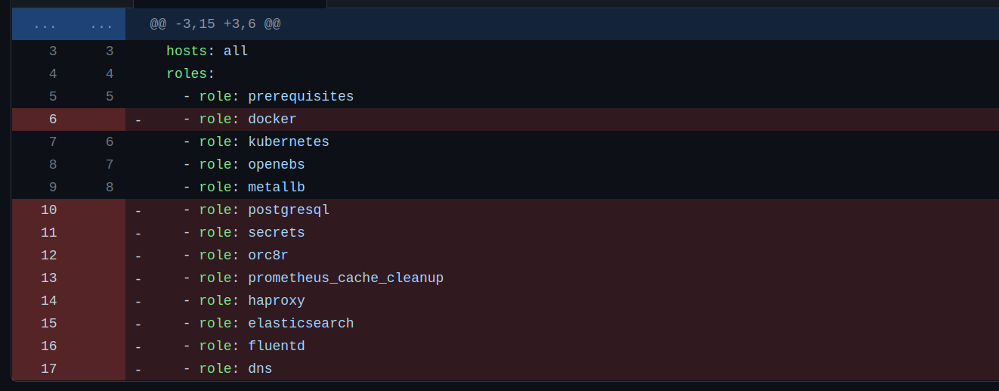
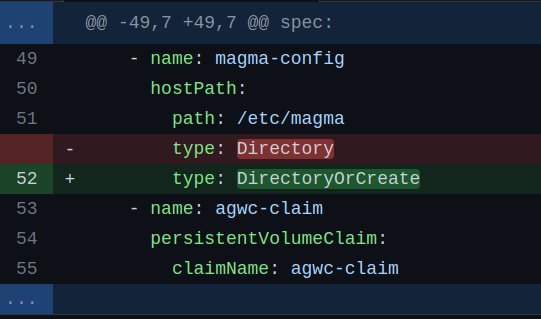
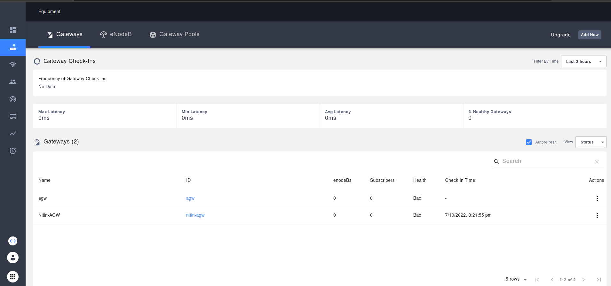
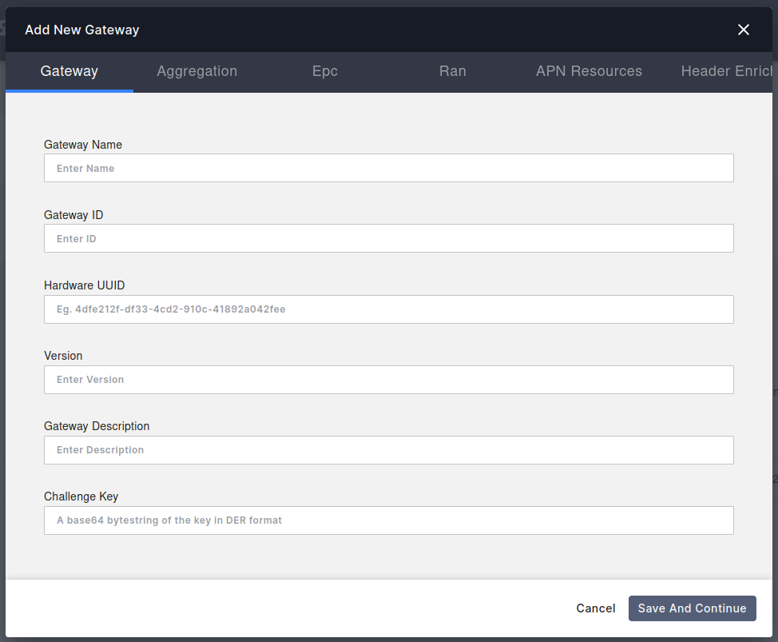
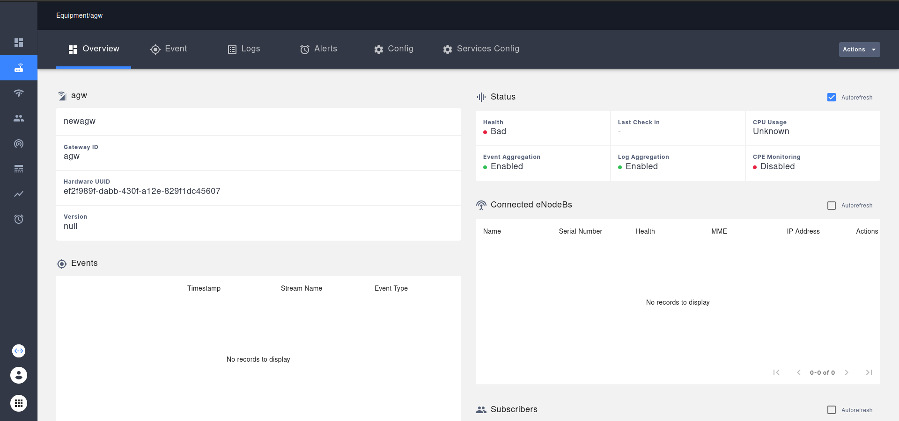

Install AGW Helm
****************

Install Access Gateway on Ubuntu (Bare Metal)
=============================================

.. note::
   AGW Helm charts are currently in experimental state, therefore sometimes there are some issues in integrating it with orc8r.

Prerequisites
=============

To setup a Magma Access Gateway, you will need a machine that satisfies the following requirements:

- 64bit-X86 machine with ubuntu 20.
- 2 ethernet ports.
- 8 Gb Ram.
- 4 Core CPU.

Deployment
==========

1. Docker
---------

Download the offical script to install and setup docker on ubuntu.

.. code-block:: bash

    wget https://raw.githubusercontent.com/magma/magma/master/lte/gateway/deploy/agw_install_docker.sh

Make some changes in the script

.. code-block:: bash

    sed -i "113 a\sed -i 's/debian/debian-test/' /opt/magma/lte/gateway/deploy/roles/magma_deploy/vars/all.yaml\n\
    sed -i 's/focal-1.7.0/focal-ci/' /opt/magma/lte/gateway/deploy/roles/magma_deploy/vars/all.yaml\n\
           " "agw_install_docker.sh"

Execute the script

.. code-block:: bash

    ./agw_install_docker.sh

This script will automatically setup docker and configure related things and restart machine.

2. Create a K8s Cluster
-----------------------

we'll only install the required components from this ansible-playbook.

Clone repo on your local machine(Not AGW machine).

.. code-block:: bash
    git clone https://github.com/ShubhamTatvamasi/magma-galaxy.git && cd magma-galaxy

Make changes to ``deploy-orc8r.yml`` file.

Make changes to ``hosts.yml`` file acc to your AGW host machine.

Run playbook.

.. code-block:: bash

    ansible-playbook config-orc8r.yml

This playbook will take around 10 min to complete.

3. Deploy AGW
-------------

Files required

- ``rootCA.pem`` certificate file from orc8r. 

place this file on the required location.

.. code-block:: bash

    sudo mkdir -p /var/opt/magma/certs/
    sudo cp rootCA.pem /var/opt/magma/certs/

- ``gwChallenge.key`` key file.

To generate it.

.. code-block:: bash

    cd /var/opt/magma/certs
    
    # Generate Private key
    sudo openssl ecparam -name secp384r1 -genkey -noout -out gw_challenge.key
    sudo chmod 644 gw_challenge.key

    # Generate Public key
    openssl ec -in gw_challenge.key -pubout -out gw_challenge.pem
    GW_CHALLENGE=$(cat gw_challenge.pem | sed '5d' | sed '1d' | tr -d '\n')
    echo ${GW_CHALLENGE}

- ``snowflake`` file that contains the uuid.

To generate this.

.. code-block:: bash

    sudo uuidgen > /etc/snowflake

Make changes to hosts file

open /etc/hosts in edit mode and Add the following lines in the file

.. code-block::
    192.168.100.102 api.<Orc8rDomainName>.com
    192.168.100.102 master.nms.<Orc8rDomainName>.com
    192.168.100.102 magma-test.nms.<Orc8rDomainName>.com
    192.168.100.102 fluentd.<Orc8rDomainName>.com
    192.168.100.102 controller.<Orc8rDomainName>.com
    192.168.100.102 bootstrapper-controller.<Orc8rDomainName>.com

replace ``192.168.100.102`` with your orc8r address.

Verify the sanity of rootCA.pem file

.. code-block:: bash

    openssl x509 -text -noout -in /var/opt/magma/certs/rootCA.pem

Create ``/var/opt/magma/configs/control_proxy.yml`` with your orc8r/controller details

.. code-block:: bash

    sudo mkdir -p /var/opt/magma/configs/
    sudo vim /var/opt/magma/configs/control_proxy.yml

Insert the following lines.

.. code-block::
    cloud_address: controller.<Orc8rDomainName>.com
    cloud_port: 443
    bootstrap_address: bootstrapper-controller.<Orc8rDomainName>.com
    bootstrap_port: 443
    fluentd_address: fluentd.<Orc8rDomainName>.com
    fluentd_port: 443
    rootca_cert: /var/opt/magma/certs/rootCA.pem

Verify connectivity between AGW and Orc8r

.. code-block:: bash

    telnet bootstrapper-controller.<Orc8rDomainName>.com 443

Will return this:

.. code-block::
    Trying 192.168.100.102...
    Connected to bootstrapper-controller.<Orc8rDomainName>.com.
    Escape character is '^]'.
    Connection closed by foreign host.

Pull Docker images.

.. code-block:: bash

    docker pull public.ecr.aws/z2g3r6f7/agw_gateway_python:latest

and

.. code-block:: bash

    docker pull public.ecr.aws/z2g3r6f7/agw_gateway_c:latest

Clone Magma repo and go to docker directory

.. code-block:: bash

    git clone https://github.com/magma/magma.git && cd magma/lte/gateway/docker/

Start docker containers

.. code-block:: bash

    docker-compose up

Let's check the docker containers

.. code-block:: bash

    docker ps | grep agw

.. code-block::
    f223ec6b263a   agw_gateway_c:latest        "sh -c 'mkdir -p /va…"    2 hours ago   Up 2 hours (healthy)                   sessiond
    2a697165cb5d   agw_gateway_c:latest        "sh -c '/usr/local/b…"    2 hours ago   Up 2 hours (healthy)                   oai_mme
    4039f37c83ea   agw_gateway_python:latest   "/usr/bin/env python…"    2 hours ago   Up 2 hours (healthy)                   state
    ef013657f24d   agw_gateway_python:latest   "/usr/bin/env python…"    2 hours ago   Up 2 hours (healthy)                   directoryd
    b857dad4a497   agw_gateway_python:latest   "/usr/bin/env python…"    2 hours ago   Up 2 hours (healthy)                   policydb
    699b02b77096   agw_gateway_python:latest   "bash -c '/usr/bin/o…"    2 hours ago   Up 2 hours (healthy)                   pipelined
    a9fe8e372aa5   agw_gateway_python:latest   "/bin/bash -c '\n  /u…"   2 hours ago   Up 2 hours                             magmad
    8c71efadcd82   agw_gateway_c:latest        "/usr/local/bin/conn…"    2 hours ago   Up 2 hours (healthy)                   connectiond
    8fc2bc86d804   agw_gateway_python:latest   "sh -c 'sleep 5 && /…"    2 hours ago   Up 2 hours (healthy)                   mobilityd
    2802a768aee6   agw_gateway_python:latest   "/usr/bin/env python…"    2 hours ago   Up 2 hours (healthy)                   smsd
    1125fafb1ef3   agw_gateway_python:latest   "/bin/bash -c '/usr/…"    2 hours ago   Up 2 hours (healthy)                   td-agent-bit
    c00658880aa8   agw_gateway_python:latest   "/bin/bash -c '/usr/…"    2 hours ago   Up 2 hours (healthy)                   redis
    a87e091bd742   agw_gateway_python:latest   "/usr/bin/env python…"    2 hours ago   Up 2 hours (healthy)                   monitord
    198350944c07   agw_gateway_python:latest   "/usr/bin/env python…"    2 hours ago   Up 2 hours (healthy)                   subscriberdb
    f33689b8ca7c   agw_gateway_python:latest   "/usr/bin/env python…"    2 hours ago   Up 2 hours (healthy)                   eventd
    3768d2542379   agw_gateway_python:latest   "/usr/bin/env python…"    2 hours ago   Up 2 hours (healthy)                   redirectd
    e095aa4b41b1   agw_gateway_python:latest   "/usr/bin/env python…"    2 hours ago   Up 2 hours (healthy)                   health
    7f450f751545   agw_gateway_python:latest   "/usr/bin/env python…"    2 hours ago   Up 2 hours (healthy)                   enodebd
    ded1bfd70252   agw_gateway_python:latest   "/usr/bin/env python…"    2 hours ago   Up 2 hours (healthy)                   ctraced
    035dbd0d3ac9   agw_gateway_python:latest   "sh -c '/usr/local/b…"    2 hours ago   Up 2 hours (healthy)                   control_proxy
    0ec3a61a34d0   agw_gateway_c:latest        "/usr/local/bin/sctpd"    2 hours ago   Up 2 hours                             sctpd

Every container is in healthy condition. Now, let's delete them

.. code-block:: bash

    docker-compose down

Go to helm directory

.. code-block:: bash

    cd ../deploy/agwc-helm-charts/

Edit values.yaml file

.. image:: photos/values.png
  :width: 800
  :alt: Alternative text

Edit agwc-config.pod.yaml file.

.. code-block:: bash

    nano templates/agwc-config.pod.yaml

and change hostPath type from Directory to DirectoryOrCreate

Create magma namespace

.. code-block:: bash

    kubectl create namespace magma

Create rootca certificate secret needed to communicate with orc8r

.. code-block:: bash

    kubectl create secret generic agwc-secret-certs --from-file=rootCA.pem=rootCA.pem --namespace magma

make sure to execute this command on the directory where rootCA.pem file is present.

Deploy an AGW after updating ``values.yaml``

.. code-block:: bash

    cd lte/gateway/deploy/agwc-helm-charts
    helm --debug install agwc --namespace magma . --values=values.yaml

Make sure all pods are in running state.

.. code-block:: bash
    
    kubectl get pods -n magma

.. image:: photos/pods.png
  :width: 800
  :alt: Alternative text

Now lets connect the orc8r with AGW.
Open your orc8r dashboard and go to Equipment section. 

Add a new AGW
By entering the following details.

AGW added successfully.

Health will come to healthy state when the connection will be successful and agw service will synchronize themself.
